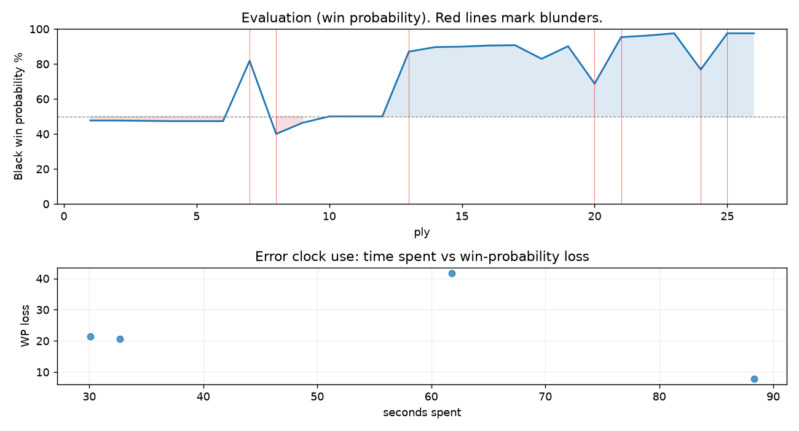

# (free, so lmk) Game analysis: DanielKetterer vs kpat1202

Date: 2026.07.30  |  Time control: rapid (1800)  |  You played: black
Game ID: 40d0daba-8c44-11f1-87d4-59424301000f
Analysis: depth=24 multipv=3 findability=honest floor=6 stable_run=3 threads=1 hash_mb=256 deterministic=True engine_id=Stockfish_18 generated=2026-07-30T19:10:16Z
Game end time UTC: 2026-07-30T18:43:21+00:00
Game: https://www.chess.com/game/live/172302205862

## Summary

- Lichess accuracy: you 51.2%, opponent 43.8%
- Opening: C57 Italian Game: Two Knights Defense, Traxler Counterattack, Knight Sacrifice Line (theory followed through ply 9)
- First deviation from theory: ply 10, You played 5... Bxf2+
- Your moves: 8 best, 1 excellent, 0 good, 1 inaccuracy, 0 mistake, 3 blunder

METRICS:

Best: The played move exactly matches Stockfish's top move

Excellent: A non-best move that loses 2 WP points or less.

Good: WP loss is over 2, but under 5 points; also used for losses under 20 when the position remains already decided.

Inaccuracy: WP loss is at least 5 but under 10 points.

Mistake: WP loss is at least 10 but under 20 points; also generally used when a forced mate is missed with under 10 points of WP loss.

Blunder: WP loss is 20 points or more, or a forced mate is missed with at least 10 points of WP loss.

See: https://support.chess.com/en/articles/8572705-how-are-moves-classified-what-is-a-blunder-or-brilliant-etc 

(Brillint, Great and Miss are rating subjective)
- Puzzles: 42 open, 0 solved

### Puzzle gate tally (this game)

Gates: category in ['brilliant_sacrifice', 'missed_tactic', 'allowed_tactic', 'endgame'], refute depth in [3, 8], best-vs-second WP gap >= 5. Refute bar per move: max(5, 0.6 x WP loss).

| outcome | errors |
|---|---|
| accepted | 1 |
| category:attention | 2 |
| refute_too_deep | 1 |

Four gates pass at once or nothing is generated, so a zero here is a product of four pass rates rather than a fault. Read the binding gate off this table before changing any threshold.

### Sacrifices in the engine's line

Real sacrifices are listed but never served as puzzles: compensation that never resolves back into material has no gradable answer.

| Move | Offered | Kind | Quiet | Line ends | Verdict |
|---|---|---|---|---|---|
| 10 | -3.0 (piece) | sham | yes | +8.0 pawns | desperado |

## Biggest missed opportunity

You played 4...Nf6. Stockfish preferred Qxg5, after which the main line runs 4...Qxg5 5. O-O Qh4 6. d4 Nxd4 7. b4. The evaluation crossed from winning to equal, which matters more than the raw number. Why it went wrong: a favorable capture was available (Qxg5). Before committing to a quiet move here, the checklist is checks, captures, threats, in that order. The engine prefers this move from at or below depth 6, which is as shallow as this measurement resolves; it sits near the surface, a forcing move, the kind a checks-and-captures scan catches. Candidates considered by the engine: Qxg5 (-4.08), d5 (-1.75), Bxf2+ (-1.33).

## Critical positions

- Ply 7 (opponent), 4.Ng5: +0.29 -> -4.08 [evaluation crossed equal -> losing]
- Ply 8 (you), 4...Nf6: -4.08 -> +1.10 [only-move situation; evaluation crossed winning -> equal]
- Ply 12 (you), 6...Nxe4+: +0.00 -> +0.00 [only-move situation]
- Ply 13 (opponent), 7.Ke2: +0.00 -> -5.18 [evaluation crossed equal -> losing]
- Ply 14 (you), 7...Nd4+: -5.18 -> -5.87 [only-move situation]
- Ply 16 (you), 8...Qh4: -5.94 -> -6.14 [only-move situation]
- Ply 20 (you), 10...Rxf1: -6.02 -> -2.14
- Ply 21 (opponent), 11.Bxf1: -2.14 -> -8.21 [only-move situation]

## Your errors, move by move

| Move | Class | Category | WP loss | Refute depth | Seconds spent | Pre-error eval |
|---|---|---|---:|---|---:|---|
| 4...Nf6 | blunder | attention | 42% | 1 | 62 | winning |
| 9...Rf8 | inaccuracy | allowed_tactic | 8% | 9 | 88 | winning |
| 10...Rxf1 | blunder | missed_tactic | 21% | 3 | 30 | winning |
| 12...Nc5+ | blunder | attention | 21% | 1 | 33 | winning |

### 4...Nf6 (blunder, tactical, wp loss 42%)

You played 4...Nf6. Stockfish preferred Qxg5, after which the main line runs 4...Qxg5 5. O-O Qh4 6. d4 Nxd4 7. b4. The evaluation crossed from winning to equal, which matters more than the raw number. Why it went wrong: a favorable capture was available (Qxg5). Before committing to a quiet move here, the checklist is checks, captures, threats, in that order. The engine prefers this move from at or below depth 6, which is as shallow as this measurement resolves; it sits near the surface, a forcing move, the kind a checks-and-captures scan catches. Candidates considered by the engine: Qxg5 (-4.08), d5 (-1.75), Bxf2+ (-1.33).

### 9...Rf8 (inaccuracy, positional, wp loss 8%)

You played 9...Rf8. Stockfish preferred d5, after which the main line runs 9...d5 10. Bb5+ Nxb5 11. Nxe5 Qg5+ 12. Rf4. Why it went wrong: left pawn on e5, knight on e4 insufficiently defended; motif: creates threat on f7, c4. This was a judgment error rather than a missed tactic; compare the pawn structure and piece activity after both moves. The engine first prefers this move at depth 9 and holds it; findable, but it takes a deliberate look rather than a scan. Candidates considered by the engine: d5 (-6.20), Rf8 (-4.07), Nf6 (-4.03).

### 10...Rxf1 (blunder, tactical, wp loss 21%)

You played 10...Rxf1. Stockfish preferred Nf2, after which the main line runs 10...Nf2 11. Rxf2 Qxf2+ 12. Kd3 d5 13. Kc3. Why it went wrong: left knight on e4, knight on d4 insufficiently defended; motif: creates threat on h2, d1. Before committing to a quiet move here, the checklist is checks, captures, threats, in that order. The engine prefers this move from at or below depth 6, which is as shallow as this measurement resolves; it sits near the surface, a forcing move, the kind a checks-and-captures scan catches. Candidates considered by the engine: Nf2 (-6.02), d5 (-4.31), Nf5+ (-4.24).

### 12...Nc5+ (blunder, tactical, wp loss 21%)

You played 12...Nc5+. Stockfish preferred Nf2+, after which the main line runs 12...Nf2+ 13. Kc3 Nxd1+ 14. Kb3 Nd4+ 15. Ka4. Why it went wrong: the best move was a forcing check; motif: fork; creates threat on h2, d1. Before committing to a quiet move here, the checklist is checks, captures, threats, in that order. The engine prefers this move from at or below depth 6, which is as shallow as this measurement resolves; it sits near the surface, a forcing move, the kind a checks-and-captures scan catches. Candidates considered by the engine: Nf2+ (-11.81), d5 (-7.11), b5 (-6.47).

## Full move table

| Ply | Move | Eval before | Eval after | Best | CP loss | WP loss | Class |
|-----|------|-------------|------------|------|---------|---------|-------|
| 1 | 1.e4 | +0.31 | +0.25 | e4 | 6 | 1% | best |
| 2 | 1...e5* | +0.25 | +0.25 | e5 | 0 | 0% | best |
| 3 | 2.Nf3 | +0.25 | +0.27 | Nf3 | 0 | 0% | best |
| 4 | 2...Nc6* | +0.27 | +0.29 | Nc6 | 2 | 0% | best |
| 5 | 3.Bc4 | +0.29 | +0.29 | Bc4 | 0 | 0% | best |
| 6 | 3...Bc5* | +0.29 | +0.29 | Nf6 | 0 | 0% | excellent |
| 7 | 4.Ng5 | +0.29 | -4.08 | O-O | 437 | 34% | blunder |
| 8 | 4...Nf6* | -4.08 | +1.10 | Qxg5 | 518 | 42% | blunder |
| 9 | 5.Nxf7 | +1.10 | +0.39 | Nxf7 | 71 | 6% | best |
| 10 | 5...Bxf2+* | +0.39 | +0.00 | Bxf2+ | 0 | 0% | best |
| 11 | 6.Kxf2 | +0.00 | +0.00 | Kxf2 | 0 | 0% | best |
| 12 | 6...Nxe4+* | +0.00 | +0.00 | Nxe4+ | 0 | 0% | best |
| 13 | 7.Ke2 | +0.00 | -5.18 | Ke3 | 518 | 37% | blunder |
| 14 | 7...Nd4+* | -5.18 | -5.87 | Nd4+ | 0 | 0% | best |
| 15 | 8.Ke3 | -5.87 | -5.94 | Kd3 | 7 | 0% | excellent |
| 16 | 8...Qh4* | -5.94 | -6.14 | Qh4 | 0 | 0% | best |
| 17 | 9.Rf1 | -6.14 | -6.20 | Nxe5 | 6 | 0% | excellent |
| 18 | 9...Rf8* | -6.20 | -4.30 | d5 | 190 | 8% | inaccuracy |
| 19 | 10.Nxe5 | -4.30 | -6.02 | g3 | 172 | 7% | inaccuracy |
| 20 | 10...Rxf1* | -6.02 | -2.14 | Nf2 | 388 | 21% | blunder |
| 21 | 11.Bxf1 | -2.14 | -8.21 | Qxf1 | 607 | 27% | blunder |
| 22 | 11...Nf5+* | -8.21 | -8.81 | Nf5+ | 0 | 0% | best |
| 23 | 12.Kd3 | -8.81 | -11.81 | Kf3 | 300 | 1% | excellent |
| 24 | 12...Nc5+* | -11.81 | -3.26 | Nf2+ | 855 | 21% | blunder |
| 25 | 13.Kc3 | -3.26 | -M1 | Ke2 |  | 21% | blunder |
| 26 | 13...Qd4#* | -M1 | -M1 | Qd4# |  | 0% | best |

Rows marked * are your moves. WP loss is win-probability loss; it is the primary signal, CP loss is shown for reference.

## Patterns in this game

- Error categories: 1 allowed_tactic, 2 attention, 1 missed_tactic.
- Attention errors per 100 moves: 15.4.
- Pre-error eval buckets: 4 winning, 0 balanced, 0 losing.
- Opening: 3 error(s) (avg wp loss 24%).
- Middlegame: 1 error(s) (avg wp loss 21%).
