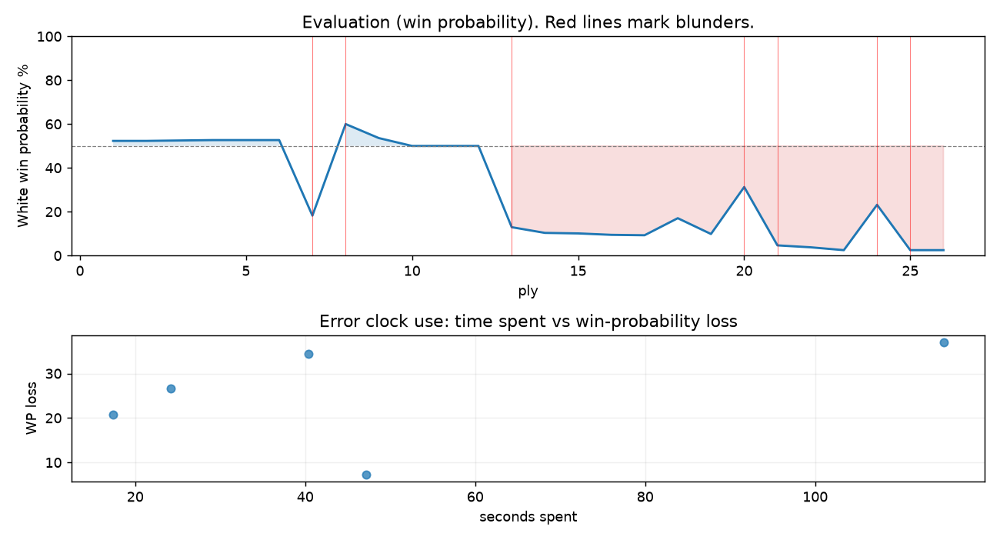

# (free, so lmk) Game analysis: DanielKetterer vs kpat1202

Date: 2026.07.30  |  Time control: rapid (1800)  |  You played: white
Game ID: 40d0daba-8c44-11f1-87d4-59424301000f
Analysis: depth=24 multipv=3 findability=honest floor=6 stable_run=3 threads=1 hash_mb=256 deterministic=True engine_id=Stockfish_18 generated=2026-07-30T19:10:16Z
Game end time UTC: 2026-07-30T18:43:21+00:00
Game: https://www.chess.com/game/live/172302205862

## Summary

- Lichess accuracy: you 43.8%, opponent 51.2%
- Opening: C57 Italian Game: Two Knights Defense, Traxler Counterattack, Knight Sacrifice Line (theory followed through ply 9)
- First deviation from theory: ply 10, Opponent played 5... Bxf2+
- Your moves: 5 best, 3 excellent, 0 good, 1 inaccuracy, 0 mistake, 4 blunder

METRICS:

Best: The played move exactly matches Stockfish's top move

Excellent: A non-best move that loses 2 WP points or less.

Good: WP loss is over 2, but under 5 points; also used for losses under 20 when the position remains already decided.

Inaccuracy: WP loss is at least 5 but under 10 points.

Mistake: WP loss is at least 10 but under 20 points; also generally used when a forced mate is missed with under 10 points of WP loss.

Blunder: WP loss is 20 points or more, or a forced mate is missed with at least 10 points of WP loss.

See: https://support.chess.com/en/articles/8572705-how-are-moves-classified-what-is-a-blunder-or-brilliant-etc 

(Brillint, Great and Miss are rating subjective)
- Puzzles: 41 open, 0 solved

### Puzzle gate tally (this game)

Gates: category in ['brilliant_sacrifice', 'missed_tactic', 'allowed_tactic', 'endgame'], refute depth in [3, 8], best-vs-second WP gap >= 5. Refute bar per move: max(5, 0.6 x WP loss).

| outcome | errors |
|---|---|
| accepted | 1 |
| category:attention | 1 |
| category:opening | 1 |
| refute_too_deep | 1 |
| wp_gap_too_small | 1 |

Four gates pass at once or nothing is generated, so a zero here is a product of four pass rates rather than a fault. Read the binding gate off this table before changing any threshold.

### Sacrifices in the engine's line

Real sacrifices are listed but never served as puzzles: compensation that never resolves back into material has no gradable answer.

| Move | Offered | Kind | Quiet | Line ends | Verdict |
|---|---|---|---|---|---|
| 4 | -8.0 (piece) | sham | yes | +0.0 pawns | opening_ply |
| 7 | -6.0 (piece) | real | yes | -4.0 pawns | real_sacrifice_not_gradable |
| 10 | -4.0 (piece) | real | yes | -4.0 pawns | real_sacrifice_not_gradable |
| 11 | -4.0 (piece) | real | no | -2.0 pawns | real_sacrifice_not_gradable |
| 13 | -5.0 (piece) | real | yes | -4.0 pawns | real_sacrifice_not_gradable |

## Biggest missed opportunity

You played 7.Ke2. Stockfish preferred Ke3, after which the main line runs 7. Ke3 Qh4 8. g3 Nxg3 9. hxg3 Qd4+. The evaluation crossed from equal to losing, which matters more than the raw number. Why it went wrong: left knight on f7 insufficiently defended; motif: creates threat on h8, d8. Before committing to a quiet move here, the checklist is checks, captures, threats, in that order. The engine first prefers this move at depth 8 and holds it; findable, but it takes a deliberate look rather than a scan. Candidates considered by the engine: Ke3 (+0.00), Kg1 (+0.00), Kf1 (-2.06).

## Critical positions

- Ply 7 (you), 4.Ng5: +0.29 -> -4.08 [evaluation crossed equal -> losing]
- Ply 8 (opponent), 4...Nf6: -4.08 -> +1.10 [only-move situation; evaluation crossed winning -> equal]
- Ply 12 (opponent), 6...Nxe4+: +0.00 -> +0.00 [only-move situation]
- Ply 13 (you), 7.Ke2: +0.00 -> -5.18 [evaluation crossed equal -> losing]
- Ply 14 (opponent), 7...Nd4+: -5.18 -> -5.87 [only-move situation]
- Ply 16 (opponent), 8...Qh4: -5.94 -> -6.14 [only-move situation]
- Ply 20 (opponent), 10...Rxf1: -6.02 -> -2.14
- Ply 21 (you), 11.Bxf1: -2.14 -> -8.21 [only-move situation]

## Your errors, move by move

| Move | Class | Category | WP loss | Refute depth | Seconds spent | Pre-error eval |
|---|---|---|---:|---|---:|---|
| 4.Ng5 | blunder | attention | 34% | 1 | 40 | balanced |
| 7.Ke2 | blunder | missed_tactic | 37% | 3 | 115 | balanced |
| 10.Nxe5 | inaccuracy | opening | 7% | 12 | 47 | losing |
| 11.Bxf1 | blunder | missed_tactic | 27% | 10 | 24 | losing |
| 13.Kc3 | blunder | allowed_tactic | 21% | 3 | 17 | losing |

### 4.Ng5 (blunder, tactical, wp loss 34%)

You played 4.Ng5. Stockfish preferred O-O, after which the main line runs 4. O-O Nf6 5. d3 d6 6. c3 a5. The evaluation crossed from equal to losing, which matters more than the raw number. Why it went wrong: left knight on g5 insufficiently defended. Before committing to a quiet move here, the checklist is checks, captures, threats, in that order. The engine prefers this move from at or below depth 6, which is as shallow as this measurement resolves; it sits near the surface, a forcing move, the kind a checks-and-captures scan catches. Candidates considered by the engine: O-O (+0.29), d3 (+0.26), c3 (+0.25).

### 7.Ke2 (blunder, tactical, wp loss 37%)

You played 7.Ke2. Stockfish preferred Ke3, after which the main line runs 7. Ke3 Qh4 8. g3 Nxg3 9. hxg3 Qd4+. The evaluation crossed from equal to losing, which matters more than the raw number. Why it went wrong: left knight on f7 insufficiently defended; motif: creates threat on h8, d8. Before committing to a quiet move here, the checklist is checks, captures, threats, in that order. The engine first prefers this move at depth 8 and holds it; findable, but it takes a deliberate look rather than a scan. Candidates considered by the engine: Ke3 (+0.00), Kg1 (+0.00), Kf1 (-2.06).

### 10.Nxe5 (inaccuracy, positional, wp loss 7%)

You played 10.Nxe5. Stockfish preferred g3, after which the main line runs 10. g3 Nxg3 11. hxg3 Qxg3+ 12. Rf3 Nf5+. Why it went wrong: left pawn on h2 insufficiently defended; motif: creates threat on e5, h4. This was a judgment error rather than a missed tactic; compare the pawn structure and piece activity after both moves. The engine does not settle on this move until depth 15; reachable with real calculation, but not on a scan. Candidates considered by the engine: g3 (-4.30), c3 (-4.52), Na3 (-4.88).

### 11.Bxf1 (blunder, tactical, wp loss 27%)

You played 11.Bxf1. Stockfish preferred Qxf1, after which the main line runs 11. Qxf1 Nf6 12. Nc3 d6 13. Bb5+ c6. Why it went wrong: left pawn on h2 insufficiently defended; a favorable capture was available (Bxf1). Before committing to a quiet move here, the checklist is checks, captures, threats, in that order. The engine prefers this move from at or below depth 6, which is as shallow as this measurement resolves; it sits near the surface, a forcing move, the kind a checks-and-captures scan catches. Candidates considered by the engine: Qxf1 (-2.14), Bxf1 (-7.82), Nf3 (-8.28).

### 13.Kc3 (blunder, tactical, wp loss 21%)

You played 13.Kc3. Stockfish preferred Ke2, after which the main line runs 13. Ke2 d6 14. Nf3 Nd4+ 15. Ke3 Nxf3. Why it went wrong: left pawn on h2 insufficiently defended. Before committing to a quiet move here, the checklist is checks, captures, threats, in that order. The engine prefers this move from at or below depth 6, which is as shallow as this measurement resolves; it sits near the surface, a forcing move, the kind a checks-and-captures scan catches. Candidates considered by the engine: Ke2 (-3.26), Kc3 (-M1).

## Full move table

| Ply | Move | Eval before | Eval after | Best | CP loss | WP loss | Class |
|-----|------|-------------|------------|------|---------|---------|-------|
| 1 | 1.e4* | +0.31 | +0.25 | e4 | 6 | 1% | best |
| 2 | 1...e5 | +0.25 | +0.25 | e5 | 0 | 0% | best |
| 3 | 2.Nf3* | +0.25 | +0.27 | Nf3 | 0 | 0% | best |
| 4 | 2...Nc6 | +0.27 | +0.29 | Nc6 | 2 | 0% | best |
| 5 | 3.Bc4* | +0.29 | +0.29 | Bc4 | 0 | 0% | best |
| 6 | 3...Bc5 | +0.29 | +0.29 | Nf6 | 0 | 0% | excellent |
| 7 | 4.Ng5* | +0.29 | -4.08 | O-O | 437 | 34% | blunder |
| 8 | 4...Nf6 | -4.08 | +1.10 | Qxg5 | 518 | 42% | blunder |
| 9 | 5.Nxf7* | +1.10 | +0.39 | Nxf7 | 71 | 6% | best |
| 10 | 5...Bxf2+ | +0.39 | +0.00 | Bxf2+ | 0 | 0% | best |
| 11 | 6.Kxf2* | +0.00 | +0.00 | Kxf2 | 0 | 0% | best |
| 12 | 6...Nxe4+ | +0.00 | +0.00 | Nxe4+ | 0 | 0% | best |
| 13 | 7.Ke2* | +0.00 | -5.18 | Ke3 | 518 | 37% | blunder |
| 14 | 7...Nd4+ | -5.18 | -5.87 | Nd4+ | 0 | 0% | best |
| 15 | 8.Ke3* | -5.87 | -5.94 | Kd3 | 7 | 0% | excellent |
| 16 | 8...Qh4 | -5.94 | -6.14 | Qh4 | 0 | 0% | best |
| 17 | 9.Rf1* | -6.14 | -6.20 | Nxe5 | 6 | 0% | excellent |
| 18 | 9...Rf8 | -6.20 | -4.30 | d5 | 190 | 8% | inaccuracy |
| 19 | 10.Nxe5* | -4.30 | -6.02 | g3 | 172 | 7% | inaccuracy |
| 20 | 10...Rxf1 | -6.02 | -2.14 | Nf2 | 388 | 21% | blunder |
| 21 | 11.Bxf1* | -2.14 | -8.21 | Qxf1 | 607 | 27% | blunder |
| 22 | 11...Nf5+ | -8.21 | -8.81 | Nf5+ | 0 | 0% | best |
| 23 | 12.Kd3* | -8.81 | -11.81 | Kf3 | 300 | 1% | excellent |
| 24 | 12...Nc5+ | -11.81 | -3.26 | Nf2+ | 855 | 21% | blunder |
| 25 | 13.Kc3* | -3.26 | -M1 | Ke2 |  | 21% | blunder |
| 26 | 13...Qd4# | -M1 | -M1 | Qd4# |  | 0% | best |

Rows marked * are your moves. WP loss is win-probability loss; it is the primary signal, CP loss is shown for reference.

## Patterns in this game

- Error categories: 1 allowed_tactic, 1 attention, 2 missed_tactic, 1 opening.
- Attention errors per 100 moves: 7.7.
- Pre-error eval buckets: 0 winning, 2 balanced, 3 losing.
- Opening: 3 error(s) (avg wp loss 26%).
- Middlegame: 2 error(s) (avg wp loss 24%).
