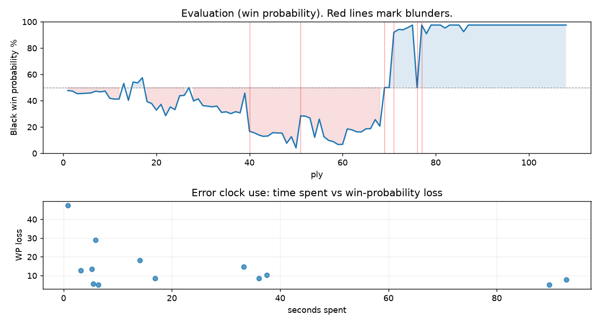

# (free, so lmk) Game analysis: DanielKetterer vs Mirrorwahl

Date: 2026.07.30  |  Time control: rapid (1800)  |  You played: black
Game ID: 270818a7-8c6a-11f1-91da-1f3fb001000f
Analysis: depth=24 multipv=3 findability=honest floor=6 stable_run=3 threads=1 hash_mb=256 deterministic=True engine_id=Stockfish_18 generated=2026-07-31T00:52:38Z
Game end time UTC: 2026-07-30T23:23:48+00:00
Game: https://www.chess.com/game/live/172311344620

## Summary

- Lichess accuracy: you 78.7%, opponent 72.8%
- Opening: B12 Caro-Kann Defense: Advance Variation, Botvinnik-Carls Defense (theory followed through ply 6)
- First deviation from theory: ply 7, Opponent played 4. c3
- Your moves: 31 best, 8 excellent, 2 good, 6 inaccuracy, 5 mistake, 2 blunder

METRICS:

Best: The played move exactly matches Stockfish's top move

Excellent: A non-best move that loses 2 WP points or less.

Good: WP loss is over 2, but under 5 points; also used for losses under 20 when the position remains already decided.

Inaccuracy: WP loss is at least 5 but under 10 points.

Mistake: WP loss is at least 10 but under 20 points; also generally used when a forced mate is missed with under 10 points of WP loss.

Blunder: WP loss is 20 points or more, or a forced mate is missed with at least 10 points of WP loss.

See: https://support.chess.com/en/articles/8572705-how-are-moves-classified-what-is-a-blunder-or-brilliant-etc 

(Brillint, Great and Miss are rating subjective)
- Puzzles: 43 open, 0 solved

### Puzzle gate tally (this game)

Gates: category in ['brilliant_sacrifice', 'missed_tactic', 'allowed_tactic', 'endgame'], refute depth in [3, 8], best-vs-second WP gap >= 5. Refute bar per move: max(5, 0.6 x WP loss).

| outcome | errors |
|---|---|
| category:attention | 3 |
| category:positional | 3 |
| refute_censored_high | 1 |
| refute_too_deep | 1 |
| refute_too_shallow | 2 |
| wp_gap_too_small | 3 |

Four gates pass at once or nothing is generated, so a zero here is a product of four pass rates rather than a fault. Read the binding gate off this table before changing any threshold.

### Sacrifices in the engine's line

Real sacrifices are listed but never served as puzzles: compensation that never resolves back into material has no gradable answer.

| Move | Offered | Kind | Quiet | Line ends | Verdict |
|---|---|---|---|---|---|
| 5 | -3.0 (piece) | sham | yes | +0.0 pawns | opening_ply |
| 7 | -3.0 (piece) | sham | yes | +0.0 pawns | opening_ply |
| 9 | -3.0 (piece) | sham | yes | +0.0 pawns | opening_ply |
| 11 | -5.0 (piece) | sham | yes | +0.0 pawns | puzzle |
| 14 | -3.0 (piece) | sham | yes | +0.0 pawns | desperado |
| 20 | -4.0 (piece) | sham | no | +2.0 pawns | obvious |
| 24 | -3.0 (piece) | real | yes | -2.0 pawns | real_sacrifice_not_gradable |
| 25 | -7.0 (piece) | real | yes | -2.0 pawns | real_sacrifice_not_gradable |

## Biggest missed opportunity

You played 38...Kg6. Stockfish preferred g6, after which the main line runs 38...g6 39. Ke5 h5 40. b5 cxb5 41. gxh5. The evaluation crossed from winning to equal, which matters more than the raw number. Why it went wrong: your king's zone came under heavier attack after this move. This was a judgment error rather than a missed tactic; compare the pawn structure and piece activity after both moves. The engine prefers this move from at or below depth 6, which is as shallow as this measurement resolves; it sits near the surface, a quiet move, but one whose point shows at a glance. Candidates considered by the engine: g6 (-25.32), g5+ (-20.42), Kg8 (-0.53).

## Critical positions

- Ply 12 (you), 6...bxc6: +0.96 -> +0.96 [only-move situation]
- Ply 40 (you), 20...Qd5: +0.46 -> +4.35 [evaluation crossed equal -> losing]
- Ply 41 (opponent), 21.fxg6: +4.35 -> +4.58 [only-move situation]
- Ply 51 (opponent), 26.Bc5: +8.54 -> +2.50
- Ply 52 (you), 26...Rxf1+: +2.50 -> +2.53 [only-move situation]
- Ply 53 (opponent), 27.Kxf1: +2.53 -> +2.73 [only-move situation]
- Ply 57 (opponent), 29.Qxe6+: +5.26 -> +6.02 [only-move situation]
- Ply 59 (opponent), 30.Qxc4: +6.31 -> +7.14 [only-move situation]

## Your errors, move by move

| Move | Class | Category | WP loss | Refute depth | Seconds spent | Pre-error eval |
|---|---|---|---:|---|---:|---|
| 5...a6 | inaccuracy | attention | 6% | 1 | 6 | balanced |
| 7...Bf5 | mistake | allowed_tactic | 13% | 8 | 3 | balanced |
| 9...Ne7 | mistake | attention | 18% | 1 | 14 | balanced |
| 11...Rc8 | inaccuracy | brilliant_sacrifice | 9% | 2 | 17 | balanced |
| 14...Bxd4 | mistake | allowed_tactic | 10% | 8 | 38 | balanced |
| 15...O-O | inaccuracy | positional | 5% | 11 | 6 | balanced |
| 20...Qd5 | blunder | attention | 29% | 1 | 6 | balanced |
| 24...Qc2 | inaccuracy | positional | 8% | 1 | 93 | losing |
| 25...Qxc3 | inaccuracy | allowed_tactic | 9% | 9 | 36 | losing |
| 27...Qf3+ | mistake | missed_tactic | 15% | 3 | 33 | losing |
| 28...h6 | mistake | missed_tactic | 13% | 1 | 5 | losing |
| 34...Qf6+ | inaccuracy | positional | 5% | >18 | 90 | losing |
| 38...Kg6 | blunder | endgame | 48% | >18 | 1 | winning |

### 5...a6 (inaccuracy, positional, wp loss 6%)

You played 5...a6. Stockfish preferred e6, after which the main line runs 5...e6 6. Ba4 Ne7 7. Ne2 Ng6 8. O-O. Why it went wrong: left pawn on c5 insufficiently defended. This was a judgment error rather than a missed tactic; compare the pawn structure and piece activity after both moves. The engine prefers this move from at or below depth 6, which is as shallow as this measurement resolves; it sits near the surface, a quiet move, but one whose point shows at a glance. Candidates considered by the engine: e6 (+0.29), cxd4 (+0.32), Qa5 (+0.44).

### 7...Bf5 (mistake, tactical, wp loss 13%)

You played 7...Bf5. Stockfish preferred e6, after which the main line runs 7...e6 8. Nf3 Nh6 9. Be3 cxd4 10. cxd4. Why it went wrong: left pawn on c5 insufficiently defended. Before committing to a quiet move here, the checklist is checks, captures, threats, in that order. The engine prefers this move from at or below depth 6, which is as shallow as this measurement resolves; it sits near the surface, a forcing move, the kind a checks-and-captures scan catches. Candidates considered by the engine: e6 (-0.34), cxd4 (-0.32), Qb6 (-0.23).

### 9...Ne7 (mistake, tactical, wp loss 18%)

You played 9...Ne7. Stockfish preferred c4, after which the main line runs 9...c4 10. O-O Nh6 11. h3 Bd3 12. Rf2. Why it went wrong: left pawn on c5 insufficiently defended. Before committing to a quiet move here, the checklist is checks, captures, threats, in that order. The engine prefers this move from at or below depth 6, which is as shallow as this measurement resolves; it sits near the surface, a forcing move, the kind a checks-and-captures scan catches. Candidates considered by the engine: c4 (-0.82), Qb8 (-0.31), Rb8 (+0.00).

### 11...Rc8 (inaccuracy, positional, wp loss 9%)

You played 11...Rc8. Stockfish preferred Nh4, after which the main line runs 11...Nh4 12. Qe2 Be4 13. Rg1 Nf5 14. Nd2. The evaluation crossed from equal to losing, which matters more than the raw number. Why it went wrong: motif: creates threat on c5, g2. This was a judgment error rather than a missed tactic; compare the pawn structure and piece activity after both moves. The engine first prefers this move at depth 8 and holds it; findable, but it takes a deliberate look rather than a scan. Candidates considered by the engine: Nh4 (+1.42), Bxb1 (+1.73), Be4 (+1.76).

### 14...Bxd4 (mistake, tactical, wp loss 10%)

You played 14...Bxd4. Stockfish preferred Bb6, after which the main line runs 14...Bb6 15. Bf2 O-O 16. Nb3 Bf5 17. Bxb6. Why it went wrong: left bishop on d4 insufficiently defended. Before committing to a quiet move here, the checklist is checks, captures, threats, in that order. The engine prefers this move from at or below depth 6, which is as shallow as this measurement resolves; it sits near the surface, a forcing move, the kind a checks-and-captures scan catches. Candidates considered by the engine: Bb6 (+0.00), Be7 (+0.47), Bxb1 (+0.72).

### 15...O-O (inaccuracy, positional, wp loss 5%)

You played 15...O-O. Stockfish preferred h5, after which the main line runs 15...h5 16. Nd2 Bf5 17. Qa4 a5 18. bxa5. This was a judgment error rather than a missed tactic; compare the pawn structure and piece activity after both moves. The engine prefers this move from at or below depth 6, which is as shallow as this measurement resolves; it sits near the surface, a quiet move, but one whose point shows at a glance. Candidates considered by the engine: h5 (+0.94), Bf5 (+1.03), Nf8 (+1.30).

### 20...Qd5 (blunder, tactical, wp loss 29%)

You played 20...Qd5. Stockfish preferred exf5, after which the main line runs 20...exf5 21. Rxf5 Qd5 22. Qg4 a5 23. Bc5. The evaluation crossed from equal to losing, which matters more than the raw number. Why it went wrong: left knight on g6 insufficiently defended. Before committing to a quiet move here, the checklist is checks, captures, threats, in that order. The engine prefers this move from at or below depth 6, which is as shallow as this measurement resolves; it sits near the surface, a forcing move, the kind a checks-and-captures scan catches. Candidates considered by the engine: exf5 (+0.46), Ne7 (+2.10), c5 (+2.49).

### 24...Qc2 (inaccuracy, positional, wp loss 8%)

You played 24...Qc2. Stockfish preferred h5, after which the main line runs 24...h5 25. Re1 Qg4 26. Qxc6 Rf3 27. Qe4. Why it went wrong: left pawn on e6, pawn on c6 insufficiently defended. This was a judgment error rather than a missed tactic; compare the pawn structure and piece activity after both moves. The engine does not settle on this move until depth 14; reachable with real calculation, but not on a scan. Candidates considered by the engine: h5 (+4.63), h6 (+4.76), Rxf2 (+4.78).

### 25...Qxc3 (inaccuracy, positional, wp loss 9%)

You played 25...Qxc3. Stockfish preferred Qf5, after which the main line runs 25...Qf5 26. Qxc6 Qg4 27. Re1 h5 28. Qe4. Why it went wrong: left pawn on e6, pawn on c6 insufficiently defended. This was a judgment error rather than a missed tactic; compare the pawn structure and piece activity after both moves. The engine does not settle on this move until depth 15; reachable with real calculation, but not on a scan. Candidates considered by the engine: Qf5 (+5.25), Qe2 (+5.70), Rf7 (+5.74).

### 27...Qf3+ (mistake, tactical, wp loss 15%)

You played 27...Qf3+. Stockfish preferred Qc1+, after which the main line runs 27...Qc1+ 28. Kg2 Qc2+ 29. Bf2 Qe4+ 30. Kf1. Why it went wrong: left pawn on e6 insufficiently defended; the best move was a forcing check. Before committing to a quiet move here, the checklist is checks, captures, threats, in that order. The engine does not settle on this move until depth 21, which is outside what a human reasonably calculates over the board; this is not a training target. Candidates considered by the engine: Qc1+ (+2.73), h5 (+3.05), h6 (+3.51).

### 28...h6 (mistake, tactical, wp loss 13%)

You played 28...h6. Stockfish preferred Qc3+, after which the main line runs 28...Qc3+ 29. Kf1 Qc1+ 30. Kg2 Qc2+ 31. Bf2. Why it went wrong: left pawn on e6 insufficiently defended; the best move was a forcing check. Before committing to a quiet move here, the checklist is checks, captures, threats, in that order. The engine does not settle on this move until depth 21, which is outside what a human reasonably calculates over the board; this is not a training target. Candidates considered by the engine: Qc3+ (+2.84), Qh1+ (+3.24), Qe4+ (+3.78).

### 34...Qf6+ (inaccuracy, positional, wp loss 5%)

You played 34...Qf6+. Stockfish preferred h5, after which the main line runs 34...h5 35. Bf2 Qa1 36. gxh5 Qd1+ 37. Ke3. Why it went wrong: left pawn on a6 insufficiently defended. This was a judgment error rather than a missed tactic; compare the pawn structure and piece activity after both moves. The engine never settles on this move within the analysis depth, so how findable it was is not measured here; weigh this one lightly. Candidates considered by the engine: h5 (+2.89), Qh2 (+3.10), Qa1 (+3.36).

### 38...Kg6 (blunder, positional, wp loss 48%)

You played 38...Kg6. Stockfish preferred g6, after which the main line runs 38...g6 39. Ke5 h5 40. b5 cxb5 41. gxh5. The evaluation crossed from winning to equal, which matters more than the raw number. Why it went wrong: your king's zone came under heavier attack after this move. This was a judgment error rather than a missed tactic; compare the pawn structure and piece activity after both moves. The engine prefers this move from at or below depth 6, which is as shallow as this measurement resolves; it sits near the surface, a quiet move, but one whose point shows at a glance. Candidates considered by the engine: g6 (-25.32), g5+ (-20.42), Kg8 (-0.53).

## Full move table

| Ply | Move | Eval before | Eval after | Best | CP loss | WP loss | Class |
|-----|------|-------------|------------|------|---------|---------|-------|
| 1 | 1.e4 | +0.31 | +0.25 | e4 | 6 | 1% | best |
| 2 | 1...c6* | +0.25 | +0.29 | e5 | 4 | 0% | excellent |
| 3 | 2.d4 | +0.29 | +0.51 | c3 | 0 | 0% | excellent |
| 4 | 2...d5* | +0.51 | +0.49 | d5 | 0 | 0% | best |
| 5 | 3.e5 | +0.49 | +0.47 | e5 | 2 | 0% | best |
| 6 | 3...c5* | +0.47 | +0.44 | c5 | 0 | 0% | best |
| 7 | 4.c3 | +0.44 | +0.30 | Nf3 | 14 | 1% | excellent |
| 8 | 4...Nc6* | +0.30 | +0.36 | Nc6 | 6 | 1% | best |
| 9 | 5.Bb5 | +0.36 | +0.29 | Be2 | 7 | 1% | excellent |
| 10 | 5...a6* | +0.29 | +0.90 | e6 | 61 | 6% | inaccuracy |
| 11 | 6.Bxc6+ | +0.90 | +0.96 | Bxc6+ | 0 | 0% | best |
| 12 | 6...bxc6* | +0.96 | +0.96 | bxc6 | 0 | 0% | best |
| 13 | 7.f4 | +0.96 | -0.34 | dxc5 | 130 | 12% | mistake |
| 14 | 7...Bf5* | -0.34 | +1.07 | e6 | 141 | 13% | mistake |
| 15 | 8.Nf3 | +1.07 | -0.46 | dxc5 | 153 | 14% | mistake |
| 16 | 8...e6* | -0.46 | -0.39 | e6 | 7 | 1% | best |
| 17 | 9.Be3 | -0.39 | -0.82 | b3 | 43 | 4% | good |
| 18 | 9...Ne7* | -0.82 | +1.18 | c4 | 200 | 18% | mistake |
| 19 | 10.dxc5 | +1.18 | +1.35 | dxc5 | 0 | 0% | best |
| 20 | 10...Ng6* | +1.35 | +1.94 | a5 | 59 | 5% | good |
| 21 | 11.Nd4 | +1.94 | +1.42 | O-O | 52 | 4% | good |
| 22 | 11...Rc8* | +1.42 | +2.48 | Nh4 | 106 | 9% | inaccuracy |
| 23 | 12.g3 | +2.48 | +1.65 | Nxf5 | 83 | 7% | inaccuracy |
| 24 | 12...Be4* | +1.65 | +1.90 | Be4 | 25 | 2% | best |
| 25 | 13.O-O | +1.90 | +0.68 | Rf1 | 122 | 11% | mistake |
| 26 | 13...Bxc5* | +0.68 | +0.65 | Bxb1 | 0 | 0% | excellent |
| 27 | 14.b4 | +0.65 | +0.00 | Nd2 | 65 | 6% | inaccuracy |
| 28 | 14...Bxd4* | +0.00 | +1.12 | Bb6 | 112 | 10% | mistake |
| 29 | 15.Bxd4 | +1.12 | +0.94 | Bxd4 | 18 | 2% | best |
| 30 | 15...O-O* | +0.94 | +1.53 | h5 | 59 | 5% | inaccuracy |
| 31 | 16.Nd2 | +1.53 | +1.58 | Nd2 | 0 | 0% | best |
| 32 | 16...Bd3* | +1.58 | +1.64 | Re8 | 6 | 1% | excellent |
| 33 | 17.Rf3 | +1.64 | +1.57 | Rf2 | 7 | 1% | excellent |
| 34 | 17...Bb5* | +1.57 | +2.16 | Bf5 | 59 | 5% | good |
| 35 | 18.a4 | +2.16 | +2.10 | a4 | 6 | 0% | best |
| 36 | 18...Bc4* | +2.10 | +2.28 | Bc4 | 18 | 1% | best |
| 37 | 19.Nxc4 | +2.28 | +2.09 | Bc5 | 19 | 1% | excellent |
| 38 | 19...dxc4* | +2.09 | +2.20 | dxc4 | 11 | 1% | best |
| 39 | 20.f5 | +2.20 | +0.46 | Qe2 | 174 | 15% | mistake |
| 40 | 20...Qd5* | +0.46 | +4.35 | exf5 | 389 | 29% | blunder |
| 41 | 21.fxg6 | +4.35 | +4.58 | fxg6 | 0 | 0% | best |
| 42 | 21...fxg6* | +4.58 | +4.94 | hxg6 | 36 | 2% | excellent |
| 43 | 22.Rxf8+ | +4.94 | +5.19 | Rxf8+ | 0 | 0% | best |
| 44 | 22...Rxf8* | +5.19 | +5.11 | Rxf8 | 0 | 0% | best |
| 45 | 23.Bf2 | +5.11 | +4.57 | Bc5 | 54 | 2% | good |
| 46 | 23...Qe4* | +4.57 | +4.61 | Qe4 | 4 | 0% | best |
| 47 | 24.Qd6 | +4.61 | +4.63 | Qd6 | 0 | 0% | best |
| 48 | 24...Qc2* | +4.63 | +6.75 | h5 | 212 | 8% | inaccuracy |
| 49 | 25.Rf1 | +6.75 | +5.25 | Bc5 | 150 | 5% | good |
| 50 | 25...Qxc3* | +5.25 | +8.54 | Qf5 | 329 | 9% | inaccuracy |
| 51 | 26.Bc5 | +8.54 | +2.50 | Qxf8+ | 604 | 24% | blunder |
| 52 | 26...Rxf1+* | +2.50 | +2.53 | Rxf1+ | 3 | 0% | best |
| 53 | 27.Kxf1 | +2.53 | +2.73 | Kxf1 | 0 | 0% | best |
| 54 | 27...Qf3+* | +2.73 | +5.37 | Qc1+ | 264 | 15% | mistake |
| 55 | 28.Ke1 | +5.37 | +2.84 | Kg1 | 253 | 14% | mistake |
| 56 | 28...h6* | +2.84 | +5.26 | Qc3+ | 242 | 13% | mistake |
| 57 | 29.Qxe6+ | +5.26 | +6.02 | Qxe6+ | 0 | 0% | best |
| 58 | 29...Kh7* | +6.02 | +6.31 | Kh7 | 29 | 1% | best |
| 59 | 30.Qxc4 | +6.31 | +7.14 | Qxc4 | 0 | 0% | best |
| 60 | 30...Qh1+* | +7.14 | +7.12 | Qh1+ | 0 | 0% | best |
| 61 | 31.Kf2 | +7.12 | +4.02 | Kd2 | 310 | 12% | mistake |
| 62 | 31...Qxh2+* | +4.02 | +4.14 | Qxh2+ | 12 | 1% | best |
| 63 | 32.Kf3 | +4.14 | +4.44 | Kf3 | 0 | 0% | best |
| 64 | 32...Qh5+* | +4.44 | +4.46 | Qh5+ | 2 | 0% | best |
| 65 | 33.g4 | +4.46 | +4.01 | Kg2 | 45 | 2% | good |
| 66 | 33...Qxe5* | +4.01 | +3.98 | Qxe5 | 0 | 0% | best |
| 67 | 34.Be3 | +3.98 | +2.89 | a5 | 109 | 7% | inaccuracy |
| 68 | 34...Qf6+* | +2.89 | +3.66 | h5 | 77 | 5% | inaccuracy |
| 69 | 35.Bf4 | +3.66 | +0.00 | Ke2 | 366 | 29% | blunder |
| 70 | 35...g5* | +0.00 | +0.00 | g5 | 0 | 0% | best |
| 71 | 36.a5 | +0.00 | -6.59 | b5 | 659 | 42% | blunder |
| 72 | 36...Qxf4+* | -6.59 | -7.57 | Qxf4+ | 0 | 0% | best |
| 73 | 37.Qxf4 | -7.57 | -7.45 | Qxf4 | 0 | 0% | best |
| 74 | 37...gxf4* | -7.45 | -8.36 | gxf4 | 0 | 0% | best |
| 75 | 38.Kxf4 | -8.36 | -25.32 | Kxf4 | 1696 | 2% | best |
| 76 | 38...Kg6* | -25.32 | +0.00 | g6 | 2532 | 48% | blunder |
| 77 | 39.Ke4 | +0.00 | -76.63 | Ke5 | 7663 | 48% | blunder |
| 78 | 39...Kg5* | -76.63 | -6.26 | Kg5 | 7037 | 7% | best |
| 79 | 40.Kd4 | -6.26 | -M24 | Kd4 |  | 7% | best |
| 80 | 40...Kxg4* | -M24 | -69.38 | Kxg4 |  | 0% | best |
| 81 | 41.Kc5 | -69.38 | -63.09 | Kc5 | 0 | 0% | best |
| 82 | 41...h5* | -63.09 | -8.17 | h5 | 5492 | 2% | best |
| 83 | 42.Kb6 | -8.17 | -62.27 | Kxc6 | 5410 | 2% | good |
| 84 | 42...h4* | -62.27 | -M23 | h4 |  | 0% | best |
| 85 | 43.Kxa6 | -M23 | -M22 | Kb7 |  | 0% | excellent |
| 86 | 43...h3* | -M22 | -6.82 | h3 |  | 5% | best |
| 87 | 44.Kb7 | -6.82 | -M19 | Kb6 |  | 5% | inaccuracy |
| 88 | 44...h2* | -M19 | -75.76 | h2 |  | 0% | best |
| 89 | 45.a6 | -75.76 | -M17 | Kc8 |  | 0% | excellent |
| 90 | 45...h1=Q* | -M17 | -M15 | h1=Q |  | 0% | best |
| 91 | 46.a7 | -M15 | -M15 | a7 |  | 0% | best |
| 92 | 46...c5+* | -M15 | -M14 | c5+ |  | 0% | best |
| 93 | 47.Kc8 | -M14 | -M8 | Kb8 |  | 0% | excellent |
| 94 | 47...cxb4* | -M8 | -M13 | Qa8+ |  | 0% | excellent |
| 95 | 48.a8=Q | -M13 | -M6 | Kb8 |  | 0% | excellent |
| 96 | 48...Qxa8+* | -M6 | -M5 | Qxa8+ |  | 0% | best |
| 97 | 49.Kc7 | -M5 | -M5 | Kd7 |  | 0% | excellent |
| 98 | 49...Qa6* | -M5 | -M6 | Qd5 |  | 0% | excellent |
| 99 | 50.Kd7 | -M6 | -M6 | Kd7 |  | 0% | best |
| 100 | 50...b3* | -M6 | -M5 | Qb7+ |  | 0% | excellent |
| 101 | 51.Ke7 | -M5 | -M5 | Ke7 |  | 0% | best |
| 102 | 51...b2* | -M5 | -M4 | b2 |  | 0% | best |
| 103 | 52.Kf7 | -M4 | -M3 | Kf8 |  | 0% | excellent |
| 104 | 52...b1=Q* | -M3 | -M2 | b1=Q |  | 0% | best |
| 105 | 53.Kxg7 | -M2 | -M2 | Kf8 |  | 0% | excellent |
| 106 | 53...Qbb7+* | -M2 | -M1 | Qa7+ |  | 0% | excellent |
| 107 | 54.Kg8 | -M1 | -M1 | Kh8 |  | 0% | excellent |
| 108 | 54...Qaa8#* | -M1 | -M1 | Qaa8# |  | 0% | best |

Rows marked * are your moves. WP loss is win-probability loss; it is the primary signal, CP loss is shown for reference.

## Patterns in this game

- Error categories: 3 allowed_tactic, 3 attention, 1 brilliant_sacrifice, 1 endgame, 2 missed_tactic, 3 positional.
- Attention errors per 100 moves: 5.6.
- Pre-error eval buckets: 1 winning, 7 balanced, 5 losing.
- Opening: 3 error(s) (avg wp loss 12%).
- Middlegame: 8 error(s) (avg wp loss 12%).
- Endgame: 2 error(s) (avg wp loss 26%).
