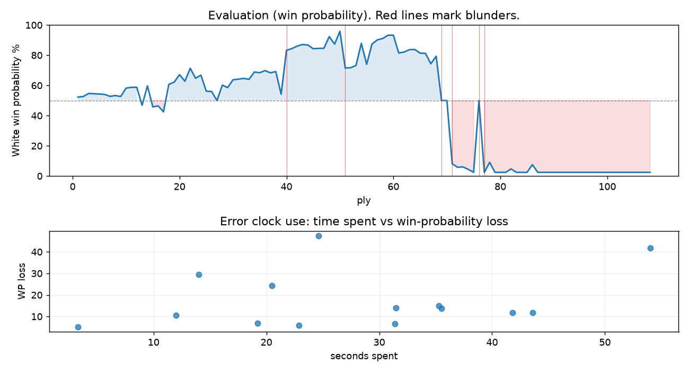

# (free, so lmk) Game analysis: DanielKetterer vs Mirrorwahl

Date: 2026.07.30  |  Time control: rapid (1800)  |  You played: white
Game ID: 270818a7-8c6a-11f1-91da-1f3fb001000f
Analysis: depth=24 multipv=3 findability=honest floor=6 stable_run=3 threads=1 hash_mb=256 deterministic=True engine_id=Stockfish_18 generated=2026-07-31T00:52:38Z
Game end time UTC: 2026-07-30T23:23:48+00:00
Game: https://www.chess.com/game/live/172311344620

## Summary

- Lichess accuracy: you 72.8%, opponent 78.7%
- Opening: B12 Caro-Kann Defense: Advance Variation, Botvinnik-Carls Defense (theory followed through ply 6)
- First deviation from theory: ply 7, You played 4. c3
- Your moves: 21 best, 13 excellent, 6 good, 4 inaccuracy, 6 mistake, 4 blunder

METRICS:

Best: The played move exactly matches Stockfish's top move

Excellent: A non-best move that loses 2 WP points or less.

Good: WP loss is over 2, but under 5 points; also used for losses under 20 when the position remains already decided.

Inaccuracy: WP loss is at least 5 but under 10 points.

Mistake: WP loss is at least 10 but under 20 points; also generally used when a forced mate is missed with under 10 points of WP loss.

Blunder: WP loss is 20 points or more, or a forced mate is missed with at least 10 points of WP loss.

See: https://support.chess.com/en/articles/8572705-how-are-moves-classified-what-is-a-blunder-or-brilliant-etc 

(Brillint, Great and Miss are rating subjective)
- Puzzles: 43 open, 0 solved

### Puzzle gate tally (this game)

Gates: category in ['brilliant_sacrifice', 'missed_tactic', 'allowed_tactic', 'endgame'], refute depth in [3, 8], best-vs-second WP gap >= 5. Refute bar per move: max(5, 0.6 x WP loss).

| outcome | errors |
|---|---|
| accepted | 1 |
| category:attention | 4 |
| category:positional | 2 |
| refute_too_deep | 2 |
| refute_too_shallow | 3 |
| wp_gap_too_small | 2 |

Four gates pass at once or nothing is generated, so a zero here is a product of four pass rates rather than a fault. Read the binding gate off this table before changing any threshold.

### Sacrifices in the engine's line

Real sacrifices are listed but never served as puzzles: compensation that never resolves back into material has no gradable answer.

| Move | Offered | Kind | Quiet | Line ends | Verdict |
|---|---|---|---|---|---|
| 7 | -7.0 (piece) | sham | no | +1.0 pawns | opening_ply |
| 8 | -9.0 (piece) | sham | no | +0.0 pawns | opening_ply |
| 12 | -3.0 (piece) | sham | no | +0.0 pawns | obvious |
| 14 | -9.0 (piece) | sham | yes | +1.0 pawns | obvious |
| 26 | -4.0 (piece) | sham | no | +8.0 pawns | eval_out_of_band |
| 44 | -9.0 (piece) | real | yes | -1.0 pawns | real_sacrifice_not_gradable |

## Biggest missed opportunity

You played 39.Ke4. Stockfish preferred Ke5, after which the main line runs 39. Ke5 Kg5 40. Kd6 Kxg4 41. Kxc6 h5. The evaluation crossed from equal to losing, which matters more than the raw number. This was a judgment error rather than a missed tactic; compare the pawn structure and piece activity after both moves. The engine prefers this move from at or below depth 6, which is as shallow as this measurement resolves; it sits near the surface, a quiet move, but one whose point shows at a glance. Candidates considered by the engine: Ke5 (+0.00), Kg3 (-35.92), Ke4 (-36.76).

## Critical positions

- Ply 12 (opponent), 6...bxc6: +0.96 -> +0.96 [only-move situation]
- Ply 40 (opponent), 20...Qd5: +0.46 -> +4.35 [evaluation crossed equal -> losing]
- Ply 41 (you), 21.fxg6: +4.35 -> +4.58 [only-move situation]
- Ply 51 (you), 26.Bc5: +8.54 -> +2.50
- Ply 52 (opponent), 26...Rxf1+: +2.50 -> +2.53 [only-move situation]
- Ply 53 (you), 27.Kxf1: +2.53 -> +2.73 [only-move situation]
- Ply 57 (you), 29.Qxe6+: +5.26 -> +6.02 [only-move situation]
- Ply 59 (you), 30.Qxc4: +6.31 -> +7.14 [only-move situation]

## Your errors, move by move

| Move | Class | Category | WP loss | Refute depth | Seconds spent | Pre-error eval |
|---|---|---|---:|---|---:|---|
| 7.f4 | mistake | attention | 12% | 1 | 44 | balanced |
| 8.Nf3 | mistake | missed_tactic | 14% | 4 | 32 | balanced |
| 12.g3 | inaccuracy | attention | 7% | 1 | 31 | winning |
| 13.O-O | mistake | allowed_tactic | 11% | 3 | 12 | winning |
| 14.b4 | inaccuracy | positional | 6% | 15 | 23 | balanced |
| 20.f5 | mistake | allowed_tactic | 15% | 1 | 35 | winning |
| 26.Bc5 | blunder | missed_tactic | 24% | 1 | 20 | winning |
| 28.Ke1 | mistake | attention | 14% | 2 | 36 | winning |
| 31.Kf2 | mistake | missed_tactic | 12% | 1 | 42 | winning |
| 34.Be3 | inaccuracy | positional | 7% | >18 | 19 | winning |
| 35.Bf4 | blunder | allowed_tactic | 29% | 3 | 14 | winning |
| 36.a5 | blunder | missed_tactic | 42% | 11 | 54 | balanced |
| 39.Ke4 | blunder | endgame | 48% | 11 | 25 | balanced |
| 44.Kb7 | inaccuracy | attention | 5% | 1 | 3 | losing |

### 7.f4 (mistake, tactical, wp loss 12%)

You played 7.f4. Stockfish preferred dxc5, after which the main line runs 7. dxc5 e6 8. b4 a5 9. f4 d4. Why it went wrong: a favorable capture was available (dxc5). Before committing to a quiet move here, the checklist is checks, captures, threats, in that order. The engine prefers this move from at or below depth 6, which is as shallow as this measurement resolves; it sits near the surface, a forcing move, the kind a checks-and-captures scan catches. Candidates considered by the engine: dxc5 (+0.96), Ne2 (+0.55), h4 (+0.36).

### 8.Nf3 (mistake, tactical, wp loss 14%)

You played 8.Nf3. Stockfish preferred dxc5, after which the main line runs 8. dxc5 e6 9. b4 a5 10. Nf3 Qb8. Why it went wrong: a favorable capture was available (dxc5). Before committing to a quiet move here, the checklist is checks, captures, threats, in that order. The engine prefers this move from at or below depth 6, which is as shallow as this measurement resolves; it sits near the surface, a forcing move, the kind a checks-and-captures scan catches. Candidates considered by the engine: dxc5 (+1.07), Qa4 (-0.09), b3 (-0.29).

### 12.g3 (inaccuracy, positional, wp loss 7%)

You played 12.g3. Stockfish preferred Nxf5, after which the main line runs 12. Nxf5 exf5 13. O-O Be7 14. Qd3 a5. The evaluation crossed from winning to equal, which matters more than the raw number. Why it went wrong: left pawn on c5 insufficiently defended. This was a judgment error rather than a missed tactic; compare the pawn structure and piece activity after both moves. The engine prefers this move from at or below depth 6, which is as shallow as this measurement resolves; it sits near the surface, a quiet move, but one whose point shows at a glance. Candidates considered by the engine: Nxf5 (+2.48), Qe2 (+2.12), Nd2 (+2.03).

### 13.O-O (mistake, tactical, wp loss 11%)

You played 13.O-O. Stockfish preferred Rf1, after which the main line runs 13. Rf1 Qd7 14. b4 f6 15. Nd2 Bd3. The evaluation crossed from winning to equal, which matters more than the raw number. Why it went wrong: left pawn on c5 insufficiently defended; your king's zone came under heavier attack after this move. Before committing to a quiet move here, the checklist is checks, captures, threats, in that order. The engine does not settle on this move until depth 15; reachable with real calculation, but not on a scan. Candidates considered by the engine: Rf1 (+1.90), Rg1 (+1.68), Nf3 (+1.60).

### 14.b4 (inaccuracy, positional, wp loss 6%)

You played 14.b4. Stockfish preferred Nd2, after which the main line runs 14. Nd2 Bd3 15. Rf3 Bb6 16. Bf2 Be4. This was a judgment error rather than a missed tactic; compare the pawn structure and piece activity after both moves. The engine prefers this move from at or below depth 6, which is as shallow as this measurement resolves; it sits near the surface, a quiet move, but one whose point shows at a glance. Candidates considered by the engine: Nd2 (+0.65), Qe2 (+0.24), b4 (+0.16).

### 20.f5 (mistake, positional, wp loss 15%)

You played 20.f5. Stockfish preferred Qe2, after which the main line runs 20. Qe2 Ne7 21. Bc5 a5 22. Qxc4 Re8. The evaluation crossed from winning to equal, which matters more than the raw number. Why it went wrong: motif: creates threat on c4. This was a judgment error rather than a missed tactic; compare the pawn structure and piece activity after both moves. The engine does not settle on this move until depth 11; reachable with real calculation, but not on a scan. Candidates considered by the engine: Qe2 (+2.20), Bc5 (+2.12), Rf2 (+2.08).

### 26.Bc5 (blunder, tactical, wp loss 24%)

You played 26.Bc5. Stockfish preferred Qxf8+, after which the main line runs 26. Qxf8+ Kxf8 27. Bd4+ Qf3 28. Rxf3+ Kg8. Why it went wrong: a favorable capture was available (Qxe6+); the best move was a forcing check. Before committing to a quiet move here, the checklist is checks, captures, threats, in that order. The engine does not settle on this move until depth 12; reachable with real calculation, but not on a scan. Candidates considered by the engine: Qxf8+ (+8.54), Qxe6+ (+7.47), b5 (+6.19).

### 28.Ke1 (mistake, positional, wp loss 14%)

You played 28.Ke1. Stockfish preferred Kg1, after which the main line runs 28. Kg1 h5 29. Qxe6+ Kh8 30. Qxc4 Qd1+. Why it went wrong: motif: creates threat on e6. This was a judgment error rather than a missed tactic; compare the pawn structure and piece activity after both moves. The engine prefers this move from at or below depth 6, which is as shallow as this measurement resolves; it sits near the surface, a quiet move, but one whose point shows at a glance. Candidates considered by the engine: Kg1 (+5.37), Bf2 (+2.94), Ke1 (+2.72).

### 31.Kf2 (mistake, tactical, wp loss 12%)

You played 31.Kf2. Stockfish preferred Kd2, after which the main line runs 31. Kd2 Qg2+ 32. Qe2 Qd5+ 33. Kc3 Qe6. Why it went wrong: left pawn on h2 insufficiently defended; motif: creates threat on a6; your king's zone came under heavier attack after this move. Before committing to a quiet move here, the checklist is checks, captures, threats, in that order. The engine first prefers this move at depth 10 and holds it; findable, but it takes a deliberate look rather than a scan. Candidates considered by the engine: Kd2 (+7.12), Ke2 (+5.54), Qf1 (+5.04).

### 34.Be3 (inaccuracy, positional, wp loss 7%)

You played 34.Be3. Stockfish preferred a5, after which the main line runs 34. a5 h5 35. gxh5 Qxh5+ 36. Ke3 Qg5+. Why it went wrong: motif: creates threat on a6. This was a judgment error rather than a missed tactic; compare the pawn structure and piece activity after both moves. The engine prefers this move from at or below depth 6, which is as shallow as this measurement resolves; it sits near the surface, a quiet move, but one whose point shows at a glance. Candidates considered by the engine: a5 (+3.98), Bd4 (+3.77), Qd4 (+3.49).

### 35.Bf4 (blunder, positional, wp loss 29%)

You played 35.Bf4. Stockfish preferred Ke2, after which the main line runs 35. Ke2 Qh4 36. Qe4 Qh2+ 37. Bf2 Kh8. The evaluation crossed from winning to equal, which matters more than the raw number. Why it went wrong: motif: creates threat on a6. This was a judgment error rather than a missed tactic; compare the pawn structure and piece activity after both moves. The engine prefers this move from at or below depth 6, which is as shallow as this measurement resolves; it sits near the surface, a quiet move, but one whose point shows at a glance. Candidates considered by the engine: Ke2 (+3.66), Kg2 (+3.20), Kg3 (+2.97).

### 36.a5 (blunder, tactical, wp loss 42%)

You played 36.a5. Stockfish preferred b5, after which the main line runs 36. b5 cxb5 37. Qe4+ g6 38. Qb7+ Kg8. The evaluation crossed from equal to losing, which matters more than the raw number. Why it went wrong: left bishop on f4 insufficiently defended; motif: fork; creates threat on a6. Before committing to a quiet move here, the checklist is checks, captures, threats, in that order. The engine first prefers this move at depth 8 and holds it; findable, but it takes a deliberate look rather than a scan. Candidates considered by the engine: b5 (+0.00), Qe4+ (+0.00), Kg2 (+0.00).

### 39.Ke4 (blunder, positional, wp loss 48%)

You played 39.Ke4. Stockfish preferred Ke5, after which the main line runs 39. Ke5 Kg5 40. Kd6 Kxg4 41. Kxc6 h5. The evaluation crossed from equal to losing, which matters more than the raw number. This was a judgment error rather than a missed tactic; compare the pawn structure and piece activity after both moves. The engine prefers this move from at or below depth 6, which is as shallow as this measurement resolves; it sits near the surface, a quiet move, but one whose point shows at a glance. Candidates considered by the engine: Ke5 (+0.00), Kg3 (-35.92), Ke4 (-36.76).

### 44.Kb7 (inaccuracy, positional, wp loss 5%)

You played 44.Kb7. Stockfish preferred Kb6, after which the main line runs 44. Kb6 h2 45. a6 h1=Q 46. a7 Qa1. Why it went wrong: motif: creates threat on c6. This was a judgment error rather than a missed tactic; compare the pawn structure and piece activity after both moves. The engine prefers this move from at or below depth 6, which is as shallow as this measurement resolves; it sits near the surface, a quiet move, but one whose point shows at a glance. Candidates considered by the engine: Kb6 (-6.82), Kb7 (-70.50), Ka7 (-M17).

## Full move table

| Ply | Move | Eval before | Eval after | Best | CP loss | WP loss | Class |
|-----|------|-------------|------------|------|---------|---------|-------|
| 1 | 1.e4* | +0.31 | +0.25 | e4 | 6 | 1% | best |
| 2 | 1...c6 | +0.25 | +0.29 | e5 | 4 | 0% | excellent |
| 3 | 2.d4* | +0.29 | +0.51 | c3 | 0 | 0% | excellent |
| 4 | 2...d5 | +0.51 | +0.49 | d5 | 0 | 0% | best |
| 5 | 3.e5* | +0.49 | +0.47 | e5 | 2 | 0% | best |
| 6 | 3...c5 | +0.47 | +0.44 | c5 | 0 | 0% | best |
| 7 | 4.c3* | +0.44 | +0.30 | Nf3 | 14 | 1% | excellent |
| 8 | 4...Nc6 | +0.30 | +0.36 | Nc6 | 6 | 1% | best |
| 9 | 5.Bb5* | +0.36 | +0.29 | Be2 | 7 | 1% | excellent |
| 10 | 5...a6 | +0.29 | +0.90 | e6 | 61 | 6% | inaccuracy |
| 11 | 6.Bxc6+* | +0.90 | +0.96 | Bxc6+ | 0 | 0% | best |
| 12 | 6...bxc6 | +0.96 | +0.96 | bxc6 | 0 | 0% | best |
| 13 | 7.f4* | +0.96 | -0.34 | dxc5 | 130 | 12% | mistake |
| 14 | 7...Bf5 | -0.34 | +1.07 | e6 | 141 | 13% | mistake |
| 15 | 8.Nf3* | +1.07 | -0.46 | dxc5 | 153 | 14% | mistake |
| 16 | 8...e6 | -0.46 | -0.39 | e6 | 7 | 1% | best |
| 17 | 9.Be3* | -0.39 | -0.82 | b3 | 43 | 4% | good |
| 18 | 9...Ne7 | -0.82 | +1.18 | c4 | 200 | 18% | mistake |
| 19 | 10.dxc5* | +1.18 | +1.35 | dxc5 | 0 | 0% | best |
| 20 | 10...Ng6 | +1.35 | +1.94 | a5 | 59 | 5% | good |
| 21 | 11.Nd4* | +1.94 | +1.42 | O-O | 52 | 4% | good |
| 22 | 11...Rc8 | +1.42 | +2.48 | Nh4 | 106 | 9% | inaccuracy |
| 23 | 12.g3* | +2.48 | +1.65 | Nxf5 | 83 | 7% | inaccuracy |
| 24 | 12...Be4 | +1.65 | +1.90 | Be4 | 25 | 2% | best |
| 25 | 13.O-O* | +1.90 | +0.68 | Rf1 | 122 | 11% | mistake |
| 26 | 13...Bxc5 | +0.68 | +0.65 | Bxb1 | 0 | 0% | excellent |
| 27 | 14.b4* | +0.65 | +0.00 | Nd2 | 65 | 6% | inaccuracy |
| 28 | 14...Bxd4 | +0.00 | +1.12 | Bb6 | 112 | 10% | mistake |
| 29 | 15.Bxd4* | +1.12 | +0.94 | Bxd4 | 18 | 2% | best |
| 30 | 15...O-O | +0.94 | +1.53 | h5 | 59 | 5% | inaccuracy |
| 31 | 16.Nd2* | +1.53 | +1.58 | Nd2 | 0 | 0% | best |
| 32 | 16...Bd3 | +1.58 | +1.64 | Re8 | 6 | 1% | excellent |
| 33 | 17.Rf3* | +1.64 | +1.57 | Rf2 | 7 | 1% | excellent |
| 34 | 17...Bb5 | +1.57 | +2.16 | Bf5 | 59 | 5% | good |
| 35 | 18.a4* | +2.16 | +2.10 | a4 | 6 | 0% | best |
| 36 | 18...Bc4 | +2.10 | +2.28 | Bc4 | 18 | 1% | best |
| 37 | 19.Nxc4* | +2.28 | +2.09 | Bc5 | 19 | 1% | excellent |
| 38 | 19...dxc4 | +2.09 | +2.20 | dxc4 | 11 | 1% | best |
| 39 | 20.f5* | +2.20 | +0.46 | Qe2 | 174 | 15% | mistake |
| 40 | 20...Qd5 | +0.46 | +4.35 | exf5 | 389 | 29% | blunder |
| 41 | 21.fxg6* | +4.35 | +4.58 | fxg6 | 0 | 0% | best |
| 42 | 21...fxg6 | +4.58 | +4.94 | hxg6 | 36 | 2% | excellent |
| 43 | 22.Rxf8+* | +4.94 | +5.19 | Rxf8+ | 0 | 0% | best |
| 44 | 22...Rxf8 | +5.19 | +5.11 | Rxf8 | 0 | 0% | best |
| 45 | 23.Bf2* | +5.11 | +4.57 | Bc5 | 54 | 2% | good |
| 46 | 23...Qe4 | +4.57 | +4.61 | Qe4 | 4 | 0% | best |
| 47 | 24.Qd6* | +4.61 | +4.63 | Qd6 | 0 | 0% | best |
| 48 | 24...Qc2 | +4.63 | +6.75 | h5 | 212 | 8% | inaccuracy |
| 49 | 25.Rf1* | +6.75 | +5.25 | Bc5 | 150 | 5% | good |
| 50 | 25...Qxc3 | +5.25 | +8.54 | Qf5 | 329 | 9% | inaccuracy |
| 51 | 26.Bc5* | +8.54 | +2.50 | Qxf8+ | 604 | 24% | blunder |
| 52 | 26...Rxf1+ | +2.50 | +2.53 | Rxf1+ | 3 | 0% | best |
| 53 | 27.Kxf1* | +2.53 | +2.73 | Kxf1 | 0 | 0% | best |
| 54 | 27...Qf3+ | +2.73 | +5.37 | Qc1+ | 264 | 15% | mistake |
| 55 | 28.Ke1* | +5.37 | +2.84 | Kg1 | 253 | 14% | mistake |
| 56 | 28...h6 | +2.84 | +5.26 | Qc3+ | 242 | 13% | mistake |
| 57 | 29.Qxe6+* | +5.26 | +6.02 | Qxe6+ | 0 | 0% | best |
| 58 | 29...Kh7 | +6.02 | +6.31 | Kh7 | 29 | 1% | best |
| 59 | 30.Qxc4* | +6.31 | +7.14 | Qxc4 | 0 | 0% | best |
| 60 | 30...Qh1+ | +7.14 | +7.12 | Qh1+ | 0 | 0% | best |
| 61 | 31.Kf2* | +7.12 | +4.02 | Kd2 | 310 | 12% | mistake |
| 62 | 31...Qxh2+ | +4.02 | +4.14 | Qxh2+ | 12 | 1% | best |
| 63 | 32.Kf3* | +4.14 | +4.44 | Kf3 | 0 | 0% | best |
| 64 | 32...Qh5+ | +4.44 | +4.46 | Qh5+ | 2 | 0% | best |
| 65 | 33.g4* | +4.46 | +4.01 | Kg2 | 45 | 2% | good |
| 66 | 33...Qxe5 | +4.01 | +3.98 | Qxe5 | 0 | 0% | best |
| 67 | 34.Be3* | +3.98 | +2.89 | a5 | 109 | 7% | inaccuracy |
| 68 | 34...Qf6+ | +2.89 | +3.66 | h5 | 77 | 5% | inaccuracy |
| 69 | 35.Bf4* | +3.66 | +0.00 | Ke2 | 366 | 29% | blunder |
| 70 | 35...g5 | +0.00 | +0.00 | g5 | 0 | 0% | best |
| 71 | 36.a5* | +0.00 | -6.59 | b5 | 659 | 42% | blunder |
| 72 | 36...Qxf4+ | -6.59 | -7.57 | Qxf4+ | 0 | 0% | best |
| 73 | 37.Qxf4* | -7.57 | -7.45 | Qxf4 | 0 | 0% | best |
| 74 | 37...gxf4 | -7.45 | -8.36 | gxf4 | 0 | 0% | best |
| 75 | 38.Kxf4* | -8.36 | -25.32 | Kxf4 | 1696 | 2% | best |
| 76 | 38...Kg6 | -25.32 | +0.00 | g6 | 2532 | 48% | blunder |
| 77 | 39.Ke4* | +0.00 | -76.63 | Ke5 | 7663 | 48% | blunder |
| 78 | 39...Kg5 | -76.63 | -6.26 | Kg5 | 7037 | 7% | best |
| 79 | 40.Kd4* | -6.26 | -M24 | Kd4 |  | 7% | best |
| 80 | 40...Kxg4 | -M24 | -69.38 | Kxg4 |  | 0% | best |
| 81 | 41.Kc5* | -69.38 | -63.09 | Kc5 | 0 | 0% | best |
| 82 | 41...h5 | -63.09 | -8.17 | h5 | 5492 | 2% | best |
| 83 | 42.Kb6* | -8.17 | -62.27 | Kxc6 | 5410 | 2% | good |
| 84 | 42...h4 | -62.27 | -M23 | h4 |  | 0% | best |
| 85 | 43.Kxa6* | -M23 | -M22 | Kb7 |  | 0% | excellent |
| 86 | 43...h3 | -M22 | -6.82 | h3 |  | 5% | best |
| 87 | 44.Kb7* | -6.82 | -M19 | Kb6 |  | 5% | inaccuracy |
| 88 | 44...h2 | -M19 | -75.76 | h2 |  | 0% | best |
| 89 | 45.a6* | -75.76 | -M17 | Kc8 |  | 0% | excellent |
| 90 | 45...h1=Q | -M17 | -M15 | h1=Q |  | 0% | best |
| 91 | 46.a7* | -M15 | -M15 | a7 |  | 0% | best |
| 92 | 46...c5+ | -M15 | -M14 | c5+ |  | 0% | best |
| 93 | 47.Kc8* | -M14 | -M8 | Kb8 |  | 0% | excellent |
| 94 | 47...cxb4 | -M8 | -M13 | Qa8+ |  | 0% | excellent |
| 95 | 48.a8=Q* | -M13 | -M6 | Kb8 |  | 0% | excellent |
| 96 | 48...Qxa8+ | -M6 | -M5 | Qxa8+ |  | 0% | best |
| 97 | 49.Kc7* | -M5 | -M5 | Kd7 |  | 0% | excellent |
| 98 | 49...Qa6 | -M5 | -M6 | Qd5 |  | 0% | excellent |
| 99 | 50.Kd7* | -M6 | -M6 | Kd7 |  | 0% | best |
| 100 | 50...b3 | -M6 | -M5 | Qb7+ |  | 0% | excellent |
| 101 | 51.Ke7* | -M5 | -M5 | Ke7 |  | 0% | best |
| 102 | 51...b2 | -M5 | -M4 | b2 |  | 0% | best |
| 103 | 52.Kf7* | -M4 | -M3 | Kf8 |  | 0% | excellent |
| 104 | 52...b1=Q | -M3 | -M2 | b1=Q |  | 0% | best |
| 105 | 53.Kxg7* | -M2 | -M2 | Kf8 |  | 0% | excellent |
| 106 | 53...Qbb7+ | -M2 | -M1 | Qa7+ |  | 0% | excellent |
| 107 | 54.Kg8* | -M1 | -M1 | Kh8 |  | 0% | excellent |
| 108 | 54...Qaa8# | -M1 | -M1 | Qaa8# |  | 0% | best |

Rows marked * are your moves. WP loss is win-probability loss; it is the primary signal, CP loss is shown for reference.

## Patterns in this game

- Error categories: 3 allowed_tactic, 4 attention, 1 endgame, 4 missed_tactic, 2 positional.
- Attention errors per 100 moves: 7.4.
- Pre-error eval buckets: 8 winning, 5 balanced, 1 losing.
- Opening: 2 error(s) (avg wp loss 13%).
- Middlegame: 6 error(s) (avg wp loss 13%).
- Endgame: 6 error(s) (avg wp loss 24%).
