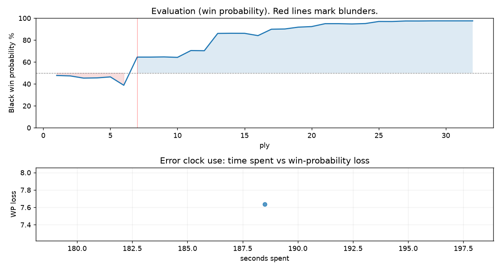

# (free, so lmk) Game analysis: oliviervermeer vs DanielKetterer

Date: 2026.07.29  |  Time control: daily (1/259200)  |  You played: black
Game ID: ec88bdcc-8b59-11f1-9e65-dc4af001000b
Analysis: depth=24 multipv=3 findability=honest floor=6 stable_run=3 threads=1 hash_mb=256 deterministic=True engine_id=Stockfish_18 generated=2026-07-31T13:32:26Z
Game end time UTC: 2026-07-31T13:13:02+00:00
Game: https://www.chess.com/game/daily/1006176728

## Summary

- Lichess accuracy: you 97.1%, opponent 70.0%
- Opening: B15 Caro-Kann Defense: Campomanes Attack (theory followed through ply 6)
- First deviation from theory: ply 7, Opponent played 4. g4
- Your moves: 11 best, 3 excellent, 1 good, 1 inaccuracy, 0 mistake, 0 blunder

METRICS:

Best: The played move exactly matches Stockfish's top move

Excellent: A non-best move that loses 2 WP points or less.

Good: WP loss is over 2, but under 5 points; also used for losses under 20 when the position remains already decided.

Inaccuracy: WP loss is at least 5 but under 10 points.

Mistake: WP loss is at least 10 but under 20 points; also generally used when a forced mate is missed with under 10 points of WP loss.

Blunder: WP loss is 20 points or more, or a forced mate is missed with at least 10 points of WP loss.

See: https://support.chess.com/en/articles/8572705-how-are-moves-classified-what-is-a-blunder-or-brilliant-etc 

(Brillint, Great and Miss are rating subjective)
- Puzzles: 44 open, 0 solved

### Puzzle gate tally (this game)

Gates: category in ['brilliant_sacrifice', 'missed_tactic', 'allowed_tactic', 'endgame'], refute depth in [3, 8], best-vs-second WP gap >= 5. Refute bar per move: max(5, 0.6 x WP loss).

| outcome | errors |
|---|---|
| category:opening | 1 |

Four gates pass at once or nothing is generated, so a zero here is a product of four pass rates rather than a fault. Read the binding gate off this table before changing any threshold.

### Sacrifices in the engine's line

Real sacrifices are listed but never served as puzzles: compensation that never resolves back into material has no gradable answer.

| Move | Offered | Kind | Quiet | Line ends | Verdict |
|---|---|---|---|---|---|
| 3 | -3.0 (piece) | sham | no | +0.0 pawns | opening_ply |

## Critical positions

- Ply 7 (opponent), 4.g4: +1.24 -> -1.62

## Your errors, move by move

| Move | Class | Category | WP loss | Refute depth | Seconds spent | Pre-error eval |
|---|---|---|---:|---|---:|---|
| 3...Nf6 | inaccuracy | opening | 8% | 9 | 188 | balanced |

### 3...Nf6 (inaccuracy, positional, wp loss 8%)

You played 3...Nf6. Stockfish preferred dxe4, after which the main line runs 3...dxe4 4. Nxe4 Nf6 5. Nxf6+ exf6 6. c3. This was a judgment error rather than a missed tactic; compare the pawn structure and piece activity after both moves. The engine prefers this move from at or below depth 6, which is as shallow as this measurement resolves; it sits near the surface, a quiet move, but one whose point shows at a glance. Candidates considered by the engine: dxe4 (+0.39), a6 (+0.62), h6 (+0.69).

## Full move table

| Ply | Move | Eval before | Eval after | Best | CP loss | WP loss | Class |
|-----|------|-------------|------------|------|---------|---------|-------|
| 1 | 1.e4 | +0.31 | +0.25 | e4 | 6 | 1% | best |
| 2 | 1...c6* | +0.25 | +0.29 | e5 | 4 | 0% | excellent |
| 3 | 2.d4 | +0.29 | +0.51 | c3 | 0 | 0% | excellent |
| 4 | 2...d5* | +0.51 | +0.49 | d5 | 0 | 0% | best |
| 5 | 3.Nc3 | +0.49 | +0.39 | e5 | 10 | 1% | excellent |
| 6 | 3...Nf6* | +0.39 | +1.24 | dxe4 | 85 | 8% | inaccuracy |
| 7 | 4.g4 | +1.24 | -1.62 | e5 | 286 | 26% | blunder |
| 8 | 4...Bxg4* | -1.62 | -1.62 | Bxg4 | 0 | 0% | best |
| 9 | 5.f3 | -1.62 | -1.64 | f3 | 2 | 0% | best |
| 10 | 5...Bh5* | -1.64 | -1.59 | Bh5 | 5 | 0% | best |
| 11 | 6.Bf4 | -1.59 | -2.36 | Qd3 | 77 | 6% | inaccuracy |
| 12 | 6...dxe4* | -2.36 | -2.34 | Nxe4 | 2 | 0% | excellent |
| 13 | 7.fxe4 | -2.34 | -4.95 | Be2 | 261 | 16% | mistake |
| 14 | 7...Bxd1* | -4.95 | -4.98 | Bxd1 | 0 | 0% | best |
| 15 | 8.Rxd1 | -4.98 | -4.97 | Rxd1 | 0 | 0% | best |
| 16 | 8...Nh5* | -4.97 | -4.52 | Qa5 | 45 | 2% | good |
| 17 | 9.Nh3 | -4.52 | -5.94 | Be3 | 142 | 6% | inaccuracy |
| 18 | 9...Nxf4* | -5.94 | -6.01 | Nxf4 | 0 | 0% | best |
| 19 | 10.Nxf4 | -6.01 | -6.56 | Nxf4 | 55 | 2% | best |
| 20 | 10...e5* | -6.56 | -6.76 | e5 | 0 | 0% | best |
| 21 | 11.dxe5 | -6.76 | -7.98 | Nfe2 | 122 | 3% | good |
| 22 | 11...Qh4+* | -7.98 | -7.99 | Qh4+ | 0 | 0% | best |
| 23 | 12.Ke2 | -7.99 | -7.84 | Ke2 | 0 | 0% | best |
| 24 | 12...Qxf4* | -7.84 | -8.05 | Qxf4 | 0 | 0% | best |
| 25 | 13.b4 | -8.05 | -9.43 | Bh3 | 138 | 2% | excellent |
| 26 | 13...Qg4+* | -9.43 | -9.40 | Bxb4 | 3 | 0% | excellent |
| 27 | 14.Ke3 | -9.40 | -9.88 | Kd3 | 48 | 0% | excellent |
| 28 | 14...Bxb4* | -9.88 | -9.87 | Bxb4 | 1 | 0% | best |
| 29 | 15.Kd4 | -9.87 | -10.99 | Ne2 | 112 | 0% | excellent |
| 30 | 15...Qf3* | -10.99 | -11.13 | Qf3 | 0 | 0% | best |
| 31 | 16.Bc4 | -11.13 | -M1 | Rd3 |  | 0% | excellent |
| 32 | 16...Qxc3#* | -M1 | -M1 | Qxc3# |  | 0% | best |

Rows marked * are your moves. WP loss is win-probability loss; it is the primary signal, CP loss is shown for reference.

## Patterns in this game

- Error categories: 1 opening.
- Attention errors per 100 moves: 0.0.
- Pre-error eval buckets: 0 winning, 1 balanced, 0 losing.
- Opening: 1 error(s) (avg wp loss 8%).
- 1 of your errors came with under a minute on the clock.
