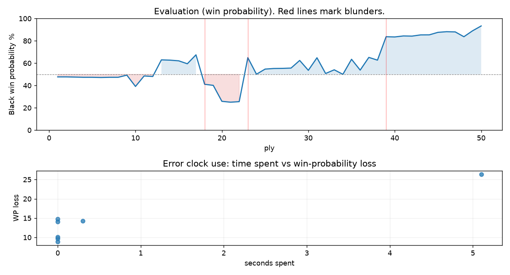

# (free, so lmk) Game analysis: DanielKetterer vs Strategic_Logic

Date: 2026.07.31  |  Time control: daily (1/86400)  |  You played: black
Game ID: c82c44f2-8cfe-11f1-8df0-d6af9301000b
Analysis: depth=24 multipv=3 findability=honest floor=6 stable_run=3 threads=1 hash_mb=256 deterministic=True engine_id=Stockfish_18 generated=2026-07-31T18:26:27Z
Game end time UTC: 2026-07-31T17:58:35+00:00
Game: https://www.chess.com/game/daily/1007135470

## Summary

- Lichess accuracy: you 78.8%, opponent 70.8%
- Opening: C50 Italian Game: Giuoco Pianissimo, Normal (theory followed through ply 8)
- First deviation from theory: ply 9, Opponent played 5. Be3
- Your moves: 10 best, 4 excellent, 4 good, 2 inaccuracy, 4 mistake, 1 blunder

METRICS:

Best: The played move exactly matches Stockfish's top move

Excellent: A non-best move that loses 2 WP points or less.

Good: WP loss is over 2, but under 5 points; also used for losses under 20 when the position remains already decided.

Inaccuracy: WP loss is at least 5 but under 10 points.

Mistake: WP loss is at least 10 but under 20 points; also generally used when a forced mate is missed with under 10 points of WP loss.

Blunder: WP loss is 20 points or more, or a forced mate is missed with at least 10 points of WP loss.

See: https://support.chess.com/en/articles/8572705-how-are-moves-classified-what-is-a-blunder-or-brilliant-etc 

(Brillint, Great and Miss are rating subjective)
- Puzzles: 50 open, 0 solved

### Puzzle gate tally (this game)

Gates: category in ['brilliant_sacrifice', 'missed_tactic', 'allowed_tactic', 'endgame'], refute depth in [3, 8], best-vs-second WP gap >= 5. Refute bar per move: max(5, 0.6 x WP loss).

| outcome | errors |
|---|---|
| accepted | 3 |
| category:attention | 2 |
| refute_too_deep | 1 |
| wp_gap_too_small | 1 |

Four gates pass at once or nothing is generated, so a zero here is a product of four pass rates rather than a fault. Read the binding gate off this table before changing any threshold.

### Sacrifices in the engine's line

Real sacrifices are listed but never served as puzzles: compensation that never resolves back into material has no gradable answer.

| Move | Offered | Kind | Quiet | Line ends | Verdict |
|---|---|---|---|---|---|
| 10 | -8.0 (piece) | sham | no | +1.0 pawns | opening_ply |
| 12 | -5.0 (piece) | sham | no | +0.0 pawns | obvious |
| 16 | -4.0 (piece) | sham | yes | +1.0 pawns | obvious |

## Biggest missed opportunity

You played 9...Re8. Stockfish preferred Nxc3, after which the main line runs 9...Nxc3 10. bxc3 Ne5 11. Be2 Re8 12. h3. The evaluation crossed from winning to equal, which matters more than the raw number. Before committing to a quiet move here, the checklist is checks, captures, threats, in that order. The engine prefers this move from at or below depth 6, which is as shallow as this measurement resolves; it sits near the surface, a forcing move, the kind a checks-and-captures scan catches. Candidates considered by the engine: Nxc3 (-1.98), Qh4 (-1.12), Bxd4 (-1.04).

## Critical positions

- Ply 18 (you), 9...Re8: -1.98 -> +0.98 [evaluation crossed winning -> equal]
- Ply 21 (opponent), 11.Nxc6: +2.87 -> +2.98 [only-move situation]
- Ply 23 (opponent), 12.Bb3: +2.91 -> -1.67 [only-move situation; evaluation crossed winning -> equal]
- Ply 28 (you), 14...cxd5: -0.58 -> -0.61 [only-move situation]
- Ply 39 (opponent), 20.gxf3: -1.41 -> -4.44 [only-move situation; evaluation crossed equal -> losing]
- Ply 40 (you), 20...Rxe3: -4.44 -> -4.40 [only-move situation]
- Ply 42 (you), 21...Rxe3: -4.58 -> -4.55 [only-move situation]

## Your errors, move by move

| Move | Class | Category | WP loss | Refute depth | Seconds spent | Pre-error eval |
|---|---|---|---:|---|---:|---|
| 5...d6 | mistake | missed_tactic | 10% | 5 | 0 | balanced |
| 9...Re8 | blunder | missed_tactic | 26% | 7 | 5 | winning |
| 10...Rxe4 | mistake | missed_tactic | 14% | 14 | 0 | balanced |
| 12...Be6 | mistake | attention | 15% | 1 | 0 | balanced |
| 15...c6 | inaccuracy | allowed_tactic | 9% | 7 | 0 | balanced |
| 16...Qf6 | mistake | attention | 14% | 1 | 0 | balanced |
| 18...Rae8 | inaccuracy | allowed_tactic | 10% | 3 | 0 | balanced |

### 5...d6 (mistake, tactical, wp loss 10%)

You played 5...d6. Stockfish preferred Bxe3, after which the main line runs 5...Bxe3 6. fxe3 d6 7. O-O O-O 8. a4. Before committing to a quiet move here, the checklist is checks, captures, threats, in that order. The engine prefers this move from at or below depth 6, which is as shallow as this measurement resolves; it sits near the surface, a forcing move, the kind a checks-and-captures scan catches. Candidates considered by the engine: Bxe3 (+0.08), Bb6 (+0.18), Qe7 (+0.20).

### 9...Re8 (blunder, tactical, wp loss 26%)

You played 9...Re8. Stockfish preferred Nxc3, after which the main line runs 9...Nxc3 10. bxc3 Ne5 11. Be2 Re8 12. h3. The evaluation crossed from winning to equal, which matters more than the raw number. Before committing to a quiet move here, the checklist is checks, captures, threats, in that order. The engine prefers this move from at or below depth 6, which is as shallow as this measurement resolves; it sits near the surface, a forcing move, the kind a checks-and-captures scan catches. Candidates considered by the engine: Nxc3 (-1.98), Qh4 (-1.12), Bxd4 (-1.04).

### 10...Rxe4 (mistake, tactical, wp loss 14%)

You played 10...Rxe4. Stockfish preferred Bxd4, after which the main line runs 10...Bxd4 11. Bxd4 Rxe4 12. Bxf7+ Kf8 13. Bc3. The evaluation crossed from equal to losing, which matters more than the raw number. Why it went wrong: a favorable capture was available (Rxe4). Before committing to a quiet move here, the checklist is checks, captures, threats, in that order. The engine prefers this move from at or below depth 6, which is as shallow as this measurement resolves; it sits near the surface, a forcing move, the kind a checks-and-captures scan catches. Candidates considered by the engine: Bxd4 (+1.09), Rxe4 (+2.16), Nxd4 (+3.65).

### 12...Be6 (mistake, tactical, wp loss 15%)

You played 12...Be6. Stockfish preferred Bxe3, after which the main line runs 12...Bxe3 13. fxe3 d5 14. Qd2 g6 15. c3. Before committing to a quiet move here, the checklist is checks, captures, threats, in that order. The engine prefers this move from at or below depth 6, which is as shallow as this measurement resolves; it sits near the surface, a forcing move, the kind a checks-and-captures scan catches. Candidates considered by the engine: Bxe3 (-1.67), Bg4 (-0.97), Re5 (-0.62).

### 15...c6 (inaccuracy, positional, wp loss 9%)

You played 15...c6. Stockfish preferred Bxe3, after which the main line runs 15...Bxe3 16. fxe3 Qe8 17. Rxd5 Rxe3 18. Qf4. This was a judgment error rather than a missed tactic; compare the pawn structure and piece activity after both moves. The engine prefers this move from at or below depth 6, which is as shallow as this measurement resolves; it sits near the surface, a quiet move, but one whose point shows at a glance. Candidates considered by the engine: Bxe3 (-1.38), c6 (-0.45), Bb6 (-0.17).

### 16...Qf6 (mistake, positional, wp loss 14%)

You played 16...Qf6. Stockfish preferred Qc7, after which the main line runs 16...Qc7 17. Bxc5 dxc5 18. Re3 Rae8 19. Rfe1. This was a judgment error rather than a missed tactic; compare the pawn structure and piece activity after both moves. The engine prefers this move from at or below depth 6, which is as shallow as this measurement resolves; it sits near the surface, a quiet move, but one whose point shows at a glance. Candidates considered by the engine: Qc7 (-1.66), Qe7 (-1.65), Bb6 (-1.43).

### 18...Rae8 (inaccuracy, positional, wp loss 10%)

You played 18...Rae8. Stockfish preferred Qxf3, after which the main line runs 18...Qxf3 19. Rxf3 Ra4 20. Ra1 Rb8 21. b3. Why it went wrong: a favorable capture was available (Qxb2). This was a judgment error rather than a missed tactic; compare the pawn structure and piece activity after both moves. The engine prefers this move from at or below depth 6, which is as shallow as this measurement resolves; it sits near the surface, a quiet move, but one whose point shows at a glance. Candidates considered by the engine: Qxf3 (-1.50), Rf4 (-0.63), Qe5 (-0.62).

## Full move table

| Ply | Move | Eval before | Eval after | Best | CP loss | WP loss | Class |
|-----|------|-------------|------------|------|---------|---------|-------|
| 1 | 1.e4 | +0.31 | +0.25 | e4 | 6 | 1% | best |
| 2 | 1...e5* | +0.25 | +0.25 | e5 | 0 | 0% | best |
| 3 | 2.Nf3 | +0.25 | +0.27 | Nf3 | 0 | 0% | best |
| 4 | 2...Nc6* | +0.27 | +0.29 | Nc6 | 2 | 0% | best |
| 5 | 3.Bc4 | +0.29 | +0.29 | Bc4 | 0 | 0% | best |
| 6 | 3...Nf6* | +0.29 | +0.31 | Nf6 | 2 | 0% | best |
| 7 | 4.d3 | +0.31 | +0.29 | d3 | 2 | 0% | best |
| 8 | 4...Bc5* | +0.29 | +0.29 | Be7 | 0 | 0% | excellent |
| 9 | 5.Be3 | +0.29 | +0.08 | O-O | 21 | 2% | excellent |
| 10 | 5...d6* | +0.08 | +1.20 | Bxe3 | 112 | 10% | mistake |
| 11 | 6.O-O | +1.20 | +0.16 | Bxc5 | 104 | 9% | inaccuracy |
| 12 | 6...O-O* | +0.16 | +0.21 | Bxe3 | 5 | 0% | excellent |
| 13 | 7.d4 | +0.21 | -1.44 | a4 | 165 | 15% | mistake |
| 14 | 7...exd4* | -1.44 | -1.41 | exd4 | 3 | 0% | best |
| 15 | 8.Nxd4 | -1.41 | -1.34 | Nxd4 | 0 | 0% | best |
| 16 | 8...Nxe4* | -1.34 | -1.04 | Ne5 | 30 | 3% | good |
| 17 | 9.Nc3 | -1.04 | -1.98 | Nxc6 | 94 | 8% | inaccuracy |
| 18 | 9...Re8* | -1.98 | +0.98 | Nxc3 | 296 | 26% | blunder |
| 19 | 10.Nxe4 | +0.98 | +1.09 | Nxe4 | 0 | 0% | best |
| 20 | 10...Rxe4* | +1.09 | +2.87 | Bxd4 | 178 | 14% | mistake |
| 21 | 11.Nxc6 | +2.87 | +2.98 | Nxc6 | 0 | 0% | best |
| 22 | 11...bxc6* | +2.98 | +2.91 | bxc6 | 0 | 0% | best |
| 23 | 12.Bb3 | +2.91 | -1.67 | Bxf7+ | 458 | 39% | blunder |
| 24 | 12...Be6* | -1.67 | -0.01 | Bxe3 | 166 | 15% | mistake |
| 25 | 13.Qf3 | -0.01 | -0.51 | Bxe6 | 50 | 5% | good |
| 26 | 13...Bd5* | -0.51 | -0.57 | Bd5 | 0 | 0% | best |
| 27 | 14.Bxd5 | -0.57 | -0.58 | Bxc5 | 1 | 0% | excellent |
| 28 | 14...cxd5* | -0.58 | -0.61 | cxd5 | 0 | 0% | best |
| 29 | 15.Rad1 | -0.61 | -1.38 | Bxc5 | 77 | 7% | inaccuracy |
| 30 | 15...c6* | -1.38 | -0.39 | Bxe3 | 99 | 9% | inaccuracy |
| 31 | 16.Rd3 | -0.39 | -1.66 | Bxc5 | 127 | 11% | mistake |
| 32 | 16...Qf6* | -1.66 | -0.08 | Qc7 | 158 | 14% | mistake |
| 33 | 17.Bxc5 | -0.08 | -0.44 | Qxf6 | 36 | 3% | good |
| 34 | 17...dxc5* | -0.44 | +0.00 | Rf4 | 44 | 4% | good |
| 35 | 18.Re3 | +0.00 | -1.50 | Qxf6 | 150 | 13% | mistake |
| 36 | 18...Rae8* | -1.50 | -0.41 | Qxf3 | 109 | 10% | inaccuracy |
| 37 | 19.b3 | -0.41 | -1.70 | Qxf6 | 129 | 11% | mistake |
| 38 | 19...Qxf3* | -1.70 | -1.41 | Qd4 | 29 | 2% | good |
| 39 | 20.gxf3 | -1.41 | -4.44 | Rxf3 | 303 | 21% | blunder |
| 40 | 20...Rxe3* | -4.44 | -4.40 | Rxe3 | 4 | 0% | best |
| 41 | 21.fxe3 | -4.40 | -4.58 | fxe3 | 18 | 1% | best |
| 42 | 21...Rxe3* | -4.58 | -4.55 | Rxe3 | 3 | 0% | best |
| 43 | 22.f4 | -4.55 | -4.78 | f4 | 23 | 1% | best |
| 44 | 22...Re2* | -4.78 | -4.79 | Rc3 | 0 | 0% | excellent |
| 45 | 23.Rf2 | -4.79 | -5.31 | c4 | 52 | 2% | good |
| 46 | 23...Rxf2* | -5.31 | -5.46 | Rxf2 | 0 | 0% | best |
| 47 | 24.Kxf2 | -5.46 | -5.41 | Kxf2 | 0 | 0% | best |
| 48 | 24...c4* | -5.41 | -4.44 | Kf8 | 97 | 4% | good |
| 49 | 25.b4 | -4.44 | -5.67 | bxc4 | 123 | 5% | inaccuracy |
| 50 | 25...Kf8* | -5.67 | -7.16 | h6 | 0 | 0% | excellent |

Rows marked * are your moves. WP loss is win-probability loss; it is the primary signal, CP loss is shown for reference.

## Patterns in this game

- Error categories: 2 allowed_tactic, 2 attention, 3 missed_tactic.
- Attention errors per 100 moves: 8.0.
- Pre-error eval buckets: 1 winning, 6 balanced, 0 losing.
- Opening: 3 error(s) (avg wp loss 17%).
- Middlegame: 4 error(s) (avg wp loss 12%).
- 7 of your errors came with under a minute on the clock.
