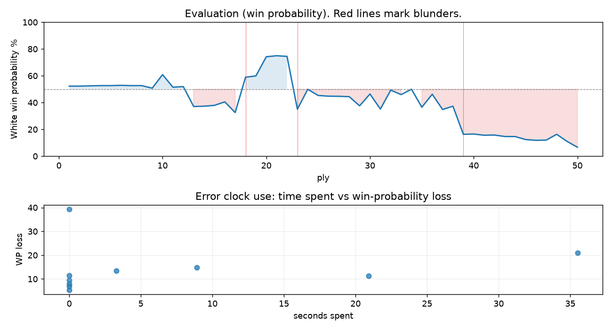

# (free, so lmk) Game analysis: DanielKetterer vs Strategic_Logic

Date: 2026.07.31  |  Time control: daily (1/86400)  |  You played: white
Game ID: c82c44f2-8cfe-11f1-8df0-d6af9301000b
Analysis: depth=24 multipv=3 findability=honest floor=6 stable_run=3 threads=1 hash_mb=256 deterministic=True engine_id=Stockfish_18 generated=2026-07-31T18:26:27Z
Game end time UTC: 2026-07-31T17:58:35+00:00
Game: https://www.chess.com/game/daily/1007135470

## Summary

- Lichess accuracy: you 70.8%, opponent 78.8%
- Opening: C50 Italian Game: Giuoco Pianissimo, Normal (theory followed through ply 8)
- First deviation from theory: ply 9, You played 5. Be3
- Your moves: 10 best, 2 excellent, 3 good, 4 inaccuracy, 4 mistake, 2 blunder

METRICS:

Best: The played move exactly matches Stockfish's top move

Excellent: A non-best move that loses 2 WP points or less.

Good: WP loss is over 2, but under 5 points; also used for losses under 20 when the position remains already decided.

Inaccuracy: WP loss is at least 5 but under 10 points.

Mistake: WP loss is at least 10 but under 20 points; also generally used when a forced mate is missed with under 10 points of WP loss.

Blunder: WP loss is 20 points or more, or a forced mate is missed with at least 10 points of WP loss.

See: https://support.chess.com/en/articles/8572705-how-are-moves-classified-what-is-a-blunder-or-brilliant-etc 

(Brillint, Great and Miss are rating subjective)
- Puzzles: 47 open, 0 solved

### Puzzle gate tally (this game)

Gates: category in ['brilliant_sacrifice', 'missed_tactic', 'allowed_tactic', 'endgame'], refute depth in [3, 8], best-vs-second WP gap >= 5. Refute bar per move: max(5, 0.6 x WP loss).

| outcome | errors |
|---|---|
| accepted | 3 |
| category:attention | 2 |
| category:positional | 1 |
| refute_too_deep | 1 |
| refute_too_shallow | 1 |
| wp_gap_too_small | 2 |

Four gates pass at once or nothing is generated, so a zero here is a product of four pass rates rather than a fault. Read the binding gate off this table before changing any threshold.

### Sacrifices in the engine's line

Real sacrifices are listed but never served as puzzles: compensation that never resolves back into material has no gradable answer.

| Move | Offered | Kind | Quiet | Line ends | Verdict |
|---|---|---|---|---|---|
| 7 | -3.0 (piece) | sham | yes | +0.0 pawns | opening_ply |
| 9 | -3.0 (piece) | sham | no | +0.0 pawns | opening_ply |
| 12 | -2.0 (exchange) | sham | no | +3.0 pawns | desperado |
| 16 | -5.0 (piece) | sham | no | +0.0 pawns | obvious |
| 18 | -4.0 (piece) | real | no | -4.0 pawns | real_sacrifice_not_gradable |

## Biggest missed opportunity

You played 12.Bb3. Stockfish preferred Bxf7+, after which the main line runs 12. Bxf7+ Kxf7 13. Qf3+ Qf6 14. Qxe4 d5. The evaluation crossed from winning to equal, which matters more than the raw number. Why it went wrong: the best move was a forcing check. Before committing to a quiet move here, the checklist is checks, captures, threats, in that order. The engine prefers this move from at or below depth 6, which is as shallow as this measurement resolves; it sits near the surface, a forcing move, the kind a checks-and-captures scan catches. Candidates considered by the engine: Bxf7+ (+2.91), Qd3 (-0.21), Bxc5 (-0.46).

## Critical positions

- Ply 18 (opponent), 9...Re8: -1.98 -> +0.98 [evaluation crossed winning -> equal]
- Ply 21 (you), 11.Nxc6: +2.87 -> +2.98 [only-move situation]
- Ply 23 (you), 12.Bb3: +2.91 -> -1.67 [only-move situation; evaluation crossed winning -> equal]
- Ply 28 (opponent), 14...cxd5: -0.58 -> -0.61 [only-move situation]
- Ply 39 (you), 20.gxf3: -1.41 -> -4.44 [only-move situation; evaluation crossed equal -> losing]
- Ply 40 (opponent), 20...Rxe3: -4.44 -> -4.40 [only-move situation]
- Ply 42 (opponent), 21...Rxe3: -4.58 -> -4.55 [only-move situation]

## Your errors, move by move

| Move | Class | Category | WP loss | Refute depth | Seconds spent | Pre-error eval |
|---|---|---|---:|---|---:|---|
| 6.O-O | inaccuracy | allowed_tactic | 9% | 6 | 0 | balanced |
| 7.d4 | mistake | allowed_tactic | 15% | 1 | 9 | balanced |
| 9.Nc3 | inaccuracy | allowed_tactic | 8% | 5 | 0 | balanced |
| 12.Bb3 | blunder | missed_tactic | 39% | 7 | 0 | winning |
| 15.Rad1 | inaccuracy | allowed_tactic | 7% | 5 | 0 | balanced |
| 16.Rd3 | mistake | missed_tactic | 11% | 10 | 21 | balanced |
| 18.Re3 | mistake | attention | 13% | 1 | 3 | balanced |
| 19.b3 | mistake | attention | 11% | 1 | 0 | balanced |
| 20.gxf3 | blunder | missed_tactic | 21% | 5 | 36 | balanced |
| 25.b4 | inaccuracy | positional | 5% | 4 | 0 | losing |

### 6.O-O (inaccuracy, positional, wp loss 9%)

You played 6.O-O. Stockfish preferred Bxc5, after which the main line runs 6. Bxc5 dxc5 7. Bb5 Bg4 8. Nbd2 Nd7. This was a judgment error rather than a missed tactic; compare the pawn structure and piece activity after both moves. The engine prefers this move from at or below depth 6, which is as shallow as this measurement resolves; it sits near the surface, a quiet move, but one whose point shows at a glance. Candidates considered by the engine: Bxc5 (+1.20), a4 (+0.15), O-O (+0.11).

### 7.d4 (mistake, tactical, wp loss 15%)

You played 7.d4. Stockfish preferred a4, after which the main line runs 7. a4 Bb6 8. Nbd2 Bxe3 9. fxe3 Ne7. Why it went wrong: left pawn on e4 insufficiently defended. Before committing to a quiet move here, the checklist is checks, captures, threats, in that order. The engine first prefers this move at depth 10 and holds it; findable, but it takes a deliberate look rather than a scan. Candidates considered by the engine: a4 (+0.21), Bxc5 (+0.16), Qe1 (+0.11).

### 9.Nc3 (inaccuracy, positional, wp loss 8%)

You played 9.Nc3. Stockfish preferred Nxc6, after which the main line runs 9. Nxc6 bxc6 10. Bd3 Bxe3 11. Bxe4 Bg5. The evaluation crossed from equal to losing, which matters more than the raw number. This was a judgment error rather than a missed tactic; compare the pawn structure and piece activity after both moves. The engine prefers this move from at or below depth 6, which is as shallow as this measurement resolves; it sits near the surface, a quiet move, but one whose point shows at a glance. Candidates considered by the engine: Nxc6 (-1.04), Bd5 (-1.38), Bd3 (-1.39).

### 12.Bb3 (blunder, tactical, wp loss 39%)

You played 12.Bb3. Stockfish preferred Bxf7+, after which the main line runs 12. Bxf7+ Kxf7 13. Qf3+ Qf6 14. Qxe4 d5. The evaluation crossed from winning to equal, which matters more than the raw number. Why it went wrong: the best move was a forcing check. Before committing to a quiet move here, the checklist is checks, captures, threats, in that order. The engine prefers this move from at or below depth 6, which is as shallow as this measurement resolves; it sits near the surface, a forcing move, the kind a checks-and-captures scan catches. Candidates considered by the engine: Bxf7+ (+2.91), Qd3 (-0.21), Bxc5 (-0.46).

### 15.Rad1 (inaccuracy, positional, wp loss 7%)

You played 15.Rad1. Stockfish preferred Bxc5, after which the main line runs 15. Bxc5 dxc5 16. Rae1 Re6 17. Qb3 c4. This was a judgment error rather than a missed tactic; compare the pawn structure and piece activity after both moves. The engine prefers this move from at or below depth 6, which is as shallow as this measurement resolves; it sits near the surface, a quiet move, but one whose point shows at a glance. Candidates considered by the engine: Bxc5 (-0.61), c4 (-1.07), Rae1 (-1.23).

### 16.Rd3 (mistake, tactical, wp loss 11%)

You played 16.Rd3. Stockfish preferred Bxc5, after which the main line runs 16. Bxc5 dxc5 17. Rfe1 Rxe1+ 18. Rxe1 Qa5. Before committing to a quiet move here, the checklist is checks, captures, threats, in that order. The engine prefers this move from at or below depth 6, which is as shallow as this measurement resolves; it sits near the surface, a forcing move, the kind a checks-and-captures scan catches. Candidates considered by the engine: Bxc5 (-0.39), Rfe1 (-1.31), Rde1 (-1.33).

### 18.Re3 (mistake, tactical, wp loss 13%)

You played 18.Re3. Stockfish preferred Qxf6, after which the main line runs 18. Qxf6 gxf6 19. Rc3 c4 20. Rd1 Rae8. Why it went wrong: left pawn on b2 insufficiently defended. Before committing to a quiet move here, the checklist is checks, captures, threats, in that order. The engine prefers this move from at or below depth 6, which is as shallow as this measurement resolves; it sits near the surface, a forcing move, the kind a checks-and-captures scan catches. Candidates considered by the engine: Qxf6 (+0.00), Re3 (-1.35), b3 (-1.55).

### 19.b3 (mistake, tactical, wp loss 11%)

You played 19.b3. Stockfish preferred Qxf6, after which the main line runs 19. Qxf6 gxf6 20. Rc3 c4 21. b3 Rd4. The evaluation crossed from equal to losing, which matters more than the raw number. Before committing to a quiet move here, the checklist is checks, captures, threats, in that order. The engine prefers this move from at or below depth 6, which is as shallow as this measurement resolves; it sits near the surface, a forcing move, the kind a checks-and-captures scan catches. Candidates considered by the engine: Qxf6 (-0.41), Rxe4 (-0.99), b3 (-1.38).

### 20.gxf3 (blunder, tactical, wp loss 21%)

You played 20.gxf3. Stockfish preferred Rxf3, after which the main line runs 20. Rxf3 Kf8 21. Rc3 c4 22. bxc4 Rxc4. The evaluation crossed from equal to losing, which matters more than the raw number. Why it went wrong: a favorable capture was available (Rxf3). Before committing to a quiet move here, the checklist is checks, captures, threats, in that order. The engine prefers this move from at or below depth 6, which is as shallow as this measurement resolves; it sits near the surface, a forcing move, the kind a checks-and-captures scan catches. Candidates considered by the engine: Rxf3 (-1.41), gxf3 (-4.20), h3 (-7.64).

### 25.b4 (inaccuracy, positional, wp loss 5%)

You played 25.b4. Stockfish preferred bxc4, after which the main line runs 25. bxc4 dxc4 26. Ke3 Kf8 27. Kd4 Ke7. This was a judgment error rather than a missed tactic; compare the pawn structure and piece activity after both moves. The engine prefers this move from at or below depth 6, which is as shallow as this measurement resolves; it sits near the surface, a quiet move, but one whose point shows at a glance. Candidates considered by the engine: bxc4 (-4.44), Kf3 (-4.95), Kg3 (-5.06).

## Full move table

| Ply | Move | Eval before | Eval after | Best | CP loss | WP loss | Class |
|-----|------|-------------|------------|------|---------|---------|-------|
| 1 | 1.e4* | +0.31 | +0.25 | e4 | 6 | 1% | best |
| 2 | 1...e5 | +0.25 | +0.25 | e5 | 0 | 0% | best |
| 3 | 2.Nf3* | +0.25 | +0.27 | Nf3 | 0 | 0% | best |
| 4 | 2...Nc6 | +0.27 | +0.29 | Nc6 | 2 | 0% | best |
| 5 | 3.Bc4* | +0.29 | +0.29 | Bc4 | 0 | 0% | best |
| 6 | 3...Nf6 | +0.29 | +0.31 | Nf6 | 2 | 0% | best |
| 7 | 4.d3* | +0.31 | +0.29 | d3 | 2 | 0% | best |
| 8 | 4...Bc5 | +0.29 | +0.29 | Be7 | 0 | 0% | excellent |
| 9 | 5.Be3* | +0.29 | +0.08 | O-O | 21 | 2% | excellent |
| 10 | 5...d6 | +0.08 | +1.20 | Bxe3 | 112 | 10% | mistake |
| 11 | 6.O-O* | +1.20 | +0.16 | Bxc5 | 104 | 9% | inaccuracy |
| 12 | 6...O-O | +0.16 | +0.21 | Bxe3 | 5 | 0% | excellent |
| 13 | 7.d4* | +0.21 | -1.44 | a4 | 165 | 15% | mistake |
| 14 | 7...exd4 | -1.44 | -1.41 | exd4 | 3 | 0% | best |
| 15 | 8.Nxd4* | -1.41 | -1.34 | Nxd4 | 0 | 0% | best |
| 16 | 8...Nxe4 | -1.34 | -1.04 | Ne5 | 30 | 3% | good |
| 17 | 9.Nc3* | -1.04 | -1.98 | Nxc6 | 94 | 8% | inaccuracy |
| 18 | 9...Re8 | -1.98 | +0.98 | Nxc3 | 296 | 26% | blunder |
| 19 | 10.Nxe4* | +0.98 | +1.09 | Nxe4 | 0 | 0% | best |
| 20 | 10...Rxe4 | +1.09 | +2.87 | Bxd4 | 178 | 14% | mistake |
| 21 | 11.Nxc6* | +2.87 | +2.98 | Nxc6 | 0 | 0% | best |
| 22 | 11...bxc6 | +2.98 | +2.91 | bxc6 | 0 | 0% | best |
| 23 | 12.Bb3* | +2.91 | -1.67 | Bxf7+ | 458 | 39% | blunder |
| 24 | 12...Be6 | -1.67 | -0.01 | Bxe3 | 166 | 15% | mistake |
| 25 | 13.Qf3* | -0.01 | -0.51 | Bxe6 | 50 | 5% | good |
| 26 | 13...Bd5 | -0.51 | -0.57 | Bd5 | 0 | 0% | best |
| 27 | 14.Bxd5* | -0.57 | -0.58 | Bxc5 | 1 | 0% | excellent |
| 28 | 14...cxd5 | -0.58 | -0.61 | cxd5 | 0 | 0% | best |
| 29 | 15.Rad1* | -0.61 | -1.38 | Bxc5 | 77 | 7% | inaccuracy |
| 30 | 15...c6 | -1.38 | -0.39 | Bxe3 | 99 | 9% | inaccuracy |
| 31 | 16.Rd3* | -0.39 | -1.66 | Bxc5 | 127 | 11% | mistake |
| 32 | 16...Qf6 | -1.66 | -0.08 | Qc7 | 158 | 14% | mistake |
| 33 | 17.Bxc5* | -0.08 | -0.44 | Qxf6 | 36 | 3% | good |
| 34 | 17...dxc5 | -0.44 | +0.00 | Rf4 | 44 | 4% | good |
| 35 | 18.Re3* | +0.00 | -1.50 | Qxf6 | 150 | 13% | mistake |
| 36 | 18...Rae8 | -1.50 | -0.41 | Qxf3 | 109 | 10% | inaccuracy |
| 37 | 19.b3* | -0.41 | -1.70 | Qxf6 | 129 | 11% | mistake |
| 38 | 19...Qxf3 | -1.70 | -1.41 | Qd4 | 29 | 2% | good |
| 39 | 20.gxf3* | -1.41 | -4.44 | Rxf3 | 303 | 21% | blunder |
| 40 | 20...Rxe3 | -4.44 | -4.40 | Rxe3 | 4 | 0% | best |
| 41 | 21.fxe3* | -4.40 | -4.58 | fxe3 | 18 | 1% | best |
| 42 | 21...Rxe3 | -4.58 | -4.55 | Rxe3 | 3 | 0% | best |
| 43 | 22.f4* | -4.55 | -4.78 | f4 | 23 | 1% | best |
| 44 | 22...Re2 | -4.78 | -4.79 | Rc3 | 0 | 0% | excellent |
| 45 | 23.Rf2* | -4.79 | -5.31 | c4 | 52 | 2% | good |
| 46 | 23...Rxf2 | -5.31 | -5.46 | Rxf2 | 0 | 0% | best |
| 47 | 24.Kxf2* | -5.46 | -5.41 | Kxf2 | 0 | 0% | best |
| 48 | 24...c4 | -5.41 | -4.44 | Kf8 | 97 | 4% | good |
| 49 | 25.b4* | -4.44 | -5.67 | bxc4 | 123 | 5% | inaccuracy |
| 50 | 25...Kf8 | -5.67 | -7.16 | h6 | 0 | 0% | excellent |

Rows marked * are your moves. WP loss is win-probability loss; it is the primary signal, CP loss is shown for reference.

## Patterns in this game

- Error categories: 4 allowed_tactic, 2 attention, 3 missed_tactic, 1 positional.
- Attention errors per 100 moves: 8.0.
- Pre-error eval buckets: 1 winning, 8 balanced, 1 losing.
- Opening: 3 error(s) (avg wp loss 11%).
- Middlegame: 7 error(s) (avg wp loss 16%).
- 10 of your errors came with under a minute on the clock.
