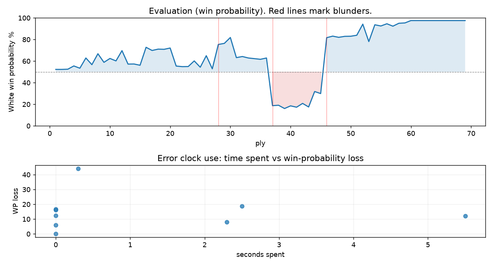

# (free, so lmk) Game analysis: Strategic_Logic vs DanielKetterer

Date: 2026.08.02  |  Time control: daily (1/86400)  |  You played: white
Game ID: 8e921396-8e8b-11f1-b0e1-57cdea01000b
Analysis: depth=24 multipv=3 findability=honest floor=6 stable_run=3 threads=1 hash_mb=256 deterministic=True engine_id=Stockfish_18 generated=2026-08-02T18:21:48Z
Game end time UTC: 2026-08-02T17:13:00+00:00
Game: https://www.chess.com/game/daily/1008090490

## Summary

- Lichess accuracy: you 77.0%, opponent 71.3%
- Opening: C41 Philidor Defense (theory followed through ply 4)
- First deviation from theory: ply 5, You played 3. Nc3
- Your moves: 15 best, 5 excellent, 6 good, 2 inaccuracy, 6 mistake, 1 blunder

METRICS:

Best: The played move exactly matches Stockfish's top move

Excellent: A non-best move that loses 2 WP points or less.

Good: WP loss is over 2, but under 5 points; also used for losses under 20 when the position remains already decided.

Inaccuracy: WP loss is at least 5 but under 10 points.

Mistake: WP loss is at least 10 but under 20 points; also generally used when a forced mate is missed with under 10 points of WP loss.

Blunder: WP loss is 20 points or more, or a forced mate is missed with at least 10 points of WP loss.

See: https://support.chess.com/en/articles/8572705-how-are-moves-classified-what-is-a-blunder-or-brilliant-etc 

(Brillint, Great and Miss are rating subjective)
- Puzzles: 51 open, 0 solved

### Puzzle gate tally (this game)

Gates: category in ['brilliant_sacrifice', 'missed_tactic', 'allowed_tactic', 'endgame'], refute depth in [3, 8], best-vs-second WP gap >= 5. Refute bar per move: max(5, 0.6 x WP loss).

| outcome | errors |
|---|---|
| accepted | 1 |
| category:attention | 3 |
| category:opening | 1 |
| category:positional | 1 |
| refute_censored_high | 1 |
| wp_gap_too_small | 2 |

Four gates pass at once or nothing is generated, so a zero here is a product of four pass rates rather than a fault. Read the binding gate off this table before changing any threshold.

### Sacrifices in the engine's line

Real sacrifices are listed but never served as puzzles: compensation that never resolves back into material has no gradable answer.

| Move | Offered | Kind | Quiet | Line ends | Verdict |
|---|---|---|---|---|---|
| 5 | -4.0 (piece) | sham | yes | +2.0 pawns | opening_ply |
| 7 | -2.0 (exchange) | sham | no | +1.0 pawns | opening_ply |
| 14 | -4.0 (piece) | sham | no | +1.0 pawns | obvious |
| 19 | -2.0 (exchange) | sham | yes | +1.0 pawns | obvious |

## Biggest missed opportunity

You played 19.Qxa7. Stockfish preferred Rb1, after which the main line runs 19. Rb1 b6 20. Na5 h5 21. Nc6 Ra8. The evaluation crossed from equal to losing, which matters more than the raw number. Why it went wrong: left knight on c4 insufficiently defended; motif: creates threat on a7. Before committing to a quiet move here, the checklist is checks, captures, threats, in that order. The engine prefers this move from at or below depth 6, which is as shallow as this measurement resolves; it sits near the surface, a forcing move, the kind a checks-and-captures scan catches. Candidates considered by the engine: Rb1 (+1.43), Nb2 (-0.40), Na3 (-0.81).

## Critical positions

- Ply 15 (you), 8.dxc4: +0.80 -> +0.67 [only-move situation]
- Ply 28 (opponent), 14...g4: +0.31 -> +3.04 [evaluation crossed equal -> losing]
- Ply 32 (opponent), 16...Qe6: +1.47 -> +1.59 [only-move situation]
- Ply 37 (you), 19.Qxa7: +1.43 -> -3.99 [only-move situation; evaluation crossed equal -> losing]
- Ply 38 (opponent), 19...Qxc4: -3.99 -> -3.92 [only-move situation]
- Ply 46 (opponent), 23...Nxe5: -2.31 -> +4.06 [only-move situation; evaluation crossed winning -> losing]
- Ply 47 (you), 24.Qxb8+: +4.06 -> +4.33 [only-move situation]
- Ply 51 (you), 26.Qe8+: +4.31 -> +4.49 [only-move situation]

## Your errors, move by move

| Move | Class | Category | WP loss | Refute depth | Seconds spent | Pre-error eval |
|---|---|---|---:|---|---:|---|
| 5.d3 | inaccuracy | opening | 8% | 1 | 2 | winning |
| 7.Re1 | mistake | missed_tactic | 12% | 5 | 0 | winning |
| 11.c3 | mistake | missed_tactic | 17% | 7 | 0 | winning |
| 13.Nd2 | inaccuracy | positional | 6% | 11 | 0 | balanced |
| 14.Nc4 | mistake | attention | 12% | 1 | 6 | balanced |
| 16.d6 | mistake | missed_tactic | 19% | 4 | 2 | winning |
| 19.Qxa7 | blunder | attention | 44% | 1 | 0 | balanced |
| 27.Re3 | mistake | attention | 16% | 1 | 0 | winning |
| 33.Qg7 | mistake | allowed_tactic | 0% | >18 | 0 | winning |

### 5.d3 (inaccuracy, positional, wp loss 8%)

You played 5.d3. Stockfish preferred d4, after which the main line runs 5. d4 fxe4 6. Ng5 Nc6 7. Nf7 Qe7. The evaluation crossed from winning to equal, which matters more than the raw number. This was a judgment error rather than a missed tactic; compare the pawn structure and piece activity after both moves. The engine does not settle on this move until depth 12; reachable with real calculation, but not on a scan. Candidates considered by the engine: d4 (+1.90), Ng5 (+1.21), d3 (+1.04).

### 7.Re1 (mistake, tactical, wp loss 12%)

You played 7.Re1. Stockfish preferred Bxe6, after which the main line runs 7. Bxe6 Qxe6 8. Ng5 Qd7 9. exf5 Nc6. The evaluation crossed from winning to equal, which matters more than the raw number. Before committing to a quiet move here, the checklist is checks, captures, threats, in that order. The engine does not settle on this move until depth 19; reachable with real calculation, but not on a scan. Candidates considered by the engine: Bxe6 (+2.26), exf5 (+1.82), Nd5 (+1.26).

### 11.c3 (mistake, tactical, wp loss 17%)

You played 11.c3. Stockfish preferred Bxf4, after which the main line runs 11. Bxf4 Nd7 12. Be3 h6 13. Qe2 Rc8. The evaluation crossed from winning to equal, which matters more than the raw number. Before committing to a quiet move here, the checklist is checks, captures, threats, in that order. The engine first prefers this move at depth 7 and holds it; findable, but it takes a deliberate look rather than a scan. Candidates considered by the engine: Bxf4 (+2.58), h4 (+1.26), b4 (+1.25).

### 13.Nd2 (inaccuracy, positional, wp loss 6%)

You played 13.Nd2. Stockfish preferred bxc5, after which the main line runs 13. bxc5 dxc5 14. Rb1 Rb8 15. g3 Qf6. This was a judgment error rather than a missed tactic; compare the pawn structure and piece activity after both moves. The engine prefers this move from at or below depth 6, which is as shallow as this measurement resolves; it sits near the surface, a quiet move, but one whose point shows at a glance. Candidates considered by the engine: bxc5 (+1.12), Nd2 (+0.51), Rb1 (+0.47).

### 14.Nc4 (mistake, tactical, wp loss 12%)

You played 14.Nc4. Stockfish preferred bxc5, after which the main line runs 14. bxc5 dxc5 15. Rb1 b6 16. Nc4 Bg7. Before committing to a quiet move here, the checklist is checks, captures, threats, in that order. The engine prefers this move from at or below depth 6, which is as shallow as this measurement resolves; it sits near the surface, a forcing move, the kind a checks-and-captures scan catches. Candidates considered by the engine: bxc5 (+1.68), Nf3 (+0.92), Rb1 (+0.77).

### 16.d6 (mistake, tactical, wp loss 19%)

You played 16.d6. Stockfish preferred Bxf4, after which the main line runs 16. Bxf4 Nd7 17. Rb1 Rb8 18. Qxg4 exf4. The evaluation crossed from winning to equal, which matters more than the raw number. Before committing to a quiet move here, the checklist is checks, captures, threats, in that order. The engine first prefers this move at depth 7 and holds it; findable, but it takes a deliberate look rather than a scan. Candidates considered by the engine: Bxf4 (+4.09), Rb1 (+3.89), Qa4+ (+2.95).

### 19.Qxa7 (blunder, tactical, wp loss 44%)

You played 19.Qxa7. Stockfish preferred Rb1, after which the main line runs 19. Rb1 b6 20. Na5 h5 21. Nc6 Ra8. The evaluation crossed from equal to losing, which matters more than the raw number. Why it went wrong: left knight on c4 insufficiently defended; motif: creates threat on a7. Before committing to a quiet move here, the checklist is checks, captures, threats, in that order. The engine prefers this move from at or below depth 6, which is as shallow as this measurement resolves; it sits near the surface, a forcing move, the kind a checks-and-captures scan catches. Candidates considered by the engine: Rb1 (+1.43), Nb2 (-0.40), Na3 (-0.81).

### 27.Re3 (mistake, positional, wp loss 16%)

You played 27.Re3. Stockfish preferred Rad1, after which the main line runs 27. Rad1 Nb6 28. Qe5+ Kf7 29. Qxh8 Qh6. This was a judgment error rather than a missed tactic; compare the pawn structure and piece activity after both moves. The engine prefers this move from at or below depth 6, which is as shallow as this measurement resolves; it sits near the surface, a quiet move, but one whose point shows at a glance. Candidates considered by the engine: Rad1 (+7.58), a4 (+5.05), Re4 (+3.92).

### 33.Qg7 (mistake, positional, wp loss 0%)

You played 33.Qg7. Stockfish preferred Rxg5+, after which the main line runs 33. Rxg5+ Kh4 34. Ree5 h5 35. Rxh5+ Rxh5. There was a forced mate on the board and this move let it slip. Why it went wrong: a favorable capture was available (Rxc5); the best move was a forcing check. This was a judgment error rather than a missed tactic; compare the pawn structure and piece activity after both moves. The engine does not settle on this move until depth 13; reachable with real calculation, but not on a scan. Candidates considered by the engine: Rxg5+ (M7), Rd5 (+11.25), Qg7 (+7.63).

## Full move table

| Ply | Move | Eval before | Eval after | Best | CP loss | WP loss | Class |
|-----|------|-------------|------------|------|---------|---------|-------|
| 1 | 1.e4* | +0.31 | +0.25 | e4 | 6 | 1% | best |
| 2 | 1...e5 | +0.25 | +0.25 | e5 | 0 | 0% | best |
| 3 | 2.Nf3* | +0.25 | +0.27 | Nf3 | 0 | 0% | best |
| 4 | 2...d6 | +0.27 | +0.60 | Nc6 | 33 | 3% | good |
| 5 | 3.Nc3* | +0.60 | +0.37 | d4 | 23 | 2% | good |
| 6 | 3...f5 | +0.37 | +1.43 | c5 | 106 | 9% | inaccuracy |
| 7 | 4.Bc4* | +1.43 | +0.73 | Bc4 | 70 | 6% | best |
| 8 | 4...Nf6 | +0.73 | +1.90 | fxe4 | 117 | 10% | mistake |
| 9 | 5.d3* | +1.90 | +0.97 | d4 | 93 | 8% | inaccuracy |
| 10 | 5...Qe7 | +0.97 | +1.38 | c6 | 41 | 4% | good |
| 11 | 6.O-O* | +1.38 | +1.12 | Bg5 | 26 | 2% | good |
| 12 | 6...Be6 | +1.12 | +2.26 | fxe4 | 114 | 10% | inaccuracy |
| 13 | 7.Re1* | +2.26 | +0.79 | Bxe6 | 147 | 12% | mistake |
| 14 | 7...Bxc4 | +0.79 | +0.80 | Bxc4 | 1 | 0% | best |
| 15 | 8.dxc4* | +0.80 | +0.67 | dxc4 | 13 | 1% | best |
| 16 | 8...c5 | +0.67 | +2.67 | Nxe4 | 200 | 17% | mistake |
| 17 | 9.Nd5* | +2.67 | +2.28 | exf5 | 39 | 3% | good |
| 18 | 9...Nxd5 | +2.28 | +2.44 | Nxd5 | 16 | 1% | best |
| 19 | 10.cxd5* | +2.44 | +2.42 | cxd5 | 2 | 0% | best |
| 20 | 10...f4 | +2.42 | +2.58 | h6 | 16 | 1% | excellent |
| 21 | 11.c3* | +2.58 | +0.59 | Bxf4 | 199 | 17% | mistake |
| 22 | 11...Nd7 | +0.59 | +0.53 | g5 | 0 | 0% | excellent |
| 23 | 12.b4* | +0.53 | +0.54 | b4 | 0 | 0% | best |
| 24 | 12...g5 | +0.54 | +1.12 | cxb4 | 58 | 5% | inaccuracy |
| 25 | 13.Nd2* | +1.12 | +0.47 | bxc5 | 65 | 6% | inaccuracy |
| 26 | 13...Nf6 | +0.47 | +1.68 | Rg8 | 121 | 11% | mistake |
| 27 | 14.Nc4* | +1.68 | +0.31 | bxc5 | 137 | 12% | mistake |
| 28 | 14...g4 | +0.31 | +3.04 | cxb4 | 273 | 23% | blunder |
| 29 | 15.bxc5* | +3.04 | +3.19 | bxc5 | 0 | 0% | best |
| 30 | 15...dxc5 | +3.19 | +4.09 | Qc7 | 90 | 5% | inaccuracy |
| 31 | 16.d6* | +4.09 | +1.47 | Bxf4 | 262 | 19% | mistake |
| 32 | 16...Qe6 | +1.47 | +1.59 | Qe6 | 12 | 1% | best |
| 33 | 17.Qa4+* | +1.59 | +1.43 | Qb3 | 16 | 1% | excellent |
| 34 | 17...Nd7 | +1.43 | +1.36 | Nd7 | 0 | 0% | best |
| 35 | 18.Rd1* | +1.36 | +1.29 | Rd1 | 7 | 1% | best |
| 36 | 18...Rb8 | +1.29 | +1.43 | Rb8 | 14 | 1% | best |
| 37 | 19.Qxa7* | +1.43 | -3.99 | Rb1 | 542 | 44% | blunder |
| 38 | 19...Qxc4 | -3.99 | -3.92 | Qxc4 | 7 | 0% | best |
| 39 | 20.Bb2* | -3.92 | -4.49 | Qa3 | 57 | 3% | good |
| 40 | 20...Qxe4 | -4.49 | -4.02 | Qa6 | 47 | 2% | good |
| 41 | 21.Re1* | -4.02 | -4.25 | Re1 | 23 | 1% | best |
| 42 | 21...Qc6 | -4.25 | -3.63 | Qc4 | 62 | 4% | good |
| 43 | 22.c4* | -3.63 | -4.21 | Rxe5+ | 58 | 3% | good |
| 44 | 22...f3 | -4.21 | -2.07 | Bxd6 | 214 | 14% | mistake |
| 45 | 23.Bxe5* | -2.07 | -2.31 | Rxe5+ | 24 | 2% | excellent |
| 46 | 23...Nxe5 | -2.31 | +4.06 | Rg8 | 637 | 52% | blunder |
| 47 | 24.Qxb8+* | +4.06 | +4.33 | Qxb8+ | 0 | 0% | best |
| 48 | 24...Kf7 | +4.33 | +4.12 | Kf7 | 0 | 0% | best |
| 49 | 25.d7* | +4.12 | +4.29 | Rab1 | 0 | 0% | excellent |
| 50 | 25...Nxd7 | +4.29 | +4.31 | Nxd7 | 2 | 0% | best |
| 51 | 26.Qe8+* | +4.31 | +4.49 | Qe8+ | 0 | 0% | best |
| 52 | 26...Kf6 | +4.49 | +7.58 | Kg7 | 309 | 10% | mistake |
| 53 | 27.Re3* | +7.58 | +3.45 | Rad1 | 413 | 16% | mistake |
| 54 | 27...fxg2 | +3.45 | +7.30 | Qd6 | 385 | 16% | mistake |
| 55 | 28.Rae1* | +7.30 | +6.83 | Rd1 | 47 | 1% | excellent |
| 56 | 28...Kg5 | +6.83 | +7.76 | Kg7 | 93 | 2% | good |
| 57 | 29.Qd8+* | +7.76 | +6.76 | Re6 | 100 | 2% | good |
| 58 | 29...Kh5 | +6.76 | +8.02 | Qf6 | 126 | 3% | good |
| 59 | 30.Re6* | +8.02 | +8.20 | Re6 | 0 | 0% | best |
| 60 | 30...Qf3 | +8.20 | M13 | Bg7 |  | 2% | good |
| 61 | 31.Qxd7* | M13 | M8 | Qxd7 |  | 0% | best |
| 62 | 31...Bh6 | M8 | M8 | Bh6 |  | 0% | best |
| 63 | 32.R1e5+* | M8 | M7 | R1e5+ |  | 0% | best |
| 64 | 32...Bg5 | M7 | M7 | Bg5 |  | 0% | best |
| 65 | 33.Qg7* | M7 | +20.00 | Rxg5+ |  | 0% | mistake |
| 66 | 33...Kh4 | +20.00 | M2 | Qd1+ |  | 0% | excellent |
| 67 | 34.Qxg5+* | M2 | M1 | Rh6+ |  | 0% | excellent |
| 68 | 34...Kh3 | M1 | M1 | Kh3 |  | 0% | best |
| 69 | 35.Rh6#* | M1 | M1 | Rh6# |  | 0% | best |

Rows marked * are your moves. WP loss is win-probability loss; it is the primary signal, CP loss is shown for reference.

## Patterns in this game

- Error categories: 1 allowed_tactic, 3 attention, 3 missed_tactic, 1 opening, 1 positional.
- Attention errors per 100 moves: 8.6.
- Pre-error eval buckets: 6 winning, 3 balanced, 0 losing.
- Opening: 2 error(s) (avg wp loss 10%).
- Middlegame: 6 error(s) (avg wp loss 19%).
- Endgame: 1 error(s) (avg wp loss 0%).
- 9 of your errors came with under a minute on the clock.
