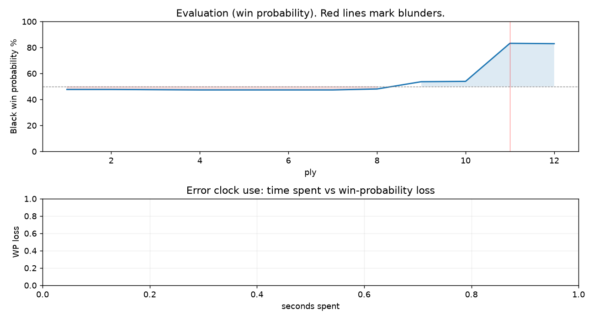

# (free, so lmk) Game analysis: kjetiltellnes vs DanielKetterer

Date: 2026.07.31  |  Time control: daily (1/259200)  |  You played: black
Game ID: 10d676e8-8cf3-11f1-93ad-9859ec01000b
Analysis: depth=24 multipv=3 findability=honest floor=6 stable_run=3 threads=1 hash_mb=256 deterministic=True engine_id=Stockfish_18 generated=2026-08-04T09:36:00Z
Game end time UTC: 2026-08-03T14:36:24+00:00
Game: https://www.chess.com/game/daily/1007093266

## Summary

- Lichess accuracy: you 100.0%, opponent 55.3%
- Opening: C50 Italian Game: Classical Variation, Albin Gambit (theory followed through ply 9)
- First deviation from theory: ply 10, You played 5... Nxe4
- Your moves: 4 best, 2 excellent, 0 good, 0 inaccuracy, 0 mistake, 0 blunder

METRICS:

Best: The played move exactly matches Stockfish's top move

Excellent: A non-best move that loses 2 WP points or less.

Good: WP loss is over 2, but under 5 points; also used for losses under 20 when the position remains already decided.

Inaccuracy: WP loss is at least 5 but under 10 points.

Mistake: WP loss is at least 10 but under 20 points; also generally used when a forced mate is missed with under 10 points of WP loss.

Blunder: WP loss is 20 points or more, or a forced mate is missed with at least 10 points of WP loss.

See: https://support.chess.com/en/articles/8572705-how-are-moves-classified-what-is-a-blunder-or-brilliant-etc 

(Brillint, Great and Miss are rating subjective)
- Puzzles: 51 open, 0 solved

## Critical positions

- Ply 11 (opponent), 6.Re1: -0.43 -> -4.35 [evaluation crossed equal -> losing]

## Full move table

| Ply | Move | Eval before | Eval after | Best | CP loss | WP loss | Class |
|-----|------|-------------|------------|------|---------|---------|-------|
| 1 | 1.e4 | +0.31 | +0.25 | e4 | 6 | 1% | best |
| 2 | 1...e5* | +0.25 | +0.25 | e5 | 0 | 0% | best |
| 3 | 2.Nf3 | +0.25 | +0.27 | Nf3 | 0 | 0% | best |
| 4 | 2...Nc6* | +0.27 | +0.29 | Nc6 | 2 | 0% | best |
| 5 | 3.Bc4 | +0.29 | +0.29 | Bc4 | 0 | 0% | best |
| 6 | 3...Bc5* | +0.29 | +0.29 | Nf6 | 0 | 0% | excellent |
| 7 | 4.O-O | +0.29 | +0.29 | O-O | 0 | 0% | best |
| 8 | 4...Nf6* | +0.29 | +0.21 | d6 | 0 | 0% | excellent |
| 9 | 5.c3 | +0.21 | -0.40 | d3 | 61 | 6% | inaccuracy |
| 10 | 5...Nxe4* | -0.40 | -0.43 | Nxe4 | 0 | 0% | best |
| 11 | 6.Re1 | -0.43 | -4.35 | d4 | 392 | 29% | blunder |
| 12 | 6...Bxf2+* | -4.35 | -4.30 | Bxf2+ | 5 | 0% | best |

Rows marked * are your moves. WP loss is win-probability loss; it is the primary signal, CP loss is shown for reference.

## Patterns in this game

- Error categories: .
- Attention errors per 100 moves: 0.0.
