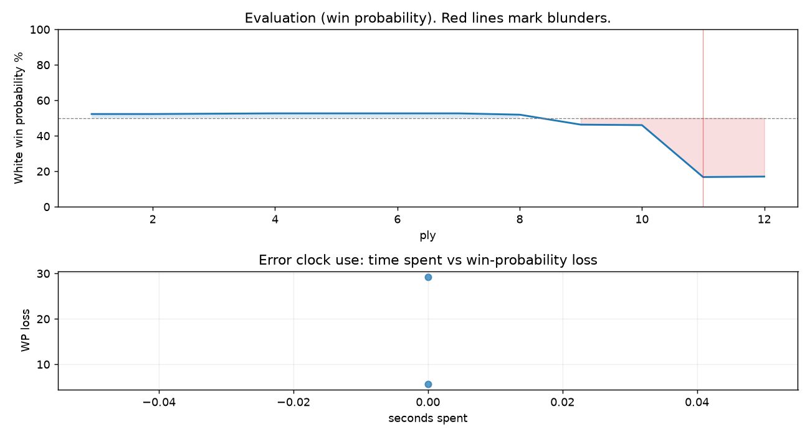

# (free, so lmk) Game analysis: kjetiltellnes vs DanielKetterer

Date: 2026.07.31  |  Time control: daily (1/259200)  |  You played: white
Game ID: 10d676e8-8cf3-11f1-93ad-9859ec01000b
Analysis: depth=24 multipv=3 findability=honest floor=6 stable_run=3 threads=1 hash_mb=256 deterministic=True engine_id=Stockfish_18 generated=2026-08-04T09:36:00Z
Game end time UTC: 2026-08-03T14:36:24+00:00
Game: https://www.chess.com/game/daily/1007093266

## Summary

- Lichess accuracy: you 55.3%, opponent 100.0%
- Opening: C50 Italian Game: Classical Variation, Albin Gambit (theory followed through ply 9)
- First deviation from theory: ply 10, Opponent played 5... Nxe4
- Your moves: 4 best, 0 excellent, 0 good, 1 inaccuracy, 0 mistake, 1 blunder

METRICS:

Best: The played move exactly matches Stockfish's top move

Excellent: A non-best move that loses 2 WP points or less.

Good: WP loss is over 2, but under 5 points; also used for losses under 20 when the position remains already decided.

Inaccuracy: WP loss is at least 5 but under 10 points.

Mistake: WP loss is at least 10 but under 20 points; also generally used when a forced mate is missed with under 10 points of WP loss.

Blunder: WP loss is 20 points or more, or a forced mate is missed with at least 10 points of WP loss.

See: https://support.chess.com/en/articles/8572705-how-are-moves-classified-what-is-a-blunder-or-brilliant-etc 

(Brillint, Great and Miss are rating subjective)
- Puzzles: 51 open, 0 solved

### Puzzle gate tally (this game)

Gates: category in ['brilliant_sacrifice', 'missed_tactic', 'allowed_tactic', 'endgame'], refute depth in [3, 8], best-vs-second WP gap >= 5. Refute bar per move: max(5, 0.6 x WP loss).

| outcome | errors |
|---|---|
| category:attention | 2 |

Four gates pass at once or nothing is generated, so a zero here is a product of four pass rates rather than a fault. Read the binding gate off this table before changing any threshold.

### Sacrifices in the engine's line

Real sacrifices are listed but never served as puzzles: compensation that never resolves back into material has no gradable answer.

| Move | Offered | Kind | Quiet | Line ends | Verdict |
|---|---|---|---|---|---|
| 5 | -3.0 (piece) | sham | yes | +0.0 pawns | opening_ply |
| 6 | -5.0 (piece) | sham | yes | +0.0 pawns | opening_ply |

## Biggest missed opportunity

You played 6.Re1. Stockfish preferred d4, after which the main line runs 6. d4 d5 7. Nxe5 Nxe5 8. Bb3 O-O. The evaluation crossed from equal to losing, which matters more than the raw number. Why it went wrong: motif: fork; creates threat on c5. This was a judgment error rather than a missed tactic; compare the pawn structure and piece activity after both moves. The engine prefers this move from at or below depth 6, which is as shallow as this measurement resolves; it sits near the surface, a quiet move, but one whose point shows at a glance. Candidates considered by the engine: d4 (-0.43), Bd5 (-0.45), d3 (-0.46).

## Critical positions

- Ply 11 (you), 6.Re1: -0.43 -> -4.35 [evaluation crossed equal -> losing]

## Your errors, move by move

| Move | Class | Category | WP loss | Refute depth | Seconds spent | Pre-error eval |
|---|---|---|---:|---|---:|---|
| 5.c3 | inaccuracy | attention | 6% | 2 | 0 | balanced |
| 6.Re1 | blunder | attention | 29% | 1 | 0 | balanced |

### 5.c3 (inaccuracy, positional, wp loss 6%)

You played 5.c3. Stockfish preferred d3, after which the main line runs 5. d3 d6 6. c3 a5 7. Re1 O-O. Why it went wrong: left pawn on e4 insufficiently defended. This was a judgment error rather than a missed tactic; compare the pawn structure and piece activity after both moves. The engine prefers this move from at or below depth 6, which is as shallow as this measurement resolves; it sits near the surface, a quiet move, but one whose point shows at a glance. Candidates considered by the engine: d3 (+0.21), Re1 (+0.19), Nc3 (+0.09).

### 6.Re1 (blunder, positional, wp loss 29%)

You played 6.Re1. Stockfish preferred d4, after which the main line runs 6. d4 d5 7. Nxe5 Nxe5 8. Bb3 O-O. The evaluation crossed from equal to losing, which matters more than the raw number. Why it went wrong: motif: fork; creates threat on c5. This was a judgment error rather than a missed tactic; compare the pawn structure and piece activity after both moves. The engine prefers this move from at or below depth 6, which is as shallow as this measurement resolves; it sits near the surface, a quiet move, but one whose point shows at a glance. Candidates considered by the engine: d4 (-0.43), Bd5 (-0.45), d3 (-0.46).

## Full move table

| Ply | Move | Eval before | Eval after | Best | CP loss | WP loss | Class |
|-----|------|-------------|------------|------|---------|---------|-------|
| 1 | 1.e4* | +0.31 | +0.25 | e4 | 6 | 1% | best |
| 2 | 1...e5 | +0.25 | +0.25 | e5 | 0 | 0% | best |
| 3 | 2.Nf3* | +0.25 | +0.27 | Nf3 | 0 | 0% | best |
| 4 | 2...Nc6 | +0.27 | +0.29 | Nc6 | 2 | 0% | best |
| 5 | 3.Bc4* | +0.29 | +0.29 | Bc4 | 0 | 0% | best |
| 6 | 3...Bc5 | +0.29 | +0.29 | Nf6 | 0 | 0% | excellent |
| 7 | 4.O-O* | +0.29 | +0.29 | O-O | 0 | 0% | best |
| 8 | 4...Nf6 | +0.29 | +0.21 | d6 | 0 | 0% | excellent |
| 9 | 5.c3* | +0.21 | -0.40 | d3 | 61 | 6% | inaccuracy |
| 10 | 5...Nxe4 | -0.40 | -0.43 | Nxe4 | 0 | 0% | best |
| 11 | 6.Re1* | -0.43 | -4.35 | d4 | 392 | 29% | blunder |
| 12 | 6...Bxf2+ | -4.35 | -4.30 | Bxf2+ | 5 | 0% | best |

Rows marked * are your moves. WP loss is win-probability loss; it is the primary signal, CP loss is shown for reference.

## Patterns in this game

- Error categories: 2 attention.
- Attention errors per 100 moves: 33.3.
- Pre-error eval buckets: 0 winning, 2 balanced, 0 losing.
- Opening: 2 error(s) (avg wp loss 17%).
