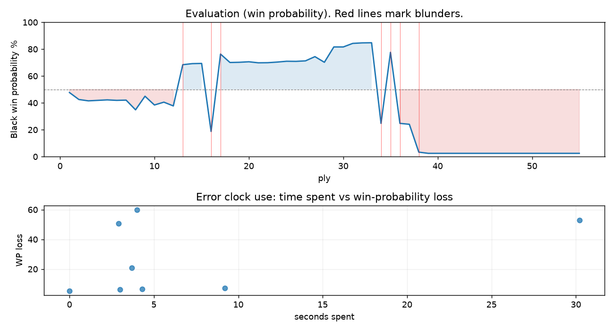

# (free, so lmk) Game analysis: DanielKetterer vs Mirrorwahl

Date: 2026.08.04  |  Time control: rapid (1800)  |  You played: black
Game ID: dee709af-905c-11f1-9797-0b6b4d01000f
Analysis: depth=24 multipv=3 findability=honest floor=6 stable_run=3 threads=1 hash_mb=256 deterministic=True engine_id=Stockfish_18 generated=2026-08-05T09:47:34Z
Game end time UTC: 2026-08-04T23:46:03+00:00
Game: https://www.chess.com/game/live/172539977052

## Summary

- Lichess accuracy: you 51.5%, opponent 60.1%
- Opening: B00 Owen Defense (theory followed through ply 2)
- First deviation from theory: ply 3, Opponent played 2. d4
- Your moves: 12 best, 5 excellent, 2 good, 4 inaccuracy, 0 mistake, 4 blunder

METRICS:

Best: The played move exactly matches Stockfish's top move

Excellent: A non-best move that loses 2 WP points or less.

Good: WP loss is over 2, but under 5 points; also used for losses under 20 when the position remains already decided.

Inaccuracy: WP loss is at least 5 but under 10 points.

Mistake: WP loss is at least 10 but under 20 points; also generally used when a forced mate is missed with under 10 points of WP loss.

Blunder: WP loss is 20 points or more, or a forced mate is missed with at least 10 points of WP loss.

See: https://support.chess.com/en/articles/8572705-how-are-moves-classified-what-is-a-blunder-or-brilliant-etc 

(Brillint, Great and Miss are rating subjective)
- Puzzles: 52 open, 0 solved

### Puzzle gate tally (this game)

Gates: category in ['brilliant_sacrifice', 'missed_tactic', 'allowed_tactic', 'endgame'], refute depth in [3, 8], best-vs-second WP gap >= 5. Refute bar per move: max(5, 0.6 x WP loss).

| outcome | errors |
|---|---|
| category:opening | 2 |
| refute_censored_high | 1 |
| refute_too_deep | 5 |

Four gates pass at once or nothing is generated, so a zero here is a product of four pass rates rather than a fault. Read the binding gate off this table before changing any threshold.

### Sacrifices in the engine's line

Real sacrifices are listed but never served as puzzles: compensation that never resolves back into material has no gradable answer.

| Move | Offered | Kind | Quiet | Line ends | Verdict |
|---|---|---|---|---|---|
| 5 | -3.0 (piece) | sham | yes | +0.0 pawns | opening_ply |
| 17 | -4.0 (piece) | sham | yes | +0.0 pawns | obvious |
| 18 | -5.0 (piece) | real | yes | -1.0 pawns | real_sacrifice_not_gradable |
| 19 | -6.0 (piece) | real | no | -6.0 pawns | real_sacrifice_not_gradable |

## Biggest missed opportunity

You played 17...Qxh2. Stockfish preferred Nd7, after which the main line runs 17...Nd7 18. Qxc6 Nf6 19. Ne4 Rad8 20. Nxf6+. The evaluation crossed from winning to losing, which matters more than the raw number. Why it went wrong: motif: creates threat on d4, h2. Before committing to a quiet move here, the checklist is checks, captures, threats, in that order. The engine prefers this move from at or below depth 6, which is as shallow as this measurement resolves; it sits near the surface, a forcing move, the kind a checks-and-captures scan catches. Candidates considered by the engine: Nd7 (-4.66), Na6 (-4.41), Rd8 (-4.37).

## Critical positions

- Ply 13 (opponent), 7.e5: +1.36 -> -2.10 [evaluation crossed equal -> losing]
- Ply 14 (you), 7...Bxg2: -2.10 -> -2.20 [only-move situation]
- Ply 16 (you), 8...Qxf6: -2.22 -> +3.98 [only-move situation; evaluation crossed winning -> losing]
- Ply 17 (opponent), 9.Ne4: +3.98 -> -3.18 [evaluation crossed winning -> losing]
- Ply 20 (you), 10...Bxh1: -2.33 -> -2.38 [only-move situation]
- Ply 22 (you), 11...Bxf3: -2.28 -> -2.29 [only-move situation]
- Ply 23 (opponent), 12.Qxf3: -2.29 -> -2.35 [only-move situation]
- Ply 24 (you), 12...c6: -2.35 -> -2.43 [only-move situation]

## Your errors, move by move

| Move | Class | Category | WP loss | Refute depth | Seconds spent | Pre-error eval |
|---|---|---|---:|---|---:|---|
| 1...b6 | inaccuracy | opening | 5% | >18 | 0 | balanced |
| 4...d5 | inaccuracy | opening | 7% | 12 | 9 | balanced |
| 5...dxe4 | inaccuracy | allowed_tactic | 7% | >18 | 4 | balanced |
| 8...Qxf6 | blunder | missed_tactic | 51% | 10 | 3 | winning |
| 9...Qh4+ | inaccuracy | allowed_tactic | 6% | 15 | 3 | winning |
| 17...Qxh2 | blunder | missed_tactic | 60% | 11 | 4 | winning |
| 18...Qg1+ | blunder | missed_tactic | 53% | 12 | 30 | winning |
| 19...Qxd4 | blunder | missed_tactic | 21% | 13 | 4 | losing |

### 1...b6 (inaccuracy, positional, wp loss 5%)

You played 1...b6. Stockfish preferred e5, after which the main line runs 1...e5 2. Nf3 Nc6 3. Bb5 Nf6 4. O-O. This was a judgment error rather than a missed tactic; compare the pawn structure and piece activity after both moves. The engine first prefers this move at depth 9 and holds it; findable, but it takes a deliberate look rather than a scan. Candidates considered by the engine: e5 (+0.25), c6 (+0.31), c5 (+0.37).

### 4...d5 (inaccuracy, positional, wp loss 7%)

You played 4...d5. Stockfish preferred e6, after which the main line runs 4...e6 5. Nge2 d6 6. d5 exd5 7. exd5. The evaluation crossed from equal to losing, which matters more than the raw number. This was a judgment error rather than a missed tactic; compare the pawn structure and piece activity after both moves. The engine prefers this move from at or below depth 6, which is as shallow as this measurement resolves; it sits near the surface, a quiet move, but one whose point shows at a glance. Candidates considered by the engine: e6 (+0.87), d6 (+0.93), c5 (+1.14).

### 5...dxe4 (inaccuracy, positional, wp loss 7%)

You played 5...dxe4. Stockfish preferred e6, after which the main line runs 5...e6 6. e5 Ng8 7. f4 Qd7 8. Nf3. This was a judgment error rather than a missed tactic; compare the pawn structure and piece activity after both moves. The engine prefers this move from at or below depth 6, which is as shallow as this measurement resolves; it sits near the surface, a quiet move, but one whose point shows at a glance. Candidates considered by the engine: e6 (+0.55), c5 (+0.55), Qd7 (+0.59).

### 8...Qxf6 (blunder, tactical, wp loss 51%)

You played 8...Qxf6. Stockfish preferred Bxh1, after which the main line runs 8...Bxh1 9. Qg4 gxf6 10. Bf4 h5 11. Qe2. The evaluation crossed from winning to losing, which matters more than the raw number. Why it went wrong: a favorable capture was available (Bxh1). Before committing to a quiet move here, the checklist is checks, captures, threats, in that order. The engine prefers this move from at or below depth 6, which is as shallow as this measurement resolves; it sits near the surface, a forcing move, the kind a checks-and-captures scan catches. Candidates considered by the engine: Bxh1 (-2.22), Bb4 (+2.12), Nc6 (+2.20).

### 9...Qh4+ (inaccuracy, positional, wp loss 6%)

You played 9...Qh4+. Stockfish preferred Bxe4, after which the main line runs 9...Bxe4 10. Qg4 Bxd3 11. cxd3 Qf5 12. Qe4. Why it went wrong: a favorable capture was available (Bxh1); motif: fork. This was a judgment error rather than a missed tactic; compare the pawn structure and piece activity after both moves. The engine does not settle on this move until depth 15; reachable with real calculation, but not on a scan. Candidates considered by the engine: Bxe4 (-3.18), Qh4+ (-2.25), Qd8 (-0.19).

### 17...Qxh2 (blunder, tactical, wp loss 60%)

You played 17...Qxh2. Stockfish preferred Nd7, after which the main line runs 17...Nd7 18. Qxc6 Nf6 19. Ne4 Rad8 20. Nxf6+. The evaluation crossed from winning to losing, which matters more than the raw number. Why it went wrong: motif: creates threat on d4, h2. Before committing to a quiet move here, the checklist is checks, captures, threats, in that order. The engine prefers this move from at or below depth 6, which is as shallow as this measurement resolves; it sits near the surface, a forcing move, the kind a checks-and-captures scan catches. Candidates considered by the engine: Nd7 (-4.66), Na6 (-4.41), Rd8 (-4.37).

### 18...Qg1+ (blunder, deep tactic, wp loss 53%)

You played 18...Qg1+. Stockfish preferred Qh4, after which the main line runs 18...Qh4 19. Bxh7+ Qxh7 20. Nf6+ gxf6 21. Rg2+. The evaluation crossed from winning to losing, which matters more than the raw number. Nothing was hanging and no capture was on offer, but the engine's continuation is forcing: this was a combination landing several moves out, not a judgment error. The engine prefers this move from at or below depth 6, which is as shallow as this measurement resolves; it sits near the surface, a forcing move, the kind a checks-and-captures scan catches. Candidates considered by the engine: Qh4 (-3.38), Qg1+ (+2.52), Qxd2+ (+3.18).

### 19...Qxd4 (blunder, tactical, wp loss 21%)

You played 19...Qxd4. Stockfish preferred Qxd1+, after which the main line runs 19...Qxd1+ 20. Kxd1 Nd7 21. Qxc6 Rad8 22. Qe4. Why it went wrong: a favorable capture was available (Qxd4); the best move was a forcing check; motif: fork. Before committing to a quiet move here, the checklist is checks, captures, threats, in that order. The engine prefers this move from at or below depth 6, which is as shallow as this measurement resolves; it sits near the surface, a forcing move, the kind a checks-and-captures scan catches. Candidates considered by the engine: Qxd1+ (+3.12), Qxg4 (+4.78), Qh2 (+6.19).

## Full move table

| Ply | Move | Eval before | Eval after | Best | CP loss | WP loss | Class |
|-----|------|-------------|------------|------|---------|---------|-------|
| 1 | 1.e4 | +0.31 | +0.25 | e4 | 6 | 1% | best |
| 2 | 1...b6* | +0.25 | +0.82 | e5 | 57 | 5% | inaccuracy |
| 3 | 2.d4 | +0.82 | +0.93 | d4 | 0 | 0% | best |
| 4 | 2...Bb7* | +0.93 | +0.89 | Bb7 | 0 | 0% | best |
| 5 | 3.Nc3 | +0.89 | +0.85 | Bd3 | 4 | 0% | excellent |
| 6 | 3...Nf6* | +0.85 | +0.89 | e6 | 4 | 0% | excellent |
| 7 | 4.Bd3 | +0.89 | +0.87 | e5 | 2 | 0% | excellent |
| 8 | 4...d5* | +0.87 | +1.70 | e6 | 83 | 7% | inaccuracy |
| 9 | 5.f3 | +1.70 | +0.55 | e5 | 115 | 10% | mistake |
| 10 | 5...dxe4* | +0.55 | +1.28 | e6 | 73 | 7% | inaccuracy |
| 11 | 6.fxe4 | +1.28 | +1.04 | fxe4 | 24 | 2% | best |
| 12 | 6...e6* | +1.04 | +1.36 | c5 | 32 | 3% | good |
| 13 | 7.e5 | +1.36 | -2.10 | Nf3 | 346 | 31% | blunder |
| 14 | 7...Bxg2* | -2.10 | -2.20 | Bxg2 | 0 | 0% | best |
| 15 | 8.exf6 | -2.20 | -2.22 | exf6 | 2 | 0% | best |
| 16 | 8...Qxf6* | -2.22 | +3.98 | Bxh1 | 620 | 51% | blunder |
| 17 | 9.Ne4 | +3.98 | -3.18 | Qg4 | 716 | 58% | blunder |
| 18 | 9...Qh4+* | -3.18 | -2.31 | Bxe4 | 87 | 6% | inaccuracy |
| 19 | 10.Nf2 | -2.31 | -2.33 | Nf2 | 2 | 0% | best |
| 20 | 10...Bxh1* | -2.33 | -2.38 | Bxh1 | 0 | 0% | best |
| 21 | 11.Nf3 | -2.38 | -2.28 | Nf3 | 0 | 0% | best |
| 22 | 11...Bxf3* | -2.28 | -2.29 | Bxf3 | 0 | 0% | best |
| 23 | 12.Qxf3 | -2.29 | -2.35 | Qxf3 | 6 | 0% | best |
| 24 | 12...c6* | -2.35 | -2.43 | c6 | 0 | 0% | best |
| 25 | 13.Bf4 | -2.43 | -2.42 | c3 | 0 | 0% | excellent |
| 26 | 13...Be7* | -2.42 | -2.47 | Be7 | 0 | 0% | best |
| 27 | 14.O-O-O | -2.47 | -2.90 | c3 | 43 | 3% | good |
| 28 | 14...O-O* | -2.90 | -2.33 | Bg5 | 57 | 4% | good |
| 29 | 15.c4 | -2.33 | -4.05 | Bg3 | 172 | 11% | mistake |
| 30 | 15...Bg5* | -4.05 | -4.05 | Bg5 | 0 | 0% | best |
| 31 | 16.Bd2 | -4.05 | -4.56 | Bxg5 | 51 | 3% | good |
| 32 | 16...Bxd2+* | -4.56 | -4.64 | Bxd2+ | 0 | 0% | best |
| 33 | 17.Rxd2 | -4.64 | -4.66 | Rxd2 | 2 | 0% | best |
| 34 | 17...Qxh2* | -4.66 | +3.02 | Nd7 | 768 | 60% | blunder |
| 35 | 18.Ng4 | +3.02 | -3.38 | Nh3 | 640 | 53% | blunder |
| 36 | 18...Qg1+* | -3.38 | +3.02 | Qh4 | 640 | 53% | blunder |
| 37 | 19.Rd1 | +3.02 | +3.12 | Rd1 | 0 | 0% | best |
| 38 | 19...Qxd4* | +3.12 | +9.14 | Qxd1+ | 602 | 21% | blunder |
| 39 | 20.Bxh7+ | +9.14 | +11.40 | Bxh7+ | 0 | 0% | best |
| 40 | 20...Kxh7* | +11.40 | +10.02 | Kxh7 | 0 | 0% | best |
| 41 | 21.Rxd4 | +10.02 | +11.03 | Rxd4 | 0 | 0% | best |
| 42 | 21...Nd7* | +11.03 | M13 | f5 |  | 0% | excellent |
| 43 | 22.Rxd7 | M13 | M12 | Rxd7 |  | 0% | best |
| 44 | 22...f5* | M12 | M5 | Rad8 |  | 0% | excellent |
| 45 | 23.Qh3+ | M5 | M7 | Qc3 |  | 0% | excellent |
| 46 | 23...Kg8* | M7 | M5 | Kg6 |  | 0% | excellent |
| 47 | 24.Nh6+ | M5 | M4 | Nh6+ |  | 0% | best |
| 48 | 24...gxh6* | M4 | M2 | Kh7 |  | 0% | excellent |
| 49 | 25.Qxh6 | M2 | M3 | Qg2+ |  | 0% | excellent |
| 50 | 25...Rf7* | M3 | M3 | Rf7 |  | 0% | best |
| 51 | 26.Qg6+ | M3 | M2 | Qg6+ |  | 0% | best |
| 52 | 26...Kh8* | M2 | M2 | Kh8 |  | 0% | best |
| 53 | 27.Rxf7 | M2 | M1 | Qxf7 |  | 0% | excellent |
| 54 | 27...f4* | M1 | M1 | f4 |  | 0% | best |
| 55 | 28.Qh7# | M1 | M1 | Qh7# |  | 0% | best |

Rows marked * are your moves. WP loss is win-probability loss; it is the primary signal, CP loss is shown for reference.

## Patterns in this game

- Error categories: 2 allowed_tactic, 4 missed_tactic, 2 opening.
- Attention errors per 100 moves: 0.0.
- Pre-error eval buckets: 4 winning, 3 balanced, 1 losing.
- Opening: 5 error(s) (avg wp loss 15%).
- Middlegame: 3 error(s) (avg wp loss 45%).
