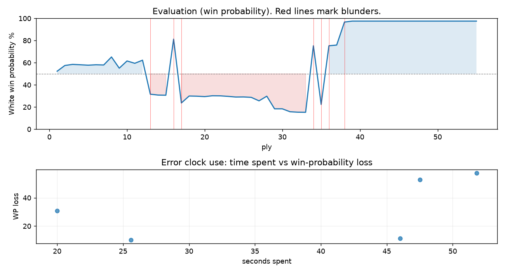

# (free, so lmk) Game analysis: DanielKetterer vs Mirrorwahl

Date: 2026.08.04  |  Time control: rapid (1800)  |  You played: white
Game ID: dee709af-905c-11f1-9797-0b6b4d01000f
Analysis: depth=24 multipv=3 findability=honest floor=6 stable_run=3 threads=1 hash_mb=256 deterministic=True engine_id=Stockfish_18 generated=2026-08-05T09:47:34Z
Game end time UTC: 2026-08-04T23:46:03+00:00
Game: https://www.chess.com/game/live/172539977052

## Summary

- Lichess accuracy: you 60.1%, opponent 51.5%
- Opening: B00 Owen Defense (theory followed through ply 2)
- First deviation from theory: ply 3, You played 2. d4
- Your moves: 15 best, 6 excellent, 2 good, 0 inaccuracy, 2 mistake, 3 blunder

METRICS:

Best: The played move exactly matches Stockfish's top move

Excellent: A non-best move that loses 2 WP points or less.

Good: WP loss is over 2, but under 5 points; also used for losses under 20 when the position remains already decided.

Inaccuracy: WP loss is at least 5 but under 10 points.

Mistake: WP loss is at least 10 but under 20 points; also generally used when a forced mate is missed with under 10 points of WP loss.

Blunder: WP loss is 20 points or more, or a forced mate is missed with at least 10 points of WP loss.

See: https://support.chess.com/en/articles/8572705-how-are-moves-classified-what-is-a-blunder-or-brilliant-etc 

(Brillint, Great and Miss are rating subjective)
- Puzzles: 52 open, 0 solved

### Puzzle gate tally (this game)

Gates: category in ['brilliant_sacrifice', 'missed_tactic', 'allowed_tactic', 'endgame'], refute depth in [3, 8], best-vs-second WP gap >= 5. Refute bar per move: max(5, 0.6 x WP loss).

| outcome | errors |
|---|---|
| accepted | 1 |
| category:attention | 2 |
| category:positional | 1 |
| refute_too_deep | 1 |

Four gates pass at once or nothing is generated, so a zero here is a product of four pass rates rather than a fault. Read the binding gate off this table before changing any threshold.

### Sacrifices in the engine's line

Real sacrifices are listed but never served as puzzles: compensation that never resolves back into material has no gradable answer.

| Move | Offered | Kind | Quiet | Line ends | Verdict |
|---|---|---|---|---|---|
| 9 | -5.0 (piece) | sham | yes | +1.0 pawns | opening_ply |
| 15 | -3.0 (piece) | sham | yes | +3.0 pawns | eval_out_of_band |
| 18 | -5.0 (piece) | sham | yes | +5.0 pawns | obvious |

## Biggest missed opportunity

You played 9.Ne4. Stockfish preferred Qg4, after which the main line runs 9. Qg4 Bxh1 10. Bg5 h5 11. Qh4 Nd7. The evaluation crossed from winning to losing, which matters more than the raw number. Why it went wrong: left pawn on d4, rook on h1 insufficiently defended; motif: creates threat on g2. Before committing to a quiet move here, the checklist is checks, captures, threats, in that order. The engine prefers this move from at or below depth 6, which is as shallow as this measurement resolves; it sits near the surface, a forcing move, the kind a checks-and-captures scan catches. Candidates considered by the engine: Qg4 (+3.98), h4 (+2.79), Nb5 (-2.31).

## Critical positions

- Ply 13 (you), 7.e5: +1.36 -> -2.10 [evaluation crossed equal -> losing]
- Ply 14 (opponent), 7...Bxg2: -2.10 -> -2.20 [only-move situation]
- Ply 16 (opponent), 8...Qxf6: -2.22 -> +3.98 [only-move situation; evaluation crossed winning -> losing]
- Ply 17 (you), 9.Ne4: +3.98 -> -3.18 [evaluation crossed winning -> losing]
- Ply 20 (opponent), 10...Bxh1: -2.33 -> -2.38 [only-move situation]
- Ply 22 (opponent), 11...Bxf3: -2.28 -> -2.29 [only-move situation]
- Ply 23 (you), 12.Qxf3: -2.29 -> -2.35 [only-move situation]
- Ply 24 (opponent), 12...c6: -2.35 -> -2.43 [only-move situation]

## Your errors, move by move

| Move | Class | Category | WP loss | Refute depth | Seconds spent | Pre-error eval |
|---|---|---|---:|---|---:|---|
| 5.f3 | mistake | attention | 10% | 1 | 26 | winning |
| 7.e5 | blunder | attention | 31% | 2 | 20 | balanced |
| 9.Ne4 | blunder | missed_tactic | 58% | 8 | 52 | winning |
| 15.c4 | mistake | positional | 11% | 1 | 46 | losing |
| 18.Ng4 | blunder | missed_tactic | 53% | 14 | 48 | winning |

### 5.f3 (mistake, positional, wp loss 10%)

You played 5.f3. Stockfish preferred e5, after which the main line runs 5. e5 Ne4 6. Nce2 c5 7. Bb5+ Bc6. The evaluation crossed from winning to equal, which matters more than the raw number. Why it went wrong: motif: creates threat on f6. This was a judgment error rather than a missed tactic; compare the pawn structure and piece activity after both moves. The engine prefers this move from at or below depth 6, which is as shallow as this measurement resolves; it sits near the surface, a quiet move, but one whose point shows at a glance. Candidates considered by the engine: e5 (+1.70), exd5 (+0.82), f3 (+0.66).

### 7.e5 (blunder, tactical, wp loss 31%)

You played 7.e5. Stockfish preferred Nf3, after which the main line runs 7. Nf3 Be7 8. O-O Nc6 9. Kh1 h5. The evaluation crossed from equal to losing, which matters more than the raw number. Why it went wrong: left pawn on d4, pawn on g2 insufficiently defended. Before committing to a quiet move here, the checklist is checks, captures, threats, in that order. The engine prefers this move from at or below depth 6, which is as shallow as this measurement resolves; it sits near the surface, a forcing move, the kind a checks-and-captures scan catches. Candidates considered by the engine: Nf3 (+1.36), Nge2 (+0.53), a3 (+0.52).

### 9.Ne4 (blunder, tactical, wp loss 58%)

You played 9.Ne4. Stockfish preferred Qg4, after which the main line runs 9. Qg4 Bxh1 10. Bg5 h5 11. Qh4 Nd7. The evaluation crossed from winning to losing, which matters more than the raw number. Why it went wrong: left pawn on d4, rook on h1 insufficiently defended; motif: creates threat on g2. Before committing to a quiet move here, the checklist is checks, captures, threats, in that order. The engine prefers this move from at or below depth 6, which is as shallow as this measurement resolves; it sits near the surface, a forcing move, the kind a checks-and-captures scan catches. Candidates considered by the engine: Qg4 (+3.98), h4 (+2.79), Nb5 (-2.31).

### 15.c4 (mistake, positional, wp loss 11%)

You played 15.c4. Stockfish preferred Bg3, after which the main line runs 15. Bg3 Qh6+ 16. Kb1 Nd7 17. Bf4 Bg5. Why it went wrong: motif: fork; creates threat on h4. This was a judgment error rather than a missed tactic; compare the pawn structure and piece activity after both moves. The engine never settles on this move within the analysis depth, so how findable it was is not measured here; weigh this one lightly. Candidates considered by the engine: Bg3 (-2.33), Rg1 (-2.34), Kb1 (-2.37).

### 18.Ng4 (blunder, deep tactic, wp loss 53%)

You played 18.Ng4. Stockfish preferred Nh3, after which the main line runs 18. Nh3 Qxd2+ 19. Kxd2 Nd7 20. Qxc6 Rad8. The evaluation crossed from winning to losing, which matters more than the raw number. Why it went wrong: motif: creates threat on h2. Nothing was hanging and no capture was on offer, but the engine's continuation is forcing: this was a combination landing several moves out, not a judgment error. The engine prefers this move from at or below depth 6, which is as shallow as this measurement resolves; it sits near the surface, a forcing move, the kind a checks-and-captures scan catches. Candidates considered by the engine: Nh3 (+3.02), Ng4 (-2.90), b4 (-3.26).

## Full move table

| Ply | Move | Eval before | Eval after | Best | CP loss | WP loss | Class |
|-----|------|-------------|------------|------|---------|---------|-------|
| 1 | 1.e4* | +0.31 | +0.25 | e4 | 6 | 1% | best |
| 2 | 1...b6 | +0.25 | +0.82 | e5 | 57 | 5% | inaccuracy |
| 3 | 2.d4* | +0.82 | +0.93 | d4 | 0 | 0% | best |
| 4 | 2...Bb7 | +0.93 | +0.89 | Bb7 | 0 | 0% | best |
| 5 | 3.Nc3* | +0.89 | +0.85 | Bd3 | 4 | 0% | excellent |
| 6 | 3...Nf6 | +0.85 | +0.89 | e6 | 4 | 0% | excellent |
| 7 | 4.Bd3* | +0.89 | +0.87 | e5 | 2 | 0% | excellent |
| 8 | 4...d5 | +0.87 | +1.70 | e6 | 83 | 7% | inaccuracy |
| 9 | 5.f3* | +1.70 | +0.55 | e5 | 115 | 10% | mistake |
| 10 | 5...dxe4 | +0.55 | +1.28 | e6 | 73 | 7% | inaccuracy |
| 11 | 6.fxe4* | +1.28 | +1.04 | fxe4 | 24 | 2% | best |
| 12 | 6...e6 | +1.04 | +1.36 | c5 | 32 | 3% | good |
| 13 | 7.e5* | +1.36 | -2.10 | Nf3 | 346 | 31% | blunder |
| 14 | 7...Bxg2 | -2.10 | -2.20 | Bxg2 | 0 | 0% | best |
| 15 | 8.exf6* | -2.20 | -2.22 | exf6 | 2 | 0% | best |
| 16 | 8...Qxf6 | -2.22 | +3.98 | Bxh1 | 620 | 51% | blunder |
| 17 | 9.Ne4* | +3.98 | -3.18 | Qg4 | 716 | 58% | blunder |
| 18 | 9...Qh4+ | -3.18 | -2.31 | Bxe4 | 87 | 6% | inaccuracy |
| 19 | 10.Nf2* | -2.31 | -2.33 | Nf2 | 2 | 0% | best |
| 20 | 10...Bxh1 | -2.33 | -2.38 | Bxh1 | 0 | 0% | best |
| 21 | 11.Nf3* | -2.38 | -2.28 | Nf3 | 0 | 0% | best |
| 22 | 11...Bxf3 | -2.28 | -2.29 | Bxf3 | 0 | 0% | best |
| 23 | 12.Qxf3* | -2.29 | -2.35 | Qxf3 | 6 | 0% | best |
| 24 | 12...c6 | -2.35 | -2.43 | c6 | 0 | 0% | best |
| 25 | 13.Bf4* | -2.43 | -2.42 | c3 | 0 | 0% | excellent |
| 26 | 13...Be7 | -2.42 | -2.47 | Be7 | 0 | 0% | best |
| 27 | 14.O-O-O* | -2.47 | -2.90 | c3 | 43 | 3% | good |
| 28 | 14...O-O | -2.90 | -2.33 | Bg5 | 57 | 4% | good |
| 29 | 15.c4* | -2.33 | -4.05 | Bg3 | 172 | 11% | mistake |
| 30 | 15...Bg5 | -4.05 | -4.05 | Bg5 | 0 | 0% | best |
| 31 | 16.Bd2* | -4.05 | -4.56 | Bxg5 | 51 | 3% | good |
| 32 | 16...Bxd2+ | -4.56 | -4.64 | Bxd2+ | 0 | 0% | best |
| 33 | 17.Rxd2* | -4.64 | -4.66 | Rxd2 | 2 | 0% | best |
| 34 | 17...Qxh2 | -4.66 | +3.02 | Nd7 | 768 | 60% | blunder |
| 35 | 18.Ng4* | +3.02 | -3.38 | Nh3 | 640 | 53% | blunder |
| 36 | 18...Qg1+ | -3.38 | +3.02 | Qh4 | 640 | 53% | blunder |
| 37 | 19.Rd1* | +3.02 | +3.12 | Rd1 | 0 | 0% | best |
| 38 | 19...Qxd4 | +3.12 | +9.14 | Qxd1+ | 602 | 21% | blunder |
| 39 | 20.Bxh7+* | +9.14 | +11.40 | Bxh7+ | 0 | 0% | best |
| 40 | 20...Kxh7 | +11.40 | +10.02 | Kxh7 | 0 | 0% | best |
| 41 | 21.Rxd4* | +10.02 | +11.03 | Rxd4 | 0 | 0% | best |
| 42 | 21...Nd7 | +11.03 | M13 | f5 |  | 0% | excellent |
| 43 | 22.Rxd7* | M13 | M12 | Rxd7 |  | 0% | best |
| 44 | 22...f5 | M12 | M5 | Rad8 |  | 0% | excellent |
| 45 | 23.Qh3+* | M5 | M7 | Qc3 |  | 0% | excellent |
| 46 | 23...Kg8 | M7 | M5 | Kg6 |  | 0% | excellent |
| 47 | 24.Nh6+* | M5 | M4 | Nh6+ |  | 0% | best |
| 48 | 24...gxh6 | M4 | M2 | Kh7 |  | 0% | excellent |
| 49 | 25.Qxh6* | M2 | M3 | Qg2+ |  | 0% | excellent |
| 50 | 25...Rf7 | M3 | M3 | Rf7 |  | 0% | best |
| 51 | 26.Qg6+* | M3 | M2 | Qg6+ |  | 0% | best |
| 52 | 26...Kh8 | M2 | M2 | Kh8 |  | 0% | best |
| 53 | 27.Rxf7* | M2 | M1 | Qxf7 |  | 0% | excellent |
| 54 | 27...f4 | M1 | M1 | f4 |  | 0% | best |
| 55 | 28.Qh7#* | M1 | M1 | Qh7# |  | 0% | best |

Rows marked * are your moves. WP loss is win-probability loss; it is the primary signal, CP loss is shown for reference.

## Patterns in this game

- Error categories: 2 attention, 2 missed_tactic, 1 positional.
- Attention errors per 100 moves: 7.1.
- Pre-error eval buckets: 3 winning, 1 balanced, 1 losing.
- Opening: 3 error(s) (avg wp loss 33%).
- Middlegame: 2 error(s) (avg wp loss 32%).
