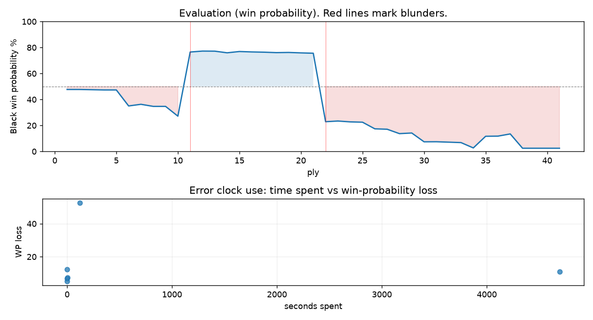

# (free, so lmk) Game analysis: DanielKetterer vs oliviervermeer

Date: 2026.07.31  |  Time control: daily (1/259200)  |  You played: black
Game ID: 5f2c9e70-8d21-11f1-b1f9-4a08bc01000b
Analysis: depth=24 multipv=3 findability=honest floor=6 stable_run=3 threads=1 hash_mb=256 deterministic=True engine_id=Stockfish_18 generated=2026-08-07T08:17:49Z
Game end time UTC: 2026-08-06T13:51:13+00:00
Game: https://www.chess.com/game/daily/1007238956

## Summary

- Lichess accuracy: you 67.9%, opponent 74.8%
- Opening: C50 Italian Game (theory followed through ply 5)
- First deviation from theory: ply 6, You played 3... f6
- Your moves: 7 best, 5 excellent, 2 good, 3 inaccuracy, 2 mistake, 1 blunder

METRICS:

Best: The played move exactly matches Stockfish's top move

Excellent: A non-best move that loses 2 WP points or less.

Good: WP loss is over 2, but under 5 points; also used for losses under 20 when the position remains already decided.

Inaccuracy: WP loss is at least 5 but under 10 points.

Mistake: WP loss is at least 10 but under 20 points; also generally used when a forced mate is missed with under 10 points of WP loss.

Blunder: WP loss is 20 points or more, or a forced mate is missed with at least 10 points of WP loss.

See: https://support.chess.com/en/articles/8572705-how-are-moves-classified-what-is-a-blunder-or-brilliant-etc 

(Brillint, Great and Miss are rating subjective)
- Puzzles: 52 open, 0 solved

### Puzzle gate tally (this game)

Gates: category in ['brilliant_sacrifice', 'missed_tactic', 'allowed_tactic', 'endgame'], refute depth in [3, 8], best-vs-second WP gap >= 5. Refute bar per move: max(5, 0.6 x WP loss).

| outcome | errors |
|---|---|
| category:attention | 2 |
| category:positional | 1 |
| refute_too_deep | 2 |
| refute_too_shallow | 1 |

Four gates pass at once or nothing is generated, so a zero here is a product of four pass rates rather than a fault. Read the binding gate off this table before changing any threshold.

### Sacrifices in the engine's line

Real sacrifices are listed but never served as puzzles: compensation that never resolves back into material has no gradable answer.

| Move | Offered | Kind | Quiet | Line ends | Verdict |
|---|---|---|---|---|---|
| 5 | -9.0 (piece) | real | no | -1.0 pawns | real_sacrifice_not_gradable |
| 15 | -5.0 (piece) | real | yes | -2.0 pawns | real_sacrifice_not_gradable |
| 19 | -2.0 (exchange) | sham | yes | +1.0 pawns | obvious |

## Biggest missed opportunity

You played 11...Nf4. Stockfish preferred Bg4, after which the main line runs 11...Bg4 12. Nc3 Rc8 13. Bg3 h5 14. h3. The evaluation crossed from winning to losing, which matters more than the raw number. Why it went wrong: left knight on f4 insufficiently defended. Before committing to a quiet move here, the checklist is checks, captures, threats, in that order. The engine prefers this move from at or below depth 6, which is as shallow as this measurement resolves; it sits near the surface, a forcing move, the kind a checks-and-captures scan catches. Candidates considered by the engine: Bg4 (-3.07), Rg8 (-2.67), Be6 (-2.56).

## Critical positions

- Ply 11 (opponent), 6.dxe5: +2.68 -> -3.21 [only-move situation; evaluation crossed winning -> losing]
- Ply 12 (you), 6...dxc4: -3.21 -> -3.32 [only-move situation]
- Ply 16 (you), 8...Ke8: -3.27 -> -3.22 [only-move situation]
- Ply 22 (you), 11...Nf4: -3.07 -> +3.30 [evaluation crossed winning -> losing]
- Ply 23 (opponent), 12.Bxf4: +3.30 -> +3.22 [only-move situation]

## Your errors, move by move

| Move | Class | Category | WP loss | Refute depth | Seconds spent | Pre-error eval |
|---|---|---|---:|---|---:|---|
| 3...f6 | mistake | attention | 12% | 2 | 0 | balanced |
| 5...d5 | inaccuracy | allowed_tactic | 8% | 1 | 3 | losing |
| 11...Nf4 | blunder | attention | 53% | 1 | 120 | winning |
| 13...f5 | inaccuracy | positional | 5% | 1 | 0 | losing |
| 15...a6 | inaccuracy | allowed_tactic | 7% | 13 | 0 | losing |
| 19...Nxa2 | mistake | missed_tactic | 11% | 12 | 4692 | losing |

### 3...f6 (mistake, positional, wp loss 12%)

You played 3...f6. Stockfish preferred Nf6, after which the main line runs 3...Nf6 4. d3 Bc5 5. c3 d6 6. O-O. Why it went wrong: motif: creates threat on e4. This was a judgment error rather than a missed tactic; compare the pawn structure and piece activity after both moves. The engine prefers this move from at or below depth 6, which is as shallow as this measurement resolves; it sits near the surface, a quiet move, but one whose point shows at a glance. Candidates considered by the engine: Nf6 (+0.29), Bc5 (+0.32), Be7 (+0.49).

### 5...d5 (inaccuracy, positional, wp loss 8%)

You played 5...d5. Stockfish preferred Nxd4, after which the main line runs 5...Nxd4 6. Nxd4 exd4 7. c3 d3 8. a4. This was a judgment error rather than a missed tactic; compare the pawn structure and piece activity after both moves. The engine does not settle on this move until depth 13; reachable with real calculation, but not on a scan. Candidates considered by the engine: Nxd4 (+1.72), exd4 (+1.78), Ng6 (+1.80).

### 11...Nf4 (blunder, tactical, wp loss 53%)

You played 11...Nf4. Stockfish preferred Bg4, after which the main line runs 11...Bg4 12. Nc3 Rc8 13. Bg3 h5 14. h3. The evaluation crossed from winning to losing, which matters more than the raw number. Why it went wrong: left knight on f4 insufficiently defended. Before committing to a quiet move here, the checklist is checks, captures, threats, in that order. The engine prefers this move from at or below depth 6, which is as shallow as this measurement resolves; it sits near the surface, a forcing move, the kind a checks-and-captures scan catches. Candidates considered by the engine: Bg4 (-3.07), Rg8 (-2.67), Be6 (-2.56).

### 13...f5 (inaccuracy, positional, wp loss 5%)

You played 13...f5. Stockfish preferred Rf8, after which the main line runs 13...Rf8 14. Nbd2 c3 15. bxc3 fxe5 16. Bxe5. This was a judgment error rather than a missed tactic; compare the pawn structure and piece activity after both moves. The engine never settles on this move within the analysis depth, so how findable it was is not measured here; weigh this one lightly. Candidates considered by the engine: Rf8 (+3.36), fxe5 (+3.42), Nxe5 (+3.51).

### 15...a6 (inaccuracy, positional, wp loss 7%)

You played 15...a6. Stockfish preferred Ke7, after which the main line runs 15...Ke7 16. Nc7 Be6 17. a3 Na6 18. Bg5+. Why it went wrong: motif: creates threat on c2. This was a judgment error rather than a missed tactic; compare the pawn structure and piece activity after both moves. The engine does not settle on this move until depth 20; reachable with real calculation, but not on a scan. Candidates considered by the engine: Ke7 (+4.89), Be6 (+4.89), Na6 (+4.96).

### 19...Nxa2 (mistake, tactical, wp loss 11%)

You played 19...Nxa2. Stockfish preferred Ba4, after which the main line runs 19...Ba4 20. Bg5+ Kf7 21. e6+ Kxe6 22. Re1+. Why it went wrong: motif: creates threat on a2. Before committing to a quiet move here, the checklist is checks, captures, threats, in that order. The engine prefers this move from at or below depth 6, which is as shallow as this measurement resolves; it sits near the surface, a forcing move, the kind a checks-and-captures scan catches. Candidates considered by the engine: Ba4 (+5.05), Bc6 (+5.09), Be6 (+5.28).

## Full move table

| Ply | Move | Eval before | Eval after | Best | CP loss | WP loss | Class |
|-----|------|-------------|------------|------|---------|---------|-------|
| 1 | 1.e4 | +0.31 | +0.25 | e4 | 6 | 1% | best |
| 2 | 1...e5* | +0.25 | +0.25 | e5 | 0 | 0% | best |
| 3 | 2.Nf3 | +0.25 | +0.27 | Nf3 | 0 | 0% | best |
| 4 | 2...Nc6* | +0.27 | +0.29 | Nc6 | 2 | 0% | best |
| 5 | 3.Bc4 | +0.29 | +0.29 | Bc4 | 0 | 0% | best |
| 6 | 3...f6* | +0.29 | +1.68 | Nf6 | 139 | 12% | mistake |
| 7 | 4.O-O | +1.68 | +1.53 | d4 | 15 | 1% | excellent |
| 8 | 4...Nge7* | +1.53 | +1.72 | g6 | 19 | 2% | excellent |
| 9 | 5.d4 | +1.72 | +1.72 | d4 | 0 | 0% | best |
| 10 | 5...d5* | +1.72 | +2.68 | Nxd4 | 96 | 8% | inaccuracy |
| 11 | 6.dxe5 | +2.68 | -3.21 | exd5 | 589 | 49% | blunder |
| 12 | 6...dxc4* | -3.21 | -3.32 | dxc4 | 0 | 0% | best |
| 13 | 7.Qxd8+ | -3.32 | -3.31 | exf6 | 0 | 0% | excellent |
| 14 | 7...Kxd8* | -3.31 | -3.12 | Nxd8 | 19 | 1% | excellent |
| 15 | 8.Rd1+ | -3.12 | -3.27 | Rd1+ | 15 | 1% | best |
| 16 | 8...Ke8* | -3.27 | -3.22 | Ke8 | 5 | 0% | best |
| 17 | 9.exf6 | -3.22 | -3.19 | Na3 | 0 | 0% | excellent |
| 18 | 9...gxf6* | -3.19 | -3.14 | gxf6 | 5 | 0% | best |
| 19 | 10.Bf4 | -3.14 | -3.16 | Bf4 | 2 | 0% | best |
| 20 | 10...Ng6* | -3.16 | -3.11 | Bg4 | 5 | 0% | excellent |
| 21 | 11.Bxc7 | -3.11 | -3.07 | Bxc7 | 0 | 0% | best |
| 22 | 11...Nf4* | -3.07 | +3.30 | Bg4 | 637 | 53% | blunder |
| 23 | 12.Bxf4 | +3.30 | +3.22 | Bxf4 | 8 | 1% | best |
| 24 | 12...Bc5* | +3.22 | +3.32 | Kf7 | 10 | 1% | excellent |
| 25 | 13.e5 | +3.32 | +3.36 | h3 | 0 | 0% | excellent |
| 26 | 13...f5* | +3.36 | +4.23 | Rf8 | 87 | 5% | inaccuracy |
| 27 | 14.Nc3 | +4.23 | +4.29 | Nc3 | 0 | 0% | best |
| 28 | 14...Nb4* | +4.29 | +5.00 | Nd8 | 71 | 3% | good |
| 29 | 15.Nb5 | +5.00 | +4.89 | Nb5 | 11 | 0% | best |
| 30 | 15...a6* | +4.89 | +6.86 | Ke7 | 197 | 7% | inaccuracy |
| 31 | 16.Nc7+ | +6.86 | +6.84 | Nc7+ | 2 | 0% | best |
| 32 | 16...Ke7* | +6.84 | +6.97 | Ke7 | 13 | 0% | best |
| 33 | 17.Nxa8 | +6.97 | +7.11 | Nxa8 | 0 | 0% | best |
| 34 | 17...Bd7* | +7.11 | +9.74 | Rg8 | 263 | 4% | good |
| 35 | 18.Rd2 | +9.74 | +5.50 | Bg5+ | 424 | 9% | inaccuracy |
| 36 | 18...Rxa8* | +5.50 | +5.47 | Rxa8 | 0 | 0% | best |
| 37 | 19.Rad1 | +5.47 | +5.05 | a3 | 42 | 2% | excellent |
| 38 | 19...Nxa2* | +5.05 | +10.36 | Ba4 | 531 | 11% | mistake |
| 39 | 20.Rxd7+ | +10.36 | +14.38 | Rxd7+ | 0 | 0% | best |
| 40 | 20...Ke6* | +14.38 | M1 | Kf8 |  | 0% | excellent |
| 41 | 21.Ng5# | M1 | M1 | Ng5# |  | 0% | best |

Rows marked * are your moves. WP loss is win-probability loss; it is the primary signal, CP loss is shown for reference.

## Patterns in this game

- Error categories: 2 allowed_tactic, 2 attention, 1 missed_tactic, 1 positional.
- Attention errors per 100 moves: 10.0.
- Pre-error eval buckets: 1 winning, 1 balanced, 4 losing.
- Opening: 2 error(s) (avg wp loss 10%).
- Middlegame: 4 error(s) (avg wp loss 19%).
- 2 of your errors came with under a minute on the clock.
