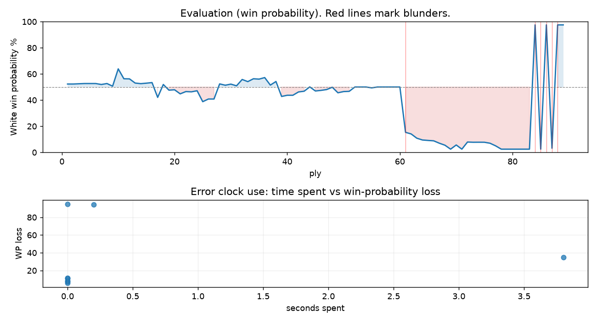

# (free, so lmk) Game analysis: DanielKetterer vs Strategic_Logic

Date: 2026.08.07  |  Time control: daily (1/86400)  |  You played: white
Game ID: 53b98194-9270-11f1-9c70-8b72fd01000b
Analysis: depth=24 multipv=3 findability=honest floor=6 stable_run=3 threads=1 hash_mb=256 deterministic=True engine_id=Stockfish_18 generated=2026-08-08T08:13:18Z
Game end time UTC: 2026-08-07T16:48:23+00:00
Game: https://www.chess.com/game/daily/1010369486

## Summary

- Lichess accuracy: you 37.8%, opponent 37.1%
- Opening: C54 Italian Game: Classical Variation, Center Attack (theory followed through ply 9)
- First deviation from theory: ply 10, Opponent played 5... Bd6
- Your moves: 13 best, 14 excellent, 10 good, 3 inaccuracy, 2 mistake, 3 blunder

METRICS:

Best: The played move exactly matches Stockfish's top move

Excellent: A non-best move that loses 2 WP points or less.

Good: WP loss is over 2, but under 5 points; also used for losses under 20 when the position remains already decided.

Inaccuracy: WP loss is at least 5 but under 10 points.

Mistake: WP loss is at least 10 but under 20 points; also generally used when a forced mate is missed with under 10 points of WP loss.

Blunder: WP loss is 20 points or more, or a forced mate is missed with at least 10 points of WP loss.

See: https://support.chess.com/en/articles/8572705-how-are-moves-classified-what-is-a-blunder-or-brilliant-etc 

(Brillint, Great and Miss are rating subjective)
- Puzzles: 53 open, 0 solved

### Puzzle gate tally (this game)

Gates: category in ['brilliant_sacrifice', 'missed_tactic', 'allowed_tactic', 'endgame'], refute depth in [3, 8], best-vs-second WP gap >= 5. Refute bar per move: max(5, 0.6 x WP loss).

| outcome | errors |
|---|---|
| accepted | 1 |
| category:positional | 1 |
| refute_too_deep | 2 |
| refute_too_shallow | 2 |
| wp_gap_too_small | 2 |

Four gates pass at once or nothing is generated, so a zero here is a product of four pass rates rather than a fault. Read the binding gate off this table before changing any threshold.

### Sacrifices in the engine's line

Real sacrifices are listed but never served as puzzles: compensation that never resolves back into material has no gradable answer.

| Move | Offered | Kind | Quiet | Line ends | Verdict |
|---|---|---|---|---|---|
| 6 | -3.0 (piece) | sham | yes | +0.0 pawns | opening_ply |
| 9 | -8.0 (piece) | sham | yes | +1.0 pawns | opening_ply |
| 19 | -3.0 (piece) | sham | yes | +0.0 pawns | puzzle |
| 20 | -2.0 (exchange) | sham | yes | +1.0 pawns | puzzle |

## Biggest missed opportunity

You played 43.Kc6. Stockfish preferred Bxd1, after which the main line runs 43. Bxd1 Ke7 44. Bg4 Kd8 45. Kc6 f6. There was a forced mate on the board and this move let it slip. The evaluation crossed from winning to losing, which matters more than the raw number. Why it went wrong: a favorable capture was available (Bxd1). Before committing to a quiet move here, the checklist is checks, captures, threats, in that order. The engine prefers this move from at or below depth 6, which is as shallow as this measurement resolves; it sits near the surface, a forcing move, the kind a checks-and-captures scan catches. Candidates considered by the engine: Bxd1 (M19), Kc4 (-70.58), Kc6 (-70.58).

## Critical positions

- Ply 43 (you), 22.axb4: -0.41 -> -0.35 [only-move situation]
- Ply 50 (opponent), 25...Rxa8: -0.48 -> -0.38 [only-move situation]
- Ply 51 (you), 26.Bxb5: -0.38 -> -0.36 [only-move situation]
- Ply 61 (you), 31.Kg3: +0.00 -> -4.64 [evaluation crossed equal -> losing]
- Ply 62 (opponent), 31...Bd6: -4.64 -> -4.91 [only-move situation]
- Ply 64 (opponent), 32...Bxe5: -5.72 -> -6.13 [only-move situation]
- Ply 78 (opponent), 39...hxg5+: -8.01 -> -10.84 [only-move situation]
- Ply 84 (opponent), 42...Rd1+: -79.32 -> M19 [only-move situation; evaluation crossed winning -> losing]

## Your errors, move by move

| Move | Class | Category | WP loss | Refute depth | Seconds spent | Pre-error eval |
|---|---|---|---:|---|---:|---|
| 6.Bg5 | inaccuracy | allowed_tactic | 8% | 9 | 0 | balanced |
| 9.b4 | mistake | allowed_tactic | 11% | 4 | 0 | balanced |
| 13.a3 | inaccuracy | allowed_tactic | 8% | 8 | 0 | balanced |
| 19.Ne2 | inaccuracy | brilliant_sacrifice | 6% | 1 | 0 | balanced |
| 20.Nh4 | mistake | brilliant_sacrifice | 11% | 1 | 0 | balanced |
| 31.Kg3 | blunder | positional | 35% | 11 | 4 | balanced |
| 43.Kc6 | blunder | endgame | 95% | 7 | 0 | winning |
| 44.Kc7 | blunder | endgame | 94% | 10 | 0 | winning |

### 6.Bg5 (inaccuracy, positional, wp loss 8%)

You played 6.Bg5. Stockfish preferred O-O, after which the main line runs 6. O-O O-O 7. Re1 h6 8. Nbd2 Re8. Why it went wrong: left pawn on e4 insufficiently defended. This was a judgment error rather than a missed tactic; compare the pawn structure and piece activity after both moves. The engine prefers this move from at or below depth 6, which is as shallow as this measurement resolves; it sits near the surface, a quiet move, but one whose point shows at a glance. Candidates considered by the engine: O-O (+1.55), Bd5 (+1.46), Nbd2 (+1.32).

### 9.b4 (mistake, positional, wp loss 11%)

You played 9.b4. Stockfish preferred Bd5, after which the main line runs 9. Bd5 Ne7 10. Bb3 b5 11. Nbd2 a5. This was a judgment error rather than a missed tactic; compare the pawn structure and piece activity after both moves. The engine does not settle on this move until depth 14; reachable with real calculation, but not on a scan. Candidates considered by the engine: Bd5 (+0.37), a4 (+0.31), Re1 (+0.25).

### 13.a3 (inaccuracy, positional, wp loss 8%)

You played 13.a3. Stockfish preferred bxa5, after which the main line runs 13. bxa5 c6 14. Nb3 cxd5 15. exd5 Bb7. Why it went wrong: a favorable capture was available (Bxb5). This was a judgment error rather than a missed tactic; compare the pawn structure and piece activity after both moves. The engine first prefers this move at depth 7 and holds it; findable, but it takes a deliberate look rather than a scan. Candidates considered by the engine: bxa5 (-0.31), a4 (-0.56), Qb3 (-0.71).

### 19.Ne2 (inaccuracy, positional, wp loss 6%)

You played 19.Ne2. Stockfish preferred Nd2, after which the main line runs 19. Nd2 c6 20. Nb3 Kf8 21. Rfd1 Rec8. This was a judgment error rather than a missed tactic; compare the pawn structure and piece activity after both moves. The engine never settles on this move within the analysis depth, so how findable it was is not measured here; weigh this one lightly. Candidates considered by the engine: Nd2 (+0.79), Rfd1 (+0.78), Be2 (+0.74).

### 20.Nh4 (mistake, positional, wp loss 11%)

You played 20.Nh4. Stockfish preferred Rfb1, after which the main line runs 20. Rfb1 c4 21. Bc2 Rb7 22. Nc3 Ne7. This was a judgment error rather than a missed tactic; compare the pawn structure and piece activity after both moves. The engine first prefers this move at depth 7 and holds it; findable, but it takes a deliberate look rather than a scan. Candidates considered by the engine: Rfb1 (+0.46), bxc5 (+0.32), Rfc1 (+0.32).

### 31.Kg3 (blunder, positional, wp loss 35%)

You played 31.Kg3. Stockfish preferred Kf1, after which the main line runs 31. Kf1 Ra1+ 32. Kg2 Ra7 33. Bb5 Ra2+. The evaluation crossed from equal to losing, which matters more than the raw number. This was a judgment error rather than a missed tactic; compare the pawn structure and piece activity after both moves. The engine prefers this move from at or below depth 6, which is as shallow as this measurement resolves; it sits near the surface, a quiet move, but one whose point shows at a glance. Candidates considered by the engine: Kf1 (+0.00), Kh3 (-0.04), Kh1 (-0.09).

### 43.Kc6 (blunder, tactical, wp loss 95%)

You played 43.Kc6. Stockfish preferred Bxd1, after which the main line runs 43. Bxd1 Ke7 44. Bg4 Kd8 45. Kc6 f6. There was a forced mate on the board and this move let it slip. The evaluation crossed from winning to losing, which matters more than the raw number. Why it went wrong: a favorable capture was available (Bxd1). Before committing to a quiet move here, the checklist is checks, captures, threats, in that order. The engine prefers this move from at or below depth 6, which is as shallow as this measurement resolves; it sits near the surface, a forcing move, the kind a checks-and-captures scan catches. Candidates considered by the engine: Bxd1 (M19), Kc4 (-70.58), Kc6 (-70.58).

### 44.Kc7 (blunder, tactical, wp loss 94%)

You played 44.Kc7. Stockfish preferred Bxd1, after which the main line runs 44. Bxd1 Kf5 45. d8=Q Kf4 46. Qf6+ Ke3. There was a forced mate on the board and this move let it slip. The evaluation crossed from winning to losing, which matters more than the raw number. Why it went wrong: a favorable capture was available (Bxd1). Before committing to a quiet move here, the checklist is checks, captures, threats, in that order. The engine prefers this move from at or below depth 6, which is as shallow as this measurement resolves; it sits near the surface, a forcing move, the kind a checks-and-captures scan catches. Candidates considered by the engine: Bxd1 (M14), Bf3 (-0.23), Kc7 (-7.52).

## Full move table

| Ply | Move | Eval before | Eval after | Best | CP loss | WP loss | Class |
|-----|------|-------------|------------|------|---------|---------|-------|
| 1 | 1.e4* | +0.31 | +0.25 | e4 | 6 | 1% | best |
| 2 | 1...e5 | +0.25 | +0.25 | e5 | 0 | 0% | best |
| 3 | 2.Nf3* | +0.25 | +0.27 | Nf3 | 0 | 0% | best |
| 4 | 2...Nc6 | +0.27 | +0.29 | Nc6 | 2 | 0% | best |
| 5 | 3.Bc4* | +0.29 | +0.29 | Bc4 | 0 | 0% | best |
| 6 | 3...Bc5 | +0.29 | +0.29 | Nf6 | 0 | 0% | excellent |
| 7 | 4.c3* | +0.29 | +0.21 | O-O | 8 | 1% | excellent |
| 8 | 4...Nf6 | +0.21 | +0.29 | Nf6 | 8 | 1% | best |
| 9 | 5.d4* | +0.29 | +0.07 | d3 | 22 | 2% | good |
| 10 | 5...Bd6 | +0.07 | +1.55 | exd4 | 148 | 13% | mistake |
| 11 | 6.Bg5* | +1.55 | +0.69 | O-O | 86 | 8% | inaccuracy |
| 12 | 6...h6 | +0.69 | +0.68 | h6 | 0 | 0% | best |
| 13 | 7.Bxf6* | +0.68 | +0.33 | Bh4 | 35 | 3% | good |
| 14 | 7...Qxf6 | +0.33 | +0.28 | Qxf6 | 0 | 0% | best |
| 15 | 8.O-O* | +0.28 | +0.32 | a4 | 0 | 0% | excellent |
| 16 | 8...O-O | +0.32 | +0.37 | O-O | 5 | 0% | best |
| 17 | 9.b4* | +0.37 | -0.87 | Bd5 | 124 | 11% | mistake |
| 18 | 9...a6 | -0.87 | +0.21 | exd4 | 108 | 10% | inaccuracy |
| 19 | 10.d5* | +0.21 | -0.26 | a3 | 47 | 4% | good |
| 20 | 10...Ne7 | -0.26 | -0.23 | Ne7 | 3 | 0% | best |
| 21 | 11.Nfd2* | -0.23 | -0.57 | Nbd2 | 34 | 3% | good |
| 22 | 11...b5 | -0.57 | -0.38 | a5 | 19 | 2% | excellent |
| 23 | 12.Bd3* | -0.38 | -0.40 | Be2 | 2 | 0% | excellent |
| 24 | 12...a5 | -0.40 | -0.31 | c6 | 9 | 1% | excellent |
| 25 | 13.a3* | -0.31 | -1.24 | bxa5 | 93 | 8% | inaccuracy |
| 26 | 13...axb4 | -1.24 | -1.01 | axb4 | 23 | 2% | best |
| 27 | 14.cxb4* | -1.01 | -1.01 | cxb4 | 0 | 0% | best |
| 28 | 14...Rb8 | -1.01 | +0.26 | Bxb4 | 127 | 12% | mistake |
| 29 | 15.Qf3* | +0.26 | +0.15 | Nc3 | 11 | 1% | excellent |
| 30 | 15...Qxf3 | +0.15 | +0.24 | Qxf3 | 9 | 1% | best |
| 31 | 16.Nxf3* | +0.24 | +0.10 | Nxf3 | 14 | 1% | best |
| 32 | 16...Ng6 | +0.10 | +0.63 | c6 | 53 | 5% | good |
| 33 | 17.g3* | +0.63 | +0.45 | Nc3 | 18 | 2% | excellent |
| 34 | 17...Re8 | +0.45 | +0.69 | c6 | 24 | 2% | good |
| 35 | 18.Nc3* | +0.69 | +0.66 | Be2 | 3 | 0% | excellent |
| 36 | 18...Ba6 | +0.66 | +0.79 | c6 | 13 | 1% | excellent |
| 37 | 19.Ne2* | +0.79 | +0.16 | Nd2 | 63 | 6% | inaccuracy |
| 38 | 19...c5 | +0.16 | +0.46 | Ne7 | 30 | 3% | good |
| 39 | 20.Nh4* | +0.46 | -0.79 | Rfb1 | 125 | 11% | mistake |
| 40 | 20...Nxh4 | -0.79 | -0.69 | Nxh4 | 10 | 1% | best |
| 41 | 21.gxh4* | -0.69 | -0.69 | gxh4 | 0 | 0% | best |
| 42 | 21...cxb4 | -0.69 | -0.41 | h5 | 28 | 3% | good |
| 43 | 22.axb4* | -0.41 | -0.35 | axb4 | 0 | 0% | best |
| 44 | 22...Ra8 | -0.35 | +0.01 | Rb6 | 36 | 3% | good |
| 45 | 23.Nc3* | +0.01 | -0.33 | Ra2 | 34 | 3% | good |
| 46 | 23...Bxb4 | -0.33 | -0.28 | Bxb4 | 5 | 0% | best |
| 47 | 24.Nxb5* | -0.28 | -0.21 | Nxb5 | 0 | 0% | best |
| 48 | 24...Bxb5 | -0.21 | -0.02 | Rec8 | 19 | 2% | excellent |
| 49 | 25.Rxa8* | -0.02 | -0.48 | Bxb5 | 46 | 4% | good |
| 50 | 25...Rxa8 | -0.48 | -0.38 | Rxa8 | 10 | 1% | best |
| 51 | 26.Bxb5* | -0.38 | -0.36 | Bxb5 | 0 | 0% | best |
| 52 | 26...Kh7 | -0.36 | +0.00 | d6 | 36 | 3% | good |
| 53 | 27.Bxd7* | +0.00 | +0.00 | Rb1 | 0 | 0% | excellent |
| 54 | 27...Kg6 | +0.00 | +0.00 | h5 | 0 | 0% | excellent |
| 55 | 28.f4* | +0.00 | -0.07 | Rb1 | 7 | 1% | excellent |
| 56 | 28...exf4 | -0.07 | +0.00 | Ra7 | 7 | 1% | excellent |
| 57 | 29.Rxf4* | +0.00 | +0.00 | Rxf4 | 0 | 0% | best |
| 58 | 29...Bc5+ | +0.00 | +0.00 | Bc5+ | 0 | 0% | best |
| 59 | 30.Kg2* | +0.00 | +0.00 | Kh1 | 0 | 0% | excellent |
| 60 | 30...Ra2+ | +0.00 | +0.00 | Ra2+ | 0 | 0% | best |
| 61 | 31.Kg3* | +0.00 | -4.64 | Kf1 | 464 | 35% | blunder |
| 62 | 31...Bd6 | -4.64 | -4.91 | Bd6 | 0 | 0% | best |
| 63 | 32.e5* | -4.91 | -5.72 | Bf5+ | 81 | 3% | good |
| 64 | 32...Bxe5 | -5.72 | -6.13 | Bxe5 | 0 | 0% | best |
| 65 | 33.Bf5+* | -6.13 | -6.24 | Kf3 | 11 | 0% | excellent |
| 66 | 33...Kf6 | -6.24 | -6.34 | Kf6 | 0 | 0% | best |
| 67 | 34.Kf3* | -6.34 | -7.02 | Bd7+ | 68 | 2% | excellent |
| 68 | 34...Bxf4 | -7.02 | -7.74 | Bxf4 | 0 | 0% | best |
| 69 | 35.Kxf4* | -7.74 | -13.69 | Bd3 | 595 | 3% | good |
| 70 | 35...Rxh2 | -13.69 | -7.64 | Rf2+ | 605 | 3% | good |
| 71 | 36.d6* | -7.64 | -81.15 | Bd7 | 7351 | 3% | good |
| 72 | 36...Rd2 | -81.15 | -6.67 | Rf2+ | 7448 | 5% | inaccuracy |
| 73 | 37.d7* | -6.67 | -6.73 | d7 | 6 | 0% | best |
| 74 | 37...Rd5 | -6.73 | -6.72 | Ke7 | 1 | 0% | excellent |
| 75 | 38.Bh3* | -6.72 | -6.73 | Ke4 | 1 | 0% | excellent |
| 76 | 38...g5+ | -6.73 | -7.03 | Ke7 | 0 | 0% | excellent |
| 77 | 39.hxg5+* | -7.03 | -8.01 | Ke4 | 98 | 2% | good |
| 78 | 39...hxg5+ | -8.01 | -10.84 | hxg5+ | 0 | 0% | best |
| 79 | 40.Ke4* | -10.84 | -31.90 | Ke4 | 2106 | 0% | best |
| 80 | 40...Rd1 | -31.90 | -33.22 | Rd6 | 0 | 0% | excellent |
| 81 | 41.Bg4* | -33.22 | -81.15 | Bf5 | 4793 | 0% | excellent |
| 82 | 41...Re1+ | -81.15 | -78.22 | Rd2 | 293 | 0% | excellent |
| 83 | 42.Kd5* | -78.22 | -79.32 | Kd3 | 110 | 0% | excellent |
| 84 | 42...Rd1+ | -79.32 | M19 | Ke7 |  | 95% | blunder |
| 85 | 43.Kc6* | M19 | -71.44 | Bxd1 |  | 95% | blunder |
| 86 | 43...Kg6 | -71.44 | M14 | Rd2 |  | 95% | blunder |
| 87 | 44.Kc7* | M14 | -9.29 | Bxd1 |  | 94% | blunder |
| 88 | 44...f5 | -9.29 | M12 | Rd4 |  | 94% | blunder |
| 89 | 45.Bxd1* | M12 | M11 | Bxd1 |  | 0% | best |

Rows marked * are your moves. WP loss is win-probability loss; it is the primary signal, CP loss is shown for reference.

## Patterns in this game

- Error categories: 3 allowed_tactic, 2 brilliant_sacrifice, 2 endgame, 1 positional.
- Attention errors per 100 moves: 0.0.
- Pre-error eval buckets: 2 winning, 6 balanced, 0 losing.
- Opening: 2 error(s) (avg wp loss 9%).
- Middlegame: 3 error(s) (avg wp loss 9%).
- Endgame: 3 error(s) (avg wp loss 75%).
- 8 of your errors came with under a minute on the clock.
