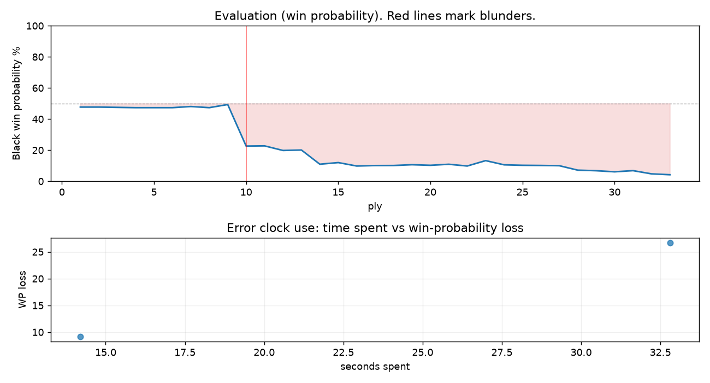

# (free, so lmk) Game analysis: DanielKetterer vs Strategic_Logic

Date: 2026.08.09  |  Time control: rapid (3600)  |  You played: black
Game ID: 365cd2b8-940b-11f1-a476-59664c01000f
Analysis: depth=24 multipv=3 findability=honest floor=6 stable_run=3 threads=1 hash_mb=256 deterministic=True engine_id=Stockfish_18 generated=2026-08-10T08:30:19Z
Game end time UTC: 2026-08-09T16:12:52+00:00
Game: https://www.chess.com/game/live/172754563870

## Summary

- Lichess accuracy: you 71.6%, opponent 98.2%
- Opening: C54 Italian Game: Classical Variation, Center Attack (theory followed through ply 9)
- First deviation from theory: ply 10, You played 5... d5
- Your moves: 6 best, 3 excellent, 5 good, 1 inaccuracy, 0 mistake, 1 blunder

METRICS:

Best: The played move exactly matches Stockfish's top move

Excellent: A non-best move that loses 2 WP points or less.

Good: WP loss is over 2, but under 5 points; also used for losses under 20 when the position remains already decided.

Inaccuracy: WP loss is at least 5 but under 10 points.

Mistake: WP loss is at least 10 but under 20 points; also generally used when a forced mate is missed with under 10 points of WP loss.

Blunder: WP loss is 20 points or more, or a forced mate is missed with at least 10 points of WP loss.

See: https://support.chess.com/en/articles/8572705-how-are-moves-classified-what-is-a-blunder-or-brilliant-etc 

(Brillint, Great and Miss are rating subjective)
- Puzzles: 55 open, 0 solved

### Puzzle gate tally (this game)

Gates: category in ['brilliant_sacrifice', 'missed_tactic', 'allowed_tactic', 'endgame'], refute depth in [3, 8], best-vs-second WP gap >= 5. Refute bar per move: max(5, 0.6 x WP loss).

| outcome | errors |
|---|---|
| accepted | 1 |
| refute_too_deep | 1 |

Four gates pass at once or nothing is generated, so a zero here is a product of four pass rates rather than a fault. Read the binding gate off this table before changing any threshold.

### Sacrifices in the engine's line

Real sacrifices are listed but never served as puzzles: compensation that never resolves back into material has no gradable answer.

| Move | Offered | Kind | Quiet | Line ends | Verdict |
|---|---|---|---|---|---|
| 5 | -3.0 (piece) | sham | no | +0.0 pawns | opening_ply |
| 7 | -3.0 (piece) | sham | yes | +0.0 pawns | opening_ply |

## Biggest missed opportunity

You played 5...d5. Stockfish preferred exd4, after which the main line runs 5...exd4 6. e5 d5 7. Be2 Ne4 8. cxd4. The evaluation crossed from equal to losing, which matters more than the raw number. Why it went wrong: left bishop on c5 insufficiently defended; a favorable capture was available (Nxe4). Before committing to a quiet move here, the checklist is checks, captures, threats, in that order. The engine prefers this move from at or below depth 6, which is as shallow as this measurement resolves; it sits near the surface, a forcing move, the kind a checks-and-captures scan catches. Candidates considered by the engine: exd4 (+0.07), Bb6 (+1.12), Bd6 (+1.49).

## Critical positions

- Ply 10 (you), 5...d5: +0.07 -> +3.34 [evaluation crossed equal -> losing]
- Ply 11 (opponent), 6.exd5: +3.34 -> +3.32 [only-move situation]

## Your errors, move by move

| Move | Class | Category | WP loss | Refute depth | Seconds spent | Pre-error eval |
|---|---|---|---:|---|---:|---|
| 5...d5 | blunder | missed_tactic | 27% | 5 | 33 | balanced |
| 7...O-O | inaccuracy | allowed_tactic | 9% | 14 | 14 | losing |

### 5...d5 (blunder, tactical, wp loss 27%)

You played 5...d5. Stockfish preferred exd4, after which the main line runs 5...exd4 6. e5 d5 7. Be2 Ne4 8. cxd4. The evaluation crossed from equal to losing, which matters more than the raw number. Why it went wrong: left bishop on c5 insufficiently defended; a favorable capture was available (Nxe4). Before committing to a quiet move here, the checklist is checks, captures, threats, in that order. The engine prefers this move from at or below depth 6, which is as shallow as this measurement resolves; it sits near the surface, a forcing move, the kind a checks-and-captures scan catches. Candidates considered by the engine: exd4 (+0.07), Bb6 (+1.12), Bd6 (+1.49).

### 7...O-O (inaccuracy, positional, wp loss 9%)

You played 7...O-O. Stockfish preferred Be6, after which the main line runs 7...Be6 8. Na3 Qd7 9. Ng5 O-O-O 10. Nxe6. This was a judgment error rather than a missed tactic; compare the pawn structure and piece activity after both moves. The engine prefers this move from at or below depth 6, which is as shallow as this measurement resolves; it sits near the surface, a quiet move, but one whose point shows at a glance. Candidates considered by the engine: Be6 (+3.75), e4 (+4.64), Nce7 (+4.65).

## Full move table

| Ply | Move | Eval before | Eval after | Best | CP loss | WP loss | Class |
|-----|------|-------------|------------|------|---------|---------|-------|
| 1 | 1.e4 | +0.31 | +0.25 | e4 | 6 | 1% | best |
| 2 | 1...e5* | +0.25 | +0.25 | e5 | 0 | 0% | best |
| 3 | 2.Nf3 | +0.25 | +0.27 | Nf3 | 0 | 0% | best |
| 4 | 2...Nc6* | +0.27 | +0.29 | Nc6 | 2 | 0% | best |
| 5 | 3.Bc4 | +0.29 | +0.29 | Bc4 | 0 | 0% | best |
| 6 | 3...Bc5* | +0.29 | +0.29 | Nf6 | 0 | 0% | excellent |
| 7 | 4.c3 | +0.29 | +0.21 | O-O | 8 | 1% | excellent |
| 8 | 4...Nf6* | +0.21 | +0.29 | Nf6 | 8 | 1% | best |
| 9 | 5.d4 | +0.29 | +0.07 | d3 | 22 | 2% | good |
| 10 | 5...d5* | +0.07 | +3.34 | exd4 | 327 | 27% | blunder |
| 11 | 6.exd5 | +3.34 | +3.32 | exd5 | 2 | 0% | best |
| 12 | 6...Nxd5* | +3.32 | +3.80 | e4 | 48 | 3% | good |
| 13 | 7.dxc5 | +3.80 | +3.75 | dxc5 | 5 | 0% | best |
| 14 | 7...O-O* | +3.75 | +5.69 | Be6 | 194 | 9% | inaccuracy |
| 15 | 8.Bxd5 | +5.69 | +5.41 | Qxd5 | 28 | 1% | excellent |
| 16 | 8...Bg4* | +5.41 | +6.03 | Qe8 | 62 | 2% | good |
| 17 | 9.h3 | +6.03 | +5.94 | h3 | 9 | 0% | best |
| 18 | 9...Bh5* | +5.94 | +5.93 | Bh5 | 0 | 0% | best |
| 19 | 10.g4 | +5.93 | +5.78 | Bxc6 | 15 | 1% | excellent |
| 20 | 10...Bg6* | +5.78 | +5.89 | Bg6 | 11 | 0% | best |
| 21 | 11.Bg5 | +5.89 | +5.70 | Bg5 | 19 | 1% | best |
| 22 | 11...Qe8* | +5.70 | +6.03 | Qd7 | 33 | 1% | excellent |
| 23 | 12.O-O | +6.03 | +5.10 | Nh4 | 93 | 3% | good |
| 24 | 12...e4* | +5.10 | +5.80 | Kh8 | 70 | 3% | good |
| 25 | 13.Re1 | +5.80 | +5.89 | Re1 | 0 | 0% | best |
| 26 | 13...h6* | +5.89 | +5.92 | h6 | 3 | 0% | best |
| 27 | 14.Bh4 | +5.92 | +5.97 | Bh4 | 0 | 0% | best |
| 28 | 14...Ne7* | +5.97 | +6.97 | exf3 | 100 | 3% | good |
| 29 | 15.Bxe4 | +6.97 | +7.12 | Bxe4 | 0 | 0% | best |
| 30 | 15...Rd8* | +7.12 | +7.44 | f5 | 32 | 1% | excellent |
| 31 | 16.Qc2 | +7.44 | +7.10 | Nbd2 | 34 | 1% | excellent |
| 32 | 16...Nd5* | +7.10 | +8.14 | f6 | 104 | 2% | good |
| 33 | 17.Bxg6 | +8.14 | +8.50 | Bxg6 | 0 | 0% | best |

Rows marked * are your moves. WP loss is win-probability loss; it is the primary signal, CP loss is shown for reference.

## Patterns in this game

- Error categories: 1 allowed_tactic, 1 missed_tactic.
- Attention errors per 100 moves: 0.0.
- Pre-error eval buckets: 0 winning, 1 balanced, 1 losing.
- Opening: 2 error(s) (avg wp loss 18%).
