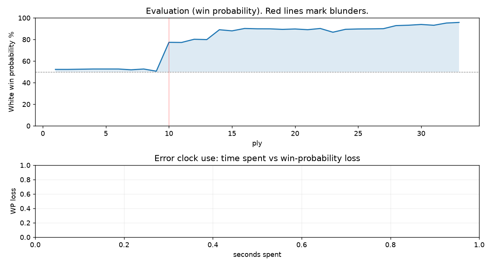

# (free, so lmk) Game analysis: DanielKetterer vs Strategic_Logic

Date: 2026.08.09  |  Time control: rapid (3600)  |  You played: white
Game ID: 365cd2b8-940b-11f1-a476-59664c01000f
Analysis: depth=24 multipv=3 findability=honest floor=6 stable_run=3 threads=1 hash_mb=256 deterministic=True engine_id=Stockfish_18 generated=2026-08-10T08:30:19Z
Game end time UTC: 2026-08-09T16:12:52+00:00
Game: https://www.chess.com/game/live/172754563870

## Summary

- Lichess accuracy: you 98.2%, opponent 71.6%
- Opening: C54 Italian Game: Classical Variation, Center Attack (theory followed through ply 9)
- First deviation from theory: ply 10, Opponent played 5... d5
- Your moves: 11 best, 4 excellent, 2 good, 0 inaccuracy, 0 mistake, 0 blunder

METRICS:

Best: The played move exactly matches Stockfish's top move

Excellent: A non-best move that loses 2 WP points or less.

Good: WP loss is over 2, but under 5 points; also used for losses under 20 when the position remains already decided.

Inaccuracy: WP loss is at least 5 but under 10 points.

Mistake: WP loss is at least 10 but under 20 points; also generally used when a forced mate is missed with under 10 points of WP loss.

Blunder: WP loss is 20 points or more, or a forced mate is missed with at least 10 points of WP loss.

See: https://support.chess.com/en/articles/8572705-how-are-moves-classified-what-is-a-blunder-or-brilliant-etc 

(Brillint, Great and Miss are rating subjective)
- Puzzles: 54 open, 0 solved

## Critical positions

- Ply 10 (opponent), 5...d5: +0.07 -> +3.34 [evaluation crossed equal -> losing]
- Ply 11 (you), 6.exd5: +3.34 -> +3.32 [only-move situation]

## Full move table

| Ply | Move | Eval before | Eval after | Best | CP loss | WP loss | Class |
|-----|------|-------------|------------|------|---------|---------|-------|
| 1 | 1.e4* | +0.31 | +0.25 | e4 | 6 | 1% | best |
| 2 | 1...e5 | +0.25 | +0.25 | e5 | 0 | 0% | best |
| 3 | 2.Nf3* | +0.25 | +0.27 | Nf3 | 0 | 0% | best |
| 4 | 2...Nc6 | +0.27 | +0.29 | Nc6 | 2 | 0% | best |
| 5 | 3.Bc4* | +0.29 | +0.29 | Bc4 | 0 | 0% | best |
| 6 | 3...Bc5 | +0.29 | +0.29 | Nf6 | 0 | 0% | excellent |
| 7 | 4.c3* | +0.29 | +0.21 | O-O | 8 | 1% | excellent |
| 8 | 4...Nf6 | +0.21 | +0.29 | Nf6 | 8 | 1% | best |
| 9 | 5.d4* | +0.29 | +0.07 | d3 | 22 | 2% | good |
| 10 | 5...d5 | +0.07 | +3.34 | exd4 | 327 | 27% | blunder |
| 11 | 6.exd5* | +3.34 | +3.32 | exd5 | 2 | 0% | best |
| 12 | 6...Nxd5 | +3.32 | +3.80 | e4 | 48 | 3% | good |
| 13 | 7.dxc5* | +3.80 | +3.75 | dxc5 | 5 | 0% | best |
| 14 | 7...O-O | +3.75 | +5.69 | Be6 | 194 | 9% | inaccuracy |
| 15 | 8.Bxd5* | +5.69 | +5.41 | Qxd5 | 28 | 1% | excellent |
| 16 | 8...Bg4 | +5.41 | +6.03 | Qe8 | 62 | 2% | good |
| 17 | 9.h3* | +6.03 | +5.94 | h3 | 9 | 0% | best |
| 18 | 9...Bh5 | +5.94 | +5.93 | Bh5 | 0 | 0% | best |
| 19 | 10.g4* | +5.93 | +5.78 | Bxc6 | 15 | 1% | excellent |
| 20 | 10...Bg6 | +5.78 | +5.89 | Bg6 | 11 | 0% | best |
| 21 | 11.Bg5* | +5.89 | +5.70 | Bg5 | 19 | 1% | best |
| 22 | 11...Qe8 | +5.70 | +6.03 | Qd7 | 33 | 1% | excellent |
| 23 | 12.O-O* | +6.03 | +5.10 | Nh4 | 93 | 3% | good |
| 24 | 12...e4 | +5.10 | +5.80 | Kh8 | 70 | 3% | good |
| 25 | 13.Re1* | +5.80 | +5.89 | Re1 | 0 | 0% | best |
| 26 | 13...h6 | +5.89 | +5.92 | h6 | 3 | 0% | best |
| 27 | 14.Bh4* | +5.92 | +5.97 | Bh4 | 0 | 0% | best |
| 28 | 14...Ne7 | +5.97 | +6.97 | exf3 | 100 | 3% | good |
| 29 | 15.Bxe4* | +6.97 | +7.12 | Bxe4 | 0 | 0% | best |
| 30 | 15...Rd8 | +7.12 | +7.44 | f5 | 32 | 1% | excellent |
| 31 | 16.Qc2* | +7.44 | +7.10 | Nbd2 | 34 | 1% | excellent |
| 32 | 16...Nd5 | +7.10 | +8.14 | f6 | 104 | 2% | good |
| 33 | 17.Bxg6* | +8.14 | +8.50 | Bxg6 | 0 | 0% | best |

Rows marked * are your moves. WP loss is win-probability loss; it is the primary signal, CP loss is shown for reference.

## Patterns in this game

- Error categories: .
- Attention errors per 100 moves: 0.0.
