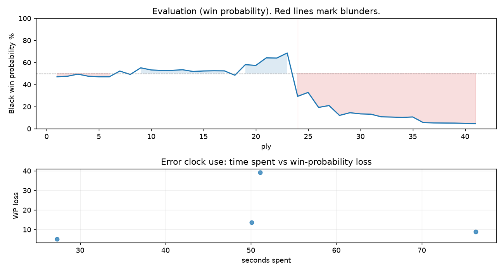

# (free, so lmk) Game analysis: Strategic_Logic vs DanielKetterer

Date: 2026.08.09  |  Time control: rapid (3600)  |  You played: black
Game ID: 7efd4845-940d-11f1-90cc-625e5f01000f
Analysis: depth=24 multipv=3 findability=honest floor=6 stable_run=3 threads=1 hash_mb=256 deterministic=True engine_id=Stockfish_18 generated=2026-08-10T08:40:01Z
Game end time UTC: 2026-08-09T16:33:25+00:00
Game: https://www.chess.com/game/live/172755254030

## Summary

- Lichess accuracy: you 70.6%, opponent 89.0%
- Opening: A45 Indian Defense (theory followed through ply 2)
- First deviation from theory: ply 3, Opponent played 2. e3
- Your moves: 6 best, 7 excellent, 3 good, 2 inaccuracy, 1 mistake, 1 blunder

METRICS:

Best: The played move exactly matches Stockfish's top move

Excellent: A non-best move that loses 2 WP points or less.

Good: WP loss is over 2, but under 5 points; also used for losses under 20 when the position remains already decided.

Inaccuracy: WP loss is at least 5 but under 10 points.

Mistake: WP loss is at least 10 but under 20 points; also generally used when a forced mate is missed with under 10 points of WP loss.

Blunder: WP loss is 20 points or more, or a forced mate is missed with at least 10 points of WP loss.

See: https://support.chess.com/en/articles/8572705-how-are-moves-classified-what-is-a-blunder-or-brilliant-etc 

(Brillint, Great and Miss are rating subjective)
- Puzzles: 55 open, 0 solved

### Puzzle gate tally (this game)

Gates: category in ['brilliant_sacrifice', 'missed_tactic', 'allowed_tactic', 'endgame'], refute depth in [3, 8], best-vs-second WP gap >= 5. Refute bar per move: max(5, 0.6 x WP loss).

| outcome | errors |
|---|---|
| refute_too_deep | 2 |
| wp_gap_too_small | 2 |

Four gates pass at once or nothing is generated, so a zero here is a product of four pass rates rather than a fault. Read the binding gate off this table before changing any threshold.

### Sacrifices in the engine's line

Real sacrifices are listed but never served as puzzles: compensation that never resolves back into material has no gradable answer.

| Move | Offered | Kind | Quiet | Line ends | Verdict |
|---|---|---|---|---|---|
| 13 | -5.0 (piece) | real | yes | -2.0 pawns | real_sacrifice_not_gradable |
| 14 | -8.0 (piece) | real | no | -3.0 pawns | real_sacrifice_not_gradable |

## Biggest missed opportunity

You played 12...Bf5. Stockfish preferred Qxd1, after which the main line runs 12...Qxd1 13. Rxd1 Bxc3 14. Rb1 c6 15. h3. The evaluation crossed from winning to losing, which matters more than the raw number. Why it went wrong: left pawn on b7 insufficiently defended; a favorable capture was available (Bxc3). Before committing to a quiet move here, the checklist is checks, captures, threats, in that order. The engine prefers this move from at or below depth 6, which is as shallow as this measurement resolves; it sits near the surface, a forcing move, the kind a checks-and-captures scan catches. Candidates considered by the engine: Qxd1 (-2.12), Bxc3 (-1.79), Nd7 (-1.57).

## Critical positions

- Ply 17 (opponent), 9.Bxe4: -0.27 -> -0.26 [only-move situation]
- Ply 24 (you), 12...Bf5: -2.12 -> +2.39 [evaluation crossed winning -> losing]
- Ply 33 (opponent), 17.Rxd1: +5.74 -> +5.81 [only-move situation]

## Your errors, move by move

| Move | Class | Category | WP loss | Refute depth | Seconds spent | Pre-error eval |
|---|---|---|---:|---|---:|---|
| 12...Bf5 | blunder | missed_tactic | 39% | 5 | 51 | winning |
| 13...Bxc3 | mistake | missed_tactic | 14% | 15 | 50 | losing |
| 14...Bd3 | inaccuracy | allowed_tactic | 9% | 8 | 76 | losing |
| 18...c6 | inaccuracy | allowed_tactic | 5% | 14 | 27 | losing |

### 12...Bf5 (blunder, tactical, wp loss 39%)

You played 12...Bf5. Stockfish preferred Qxd1, after which the main line runs 12...Qxd1 13. Rxd1 Bxc3 14. Rb1 c6 15. h3. The evaluation crossed from winning to losing, which matters more than the raw number. Why it went wrong: left pawn on b7 insufficiently defended; a favorable capture was available (Bxc3). Before committing to a quiet move here, the checklist is checks, captures, threats, in that order. The engine prefers this move from at or below depth 6, which is as shallow as this measurement resolves; it sits near the surface, a forcing move, the kind a checks-and-captures scan catches. Candidates considered by the engine: Qxd1 (-2.12), Bxc3 (-1.79), Nd7 (-1.57).

### 13...Bxc3 (mistake, tactical, wp loss 14%)

You played 13...Bxc3. Stockfish preferred Nd7, after which the main line runs 13...Nd7 14. Bg5 Nf6 15. Bxa8 Qxa8 16. Nd4. Why it went wrong: left rook on a8 insufficiently defended; motif: creates threat on c3. Before committing to a quiet move here, the checklist is checks, captures, threats, in that order. The engine prefers this move from at or below depth 6, which is as shallow as this measurement resolves; it sits near the surface, a forcing move, the kind a checks-and-captures scan catches. Candidates considered by the engine: Nd7 (+1.94), Qxd1 (+3.66), Bxc3 (+3.78).

### 14...Bd3 (inaccuracy, positional, wp loss 9%)

You played 14...Bd3. Stockfish preferred Qxd1, after which the main line runs 14...Qxd1 15. Rfxd1 Nd7 16. Rac1 Bf6 17. Rxc7. Why it went wrong: left rook on f8, rook on a8 insufficiently defended; a favorable capture was available (Bxa1). This was a judgment error rather than a missed tactic; compare the pawn structure and piece activity after both moves. The engine prefers this move from at or below depth 6, which is as shallow as this measurement resolves; it sits near the surface, a quiet move, but one whose point shows at a glance. Candidates considered by the engine: Qxd1 (+3.60), Bxa1 (+3.76), Nd7 (+3.80).

### 18...c6 (inaccuracy, positional, wp loss 5%)

You played 18...c6. Stockfish preferred Ke7, after which the main line runs 18...Ke7 19. Rc1 Ba5 20. Ne5 Ke6 21. Nc4. This was a judgment error rather than a missed tactic; compare the pawn structure and piece activity after both moves. The engine does not settle on this move until depth 22, which is outside what a human reasonably calculates over the board; this is not a training target. Candidates considered by the engine: Ke7 (+5.78), Ke8 (+5.94), Na6 (+6.05).

## Full move table

| Ply | Move | Eval before | Eval after | Best | CP loss | WP loss | Class |
|-----|------|-------------|------------|------|---------|---------|-------|
| 1 | 1.d4 | +0.31 | +0.32 | e4 | 0 | 0% | excellent |
| 2 | 1...Nf6* | +0.32 | +0.27 | d5 | 0 | 0% | excellent |
| 3 | 2.e3 | +0.27 | +0.06 | Nf3 | 21 | 2% | excellent |
| 4 | 2...g6* | +0.06 | +0.27 | e6 | 21 | 2% | excellent |
| 5 | 3.Nf3 | +0.27 | +0.32 | c4 | 0 | 0% | excellent |
| 6 | 3...Bg7* | +0.32 | +0.32 | Bg7 | 0 | 0% | best |
| 7 | 4.Nc3 | +0.32 | -0.24 | c4 | 56 | 5% | inaccuracy |
| 8 | 4...O-O* | -0.24 | +0.09 | d5 | 33 | 3% | good |
| 9 | 5.Bc4 | +0.09 | -0.56 | e4 | 65 | 6% | inaccuracy |
| 10 | 5...e6* | -0.56 | -0.35 | d5 | 21 | 2% | excellent |
| 11 | 6.e4 | -0.35 | -0.30 | Be2 | 0 | 0% | excellent |
| 12 | 6...d5* | -0.30 | -0.31 | d5 | 0 | 0% | best |
| 13 | 7.Bd3 | -0.31 | -0.37 | exd5 | 6 | 1% | excellent |
| 14 | 7...dxe4* | -0.37 | -0.20 | c5 | 17 | 2% | excellent |
| 15 | 8.Nxe4 | -0.20 | -0.25 | Nxe4 | 5 | 0% | best |
| 16 | 8...Nxe4* | -0.25 | -0.27 | Nxe4 | 0 | 0% | best |
| 17 | 9.Bxe4 | -0.27 | -0.26 | Bxe4 | 0 | 0% | best |
| 18 | 9...e5* | -0.26 | +0.17 | c5 | 43 | 4% | good |
| 19 | 10.O-O | +0.17 | -0.88 | dxe5 | 105 | 10% | inaccuracy |
| 20 | 10...exd4* | -0.88 | -0.80 | exd4 | 8 | 1% | best |
| 21 | 11.c3 | -0.80 | -1.58 | Re1 | 78 | 7% | inaccuracy |
| 22 | 11...dxc3* | -1.58 | -1.56 | dxc3 | 2 | 0% | best |
| 23 | 12.bxc3 | -1.56 | -2.12 | Qc2 | 56 | 5% | good |
| 24 | 12...Bf5* | -2.12 | +2.39 | Qxd1 | 451 | 39% | blunder |
| 25 | 13.Bxb7 | +2.39 | +1.94 | Qxd8 | 45 | 4% | good |
| 26 | 13...Bxc3* | +1.94 | +3.89 | Nd7 | 195 | 14% | mistake |
| 27 | 14.Ba3 | +3.89 | +3.60 | Bh6 | 29 | 2% | excellent |
| 28 | 14...Bd3* | +3.60 | +5.40 | Qxd1 | 180 | 9% | inaccuracy |
| 29 | 15.Bxa8 | +5.40 | +4.82 | Bxf8 | 58 | 2% | good |
| 30 | 15...Bxf1* | +4.82 | +5.06 | Bxa1 | 24 | 1% | excellent |
| 31 | 16.Bxf8 | +5.06 | +5.13 | Bxf8 | 0 | 0% | best |
| 32 | 16...Qxd1* | +5.13 | +5.74 | Qxf8 | 61 | 2% | good |
| 33 | 17.Rxd1 | +5.74 | +5.81 | Rxd1 | 0 | 0% | best |
| 34 | 17...Kxf8* | +5.81 | +5.90 | Kxf8 | 9 | 0% | best |
| 35 | 18.Kxf1 | +5.90 | +5.78 | Kxf1 | 12 | 0% | best |
| 36 | 18...c6* | +5.78 | +7.69 | Ke7 | 191 | 5% | inaccuracy |
| 37 | 19.Rd8+ | +7.69 | +7.86 | Rd8+ | 0 | 0% | best |
| 38 | 19...Ke7* | +7.86 | +7.91 | Kg7 | 5 | 0% | excellent |
| 39 | 20.Rxb8 | +7.91 | +7.95 | Rxb8 | 0 | 0% | best |
| 40 | 20...f5* | +7.95 | +8.10 | c5 | 15 | 0% | excellent |
| 41 | 21.Bxc6 | +8.10 | +8.20 | Bxc6 | 0 | 0% | best |

Rows marked * are your moves. WP loss is win-probability loss; it is the primary signal, CP loss is shown for reference.

## Patterns in this game

- Error categories: 2 allowed_tactic, 2 missed_tactic.
- Attention errors per 100 moves: 0.0.
- Pre-error eval buckets: 1 winning, 0 balanced, 3 losing.
- Middlegame: 4 error(s) (avg wp loss 17%).
