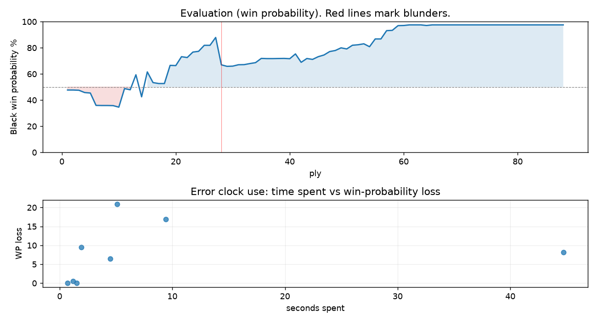

# (free, so lmk) Game analysis: DanielKetterer vs Mirrorwahl

Date: 2026.08.10  |  Time control: rapid (1800)  |  You played: black
Game ID: bd044645-94f8-11f1-aab9-2f273901000f
Analysis: depth=24 multipv=3 findability=honest floor=6 stable_run=3 threads=1 hash_mb=256 deterministic=True engine_id=Stockfish_18 generated=2026-08-11T08:28:48Z
Game end time UTC: 2026-08-10T20:35:28+00:00
Game: https://www.chess.com/game/live/172811072626

## Summary

- Lichess accuracy: you 91.3%, opponent 86.0%
- Opening: C42 Petrov's Defense: Stafford Gambit Accepted (theory followed through ply 10)
- First deviation from theory: ply 11, Opponent played 6. d4
- Your moves: 23 best, 12 excellent, 1 good, 3 inaccuracy, 4 mistake, 1 blunder

METRICS:

Best: The played move exactly matches Stockfish's top move

Excellent: A non-best move that loses 2 WP points or less.

Good: WP loss is over 2, but under 5 points; also used for losses under 20 when the position remains already decided.

Inaccuracy: WP loss is at least 5 but under 10 points.

Mistake: WP loss is at least 10 but under 20 points; also generally used when a forced mate is missed with under 10 points of WP loss.

Blunder: WP loss is 20 points or more, or a forced mate is missed with at least 10 points of WP loss.

See: https://support.chess.com/en/articles/8572705-how-are-moves-classified-what-is-a-blunder-or-brilliant-etc 

(Brillint, Great and Miss are rating subjective)
- Puzzles: 55 open, 0 solved

### Puzzle gate tally (this game)

Gates: category in ['brilliant_sacrifice', 'missed_tactic', 'allowed_tactic', 'endgame'], refute depth in [3, 8], best-vs-second WP gap >= 5. Refute bar per move: max(5, 0.6 x WP loss).

| outcome | errors |
|---|---|
| category:attention | 3 |
| category:positional | 3 |
| refute_censored_high | 1 |
| wp_gap_too_small | 1 |

Four gates pass at once or nothing is generated, so a zero here is a product of four pass rates rather than a fault. Read the binding gate off this table before changing any threshold.

### Sacrifices in the engine's line

Real sacrifices are listed but never served as puzzles: compensation that never resolves back into material has no gradable answer.

| Move | Offered | Kind | Quiet | Line ends | Verdict |
|---|---|---|---|---|---|
| 3 | -2.0 (exchange) | sham | yes | +1.0 pawns | opening_ply |
| 7 | -6.0 (piece) | sham | no | +0.0 pawns | opening_ply |
| 8 | -6.0 (piece) | sham | no | +0.0 pawns | opening_ply |
| 36 | -3.0 (piece) | sham | yes | mate | puzzle |

## Biggest missed opportunity

You played 14...Nc3+. Stockfish preferred Ng3+, after which the main line runs 14...Ng3+ 15. Kd2 Nxh1 16. f3 Re5 17. Nc3. Why it went wrong: left pawn on h7, knight on c3 insufficiently defended; the best move was a forcing check; motif: creates threat on h1. Before committing to a quiet move here, the checklist is checks, captures, threats, in that order. The engine prefers this move from at or below depth 6, which is as shallow as this measurement resolves; it sits near the surface, a forcing move, the kind a checks-and-captures scan catches. Candidates considered by the engine: Ng3+ (-5.39), a6 (-3.45), Nc5+ (-2.15).

## Critical positions

- Ply 20 (you), 10...Bd7: -1.87 -> -1.85 [only-move situation]
- Ply 24 (you), 12...Bxd4: -3.24 -> -3.33 [only-move situation]
- Ply 28 (you), 14...Nc3+: -5.39 -> -1.92
- Ply 30 (you), 15...Nxb5: -1.78 -> -1.80 [only-move situation]
- Ply 31 (opponent), 16.Bxb5: -1.80 -> -1.93 [only-move situation]
- Ply 40 (you), 20...Kxd7: -2.55 -> -2.52 [only-move situation]
- Ply 60 (you), 30...Rxe2: -9.40 -> -9.51 [only-move situation]
- Ply 64 (you), 32...b6: -M24 -> -9.51 [forced mate was on the board]

## Your errors, move by move

| Move | Class | Category | WP loss | Refute depth | Seconds spent | Pre-error eval |
|---|---|---|---:|---|---:|---|
| 3...Nc6 | inaccuracy | attention | 9% | 1 | 2 | balanced |
| 7...c5 | mistake | missed_tactic | 17% | 5 | 9 | balanced |
| 8...Bxb2 | inaccuracy | attention | 8% | 1 | 45 | balanced |
| 14...Nc3+ | blunder | attention | 21% | 2 | 5 | winning |
| 21...Rd8 | inaccuracy | positional | 6% | 1 | 4 | winning |
| 32...b6 | mistake | positional | 0% | >18 | 1 | winning |
| 35...Kxh4 | mistake | positional | 0% | >18 | 2 | winning |
| 36...Kg4 | mistake | brilliant_sacrifice | 0% | >18 | 1 | winning |

### 3...Nc6 (inaccuracy, positional, wp loss 9%)

You played 3...Nc6. Stockfish preferred d6, after which the main line runs 3...d6 4. Nf3 Nxe4 5. d4 d5 6. Bd3. Why it went wrong: motif: creates threat on e5, e4. This was a judgment error rather than a missed tactic; compare the pawn structure and piece activity after both moves. The engine prefers this move from at or below depth 6, which is as shallow as this measurement resolves; it sits near the surface, a quiet move, but one whose point shows at a glance. Candidates considered by the engine: d6 (+0.50), Nxe4 (+0.60), Qe7 (+0.71).

### 7...c5 (mistake, tactical, wp loss 17%)

You played 7...c5. Stockfish preferred Bxe3, after which the main line runs 7...Bxe3 8. Qxd8+ Kxd8 9. fxe3 Ke7 10. Be2. Before committing to a quiet move here, the checklist is checks, captures, threats, in that order. The engine does not settle on this move until depth 18; reachable with real calculation, but not on a scan. Candidates considered by the engine: Bxe3 (-1.03), Bxc3+ (-1.01), Bb6 (+0.46).

### 8...Bxb2 (inaccuracy, positional, wp loss 8%)

You played 8...Bxb2. Stockfish preferred Bxe3, after which the main line runs 8...Bxe3 9. Qxd8+ Kxd8 10. fxe3 c6 11. Nd6. Why it went wrong: left pawn on c5 insufficiently defended; a favorable capture was available (Nxe4); your king's zone came under heavier attack after this move. This was a judgment error rather than a missed tactic; compare the pawn structure and piece activity after both moves. The engine prefers this move from at or below depth 6, which is as shallow as this measurement resolves; it sits near the surface, a quiet move, but one whose point shows at a glance. Candidates considered by the engine: Bxe3 (-1.28), Bxb2 (-0.46), Bg4 (-0.01).

### 14...Nc3+ (blunder, tactical, wp loss 21%)

You played 14...Nc3+. Stockfish preferred Ng3+, after which the main line runs 14...Ng3+ 15. Kd2 Nxh1 16. f3 Re5 17. Nc3. Why it went wrong: left pawn on h7, knight on c3 insufficiently defended; the best move was a forcing check; motif: creates threat on h1. Before committing to a quiet move here, the checklist is checks, captures, threats, in that order. The engine prefers this move from at or below depth 6, which is as shallow as this measurement resolves; it sits near the surface, a forcing move, the kind a checks-and-captures scan catches. Candidates considered by the engine: Ng3+ (-5.39), a6 (-3.45), Nc5+ (-2.15).

### 21...Rd8 (inaccuracy, positional, wp loss 6%)

You played 21...Rd8. Stockfish preferred Re4, after which the main line runs 21...Re4 22. g3 Ra4 23. Ra1 h5 24. Kc3. Why it went wrong: motif: creates threat on f4. This was a judgment error rather than a missed tactic; compare the pawn structure and piece activity after both moves. The engine first prefers this move at depth 7 and holds it; findable, but it takes a deliberate look rather than a scan. Candidates considered by the engine: Re4 (-3.03), b6 (-2.91), h5 (-2.67).

### 32...b6 (mistake, positional, wp loss 0%)

You played 32...b6. Stockfish preferred Ke5, after which the main line runs 32...Ke5 33. h4 g6 34. Kd2 a5 35. Kd1. There was a forced mate on the board and this move let it slip. This was a judgment error rather than a missed tactic; compare the pawn structure and piece activity after both moves. The engine prefers this move from at or below depth 6, which is as shallow as this measurement resolves; it sits near the surface, a quiet move, but one whose point shows at a glance. Candidates considered by the engine: Ke5 (-M24), a5 (-81.15), g5 (-13.60).

### 35...Kxh4 (mistake, positional, wp loss 0%)

You played 35...Kxh4. Stockfish preferred h5, after which the main line runs 35...h5 36. Kd4 Kf5 37. a5 bxa5 38. Kc5. There was a forced mate on the board and this move let it slip. Why it went wrong: motif: creates threat on h4. This was a judgment error rather than a missed tactic; compare the pawn structure and piece activity after both moves. The engine never settles on this move within the analysis depth, so how findable it was is not measured here; weigh this one lightly. Candidates considered by the engine: h5 (-M23), Kf5 (-81.09), c5 (-10.14).

### 36...Kg4 (mistake, positional, wp loss 0%)

You played 36...Kg4. Stockfish preferred g5, after which the main line runs 36...g5 37. Ke5 g4 38. Kd6 a5 39. Kxc6. There was a forced mate on the board and this move let it slip. Why it went wrong: your king's zone came under heavier attack after this move. This was a judgment error rather than a missed tactic; compare the pawn structure and piece activity after both moves. The engine first prefers this move at depth 8 and holds it; findable, but it takes a deliberate look rather than a scan. Candidates considered by the engine: g5 (-M22), a5 (-13.17), f6 (-11.04).

## Full move table

| Ply | Move | Eval before | Eval after | Best | CP loss | WP loss | Class |
|-----|------|-------------|------------|------|---------|---------|-------|
| 1 | 1.e4 | +0.31 | +0.25 | e4 | 6 | 1% | best |
| 2 | 1...e5* | +0.25 | +0.25 | e5 | 0 | 0% | best |
| 3 | 2.Nf3 | +0.25 | +0.27 | Nf3 | 0 | 0% | best |
| 4 | 2...Nf6* | +0.27 | +0.46 | Nc6 | 19 | 2% | excellent |
| 5 | 3.Nxe5 | +0.46 | +0.50 | Nxe5 | 0 | 0% | best |
| 6 | 3...Nc6* | +0.50 | +1.57 | d6 | 107 | 9% | inaccuracy |
| 7 | 4.Nxc6 | +1.57 | +1.58 | Nxc6 | 0 | 0% | best |
| 8 | 4...dxc6* | +1.58 | +1.58 | dxc6 | 0 | 0% | best |
| 9 | 5.Nc3 | +1.58 | +1.59 | Nc3 | 0 | 0% | best |
| 10 | 5...Bc5* | +1.59 | +1.73 | Be6 | 14 | 1% | excellent |
| 11 | 6.d4 | +1.73 | +0.13 | h3 | 160 | 14% | mistake |
| 12 | 6...Bxd4* | +0.13 | +0.23 | Bxd4 | 10 | 1% | best |
| 13 | 7.Be3 | +0.23 | -1.03 | f3 | 126 | 11% | mistake |
| 14 | 7...c5* | -1.03 | +0.82 | Bxe3 | 185 | 17% | mistake |
| 15 | 8.Nb5 | +0.82 | -1.28 | Qd3 | 210 | 19% | mistake |
| 16 | 8...Bxb2* | -1.28 | -0.37 | Bxe3 | 91 | 8% | inaccuracy |
| 17 | 9.Qxd8+ | -0.37 | -0.29 | Qxd8+ | 0 | 0% | best |
| 18 | 9...Kxd8* | -0.29 | -0.29 | Kxd8 | 0 | 0% | best |
| 19 | 10.Rd1+ | -0.29 | -1.87 | Rb1 | 158 | 14% | mistake |
| 20 | 10...Bd7* | -1.87 | -1.85 | Bd7 | 2 | 0% | best |
| 21 | 11.Bxc5 | -1.85 | -2.73 | Rb1 | 88 | 7% | inaccuracy |
| 22 | 11...Nxe4* | -2.73 | -2.64 | Nxe4 | 9 | 1% | best |
| 23 | 12.Bd4 | -2.64 | -3.24 | Be3 | 60 | 4% | good |
| 24 | 12...Bxd4* | -3.24 | -3.33 | Bxd4 | 0 | 0% | best |
| 25 | 13.Rxd4 | -3.33 | -4.10 | Nxd4 | 77 | 5% | good |
| 26 | 13...Re8* | -4.10 | -4.10 | Re8 | 0 | 0% | best |
| 27 | 14.Bd3 | -4.10 | -5.39 | Be2 | 129 | 6% | inaccuracy |
| 28 | 14...Nc3+* | -5.39 | -1.92 | Ng3+ | 347 | 21% | blunder |
| 29 | 15.Kd2 | -1.92 | -1.78 | Kd2 | 0 | 0% | best |
| 30 | 15...Nxb5* | -1.78 | -1.80 | Nxb5 | 0 | 0% | best |
| 31 | 16.Bxb5 | -1.80 | -1.93 | Bxb5 | 13 | 1% | best |
| 32 | 16...c6* | -1.93 | -1.94 | c6 | 0 | 0% | best |
| 33 | 17.Be2 | -1.94 | -2.04 | Bd3 | 10 | 1% | excellent |
| 34 | 17...Kc7* | -2.04 | -2.13 | Kc7 | 0 | 0% | best |
| 35 | 18.Bg4 | -2.13 | -2.55 | h4 | 42 | 3% | good |
| 36 | 18...Rad8* | -2.55 | -2.53 | Rad8 | 2 | 0% | best |
| 37 | 19.Bxd7 | -2.53 | -2.53 | Rxd7+ | 0 | 0% | excellent |
| 38 | 19...Rxd7* | -2.53 | -2.54 | Rxd7 | 0 | 0% | best |
| 39 | 20.Rxd7+ | -2.54 | -2.55 | Rxd7+ | 1 | 0% | best |
| 40 | 20...Kxd7* | -2.55 | -2.52 | Kxd7 | 3 | 0% | best |
| 41 | 21.f4 | -2.52 | -3.03 | h4 | 51 | 4% | good |
| 42 | 21...Rd8* | -3.03 | -2.16 | Re4 | 87 | 6% | inaccuracy |
| 43 | 22.Ke3 | -2.16 | -2.54 | Kc3 | 38 | 3% | good |
| 44 | 22...Ke6* | -2.54 | -2.45 | Kc7 | 9 | 1% | excellent |
| 45 | 23.g4 | -2.45 | -2.73 | Re1 | 28 | 2% | good |
| 46 | 23...Rd5* | -2.73 | -2.91 | h5 | 0 | 0% | excellent |
| 47 | 24.f5+ | -2.91 | -3.30 | Rb1 | 39 | 3% | good |
| 48 | 24...Ke5* | -3.30 | -3.43 | Kf6 | 0 | 0% | excellent |
| 49 | 25.Rf1 | -3.43 | -3.76 | Rb1 | 33 | 2% | good |
| 50 | 25...Rc5* | -3.76 | -3.62 | Rd4 | 14 | 1% | excellent |
| 51 | 26.Rf2 | -3.62 | -4.11 | Rd1 | 49 | 3% | good |
| 52 | 26...Rc3+* | -4.11 | -4.18 | h5 | 0 | 0% | excellent |
| 53 | 27.Kd2 | -4.18 | -4.32 | Kd2 | 14 | 1% | best |
| 54 | 27...Rc4* | -4.32 | -3.91 | Rh3 | 41 | 2% | good |
| 55 | 28.Ke3 | -3.91 | -5.11 | h3 | 120 | 6% | inaccuracy |
| 56 | 28...Rxg4* | -5.11 | -5.11 | Rxg4 | 0 | 0% | best |
| 57 | 29.Re2 | -5.11 | -7.08 | Rf3 | 197 | 6% | inaccuracy |
| 58 | 29...Re4+* | -7.08 | -7.18 | Re4+ | 0 | 0% | best |
| 59 | 30.Kd3 | -7.18 | -9.40 | Kd2 | 222 | 4% | good |
| 60 | 30...Rxe2* | -9.40 | -9.51 | Rxe2 | 0 | 0% | best |
| 61 | 31.Kxe2 | -9.51 | -11.64 | h3 | 213 | 0% | excellent |
| 62 | 31...Kxf5* | -11.64 | -24.15 | Kxf5 | 0 | 0% | best |
| 63 | 32.c4 | -24.15 | -M24 | Kd2 |  | 0% | excellent |
| 64 | 32...b6* | -M24 | -9.51 | Ke5 |  | 0% | mistake |
| 65 | 33.a4 | -9.51 | -81.15 | a4 | 7164 | 0% | best |
| 66 | 33...a6* | -81.15 | -80.24 | a5 | 91 | 0% | excellent |
| 67 | 34.h4 | -80.24 | -81.15 | a5 | 91 | 0% | excellent |
| 68 | 34...Kg4* | -81.15 | -14.10 | a5 | 6705 | 0% | excellent |
| 69 | 35.Kd3 | -14.10 | -M23 | Ke3 |  | 0% | excellent |
| 70 | 35...Kxh4* | -M23 | -14.04 | h5 |  | 0% | mistake |
| 71 | 36.Ke4 | -14.04 | -M22 | Kd4 |  | 0% | excellent |
| 72 | 36...Kg4* | -M22 | -13.12 | g5 |  | 0% | mistake |
| 73 | 37.Ke5 | -13.12 | -M20 | Ke5 |  | 0% | best |
| 74 | 37...h5* | -M20 | -M19 | h5 |  | 0% | best |
| 75 | 38.Kd6 | -M19 | -M19 | Kd6 |  | 0% | best |
| 76 | 38...h4* | -M19 | -M22 | h4 |  | 0% | best |
| 77 | 39.Kxc6 | -M22 | -M17 | Kxc6 |  | 0% | best |
| 78 | 39...h3* | -M17 | -M19 | h3 |  | 0% | best |
| 79 | 40.Kxb6 | -M19 | -M13 | Kd6 |  | 0% | excellent |
| 80 | 40...h2* | -M13 | -M13 | f5 |  | 0% | excellent |
| 81 | 41.c5 | -M13 | -M12 | a5 |  | 0% | excellent |
| 82 | 41...h1=Q* | -M12 | -M11 | f5 |  | 0% | excellent |
| 83 | 42.c6 | -M11 | -M11 | a5 |  | 0% | excellent |
| 84 | 42...Qb1+* | -M11 | -M13 | f5 |  | 0% | excellent |
| 85 | 43.Kxa6 | -M13 | -M9 | Ka7 |  | 0% | excellent |
| 86 | 43...Qb8* | -M9 | -M8 | Qb8 |  | 0% | best |
| 87 | 44.c7 | -M8 | -M8 | a5 |  | 0% | excellent |
| 88 | 44...Qxc7* | -M8 | -M7 | Qxc7 |  | 0% | best |

Rows marked * are your moves. WP loss is win-probability loss; it is the primary signal, CP loss is shown for reference.

## Patterns in this game

- Error categories: 3 attention, 1 brilliant_sacrifice, 1 missed_tactic, 3 positional.
- Attention errors per 100 moves: 6.8.
- Pre-error eval buckets: 5 winning, 3 balanced, 0 losing.
- Opening: 3 error(s) (avg wp loss 12%).
- Middlegame: 2 error(s) (avg wp loss 14%).
- Endgame: 3 error(s) (avg wp loss 0%).
