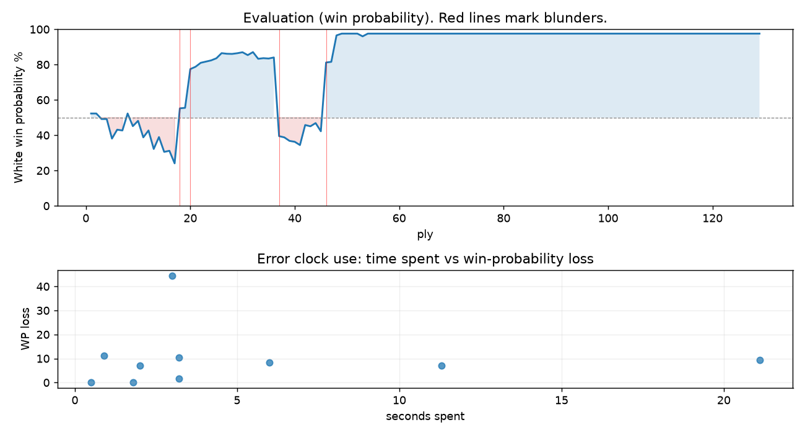

# (free, so lmk) Game analysis: Mirrorwahl vs DanielKetterer

Date: 2026.08.11  |  Time control: rapid (1800)  |  You played: white
Game ID: cd4dd80e-95c6-11f1-b5d5-5f0b4701000f
Analysis: depth=24 multipv=3 findability=honest floor=6 stable_run=3 threads=1 hash_mb=256 deterministic=True engine_id=Stockfish_18 generated=2026-08-12T08:39:07Z
Game end time UTC: 2026-08-11T21:14:24+00:00
Game: https://www.chess.com/game/live/172859523738

## Summary

- Lichess accuracy: you 87.2%, opponent 81.4%
- Opening: C21 Center Game: Halasz-McDonnell Gambit (theory followed through ply 5)
- First deviation from theory: ply 6, Opponent played 3... c5
- Your moves: 24 best, 28 excellent, 3 good, 4 inaccuracy, 5 mistake, 1 blunder

METRICS:

Best: The played move exactly matches Stockfish's top move

Excellent: A non-best move that loses 2 WP points or less.

Good: WP loss is over 2, but under 5 points; also used for losses under 20 when the position remains already decided.

Inaccuracy: WP loss is at least 5 but under 10 points.

Mistake: WP loss is at least 10 but under 20 points; also generally used when a forced mate is missed with under 10 points of WP loss.

Blunder: WP loss is 20 points or more, or a forced mate is missed with at least 10 points of WP loss.

See: https://support.chess.com/en/articles/8572705-how-are-moves-classified-what-is-a-blunder-or-brilliant-etc 

(Brillint, Great and Miss are rating subjective)
- Puzzles: 55 open, 0 solved

### Puzzle gate tally (this game)

Gates: category in ['brilliant_sacrifice', 'missed_tactic', 'allowed_tactic', 'endgame'], refute depth in [3, 8], best-vs-second WP gap >= 5. Refute bar per move: max(5, 0.6 x WP loss).

| outcome | errors |
|---|---|
| category:opening | 4 |
| category:positional | 1 |
| refute_too_shallow | 5 |

Four gates pass at once or nothing is generated, so a zero here is a product of four pass rates rather than a fault. Read the binding gate off this table before changing any threshold.

### Sacrifices in the engine's line

Real sacrifices are listed but never served as puzzles: compensation that never resolves back into material has no gradable answer.

| Move | Offered | Kind | Quiet | Line ends | Verdict |
|---|---|---|---|---|---|
| 3 | -2.0 (exchange) | sham | yes | +4.0 pawns | opening_ply |
| 5 | -2.0 (exchange) | sham | yes | +0.0 pawns | opening_ply |
| 6 | -7.0 (piece) | sham | yes | +2.0 pawns | opening_ply |
| 7 | -2.0 (exchange) | sham | yes | +0.0 pawns | opening_ply |
| 9 | -3.0 (piece) | real | yes | -1.0 pawns | real_sacrifice_not_gradable |
| 19 | -3.0 (piece) | sham | yes | +0.0 pawns | eval_out_of_band |

## Biggest missed opportunity

You played 19.Bd4. Stockfish preferred Kf2, after which the main line runs 19. Kf2 h6 20. Bb7 Rd7 21. Be4 Na6. The evaluation crossed from winning to equal, which matters more than the raw number. This was a judgment error rather than a missed tactic; compare the pawn structure and piece activity after both moves. The engine never settles on this move within the analysis depth, so how findable it was is not measured here; weigh this one lightly. Candidates considered by the engine: Kf2 (+4.51), Ne5 (+4.50), Kf1 (+4.41).

## Critical positions

- Ply 18 (opponent), 9...cxd4: -3.12 -> +0.57 [only-move situation; evaluation crossed winning -> equal]
- Ply 20 (opponent), 10...dxe4: +0.60 -> +3.35 [evaluation crossed equal -> losing]
- Ply 21 (you), 11.Bxe4: +3.35 -> +3.56 [only-move situation]
- Ply 35 (you), 18.Rxb1: +4.43 -> +4.39 [only-move situation]
- Ply 37 (you), 19.Bd4: +4.51 -> -1.16 [evaluation crossed winning -> equal]
- Ply 38 (opponent), 19...Bxd4+: -1.16 -> -1.24 [only-move situation]
- Ply 40 (opponent), 20...Rxd4: -1.47 -> -1.53 [only-move situation]
- Ply 46 (opponent), 23...Rd7: -0.85 -> +3.97 [evaluation crossed equal -> losing]

## Your errors, move by move

| Move | Class | Category | WP loss | Refute depth | Seconds spent | Pre-error eval |
|---|---|---|---:|---|---:|---|
| 3.f4 | mistake | missed_tactic | 11% | 1 | 1 | balanced |
| 5.Bd3 | inaccuracy | opening | 7% | >18 | 11 | balanced |
| 6.Nbd2 | inaccuracy | opening | 9% | 5 | 21 | balanced |
| 7.Nb3 | mistake | opening | 10% | 3 | 3 | balanced |
| 8.c3 | inaccuracy | allowed_tactic | 8% | 1 | 6 | balanced |
| 9.cxd4 | inaccuracy | opening | 7% | 3 | 2 | losing |
| 19.Bd4 | blunder | allowed_tactic | 45% | 1 | 3 | winning |
| 27.Rxb6 | mistake | allowed_tactic | 2% | 1 | 3 | winning |
| 29.Rxa5 | mistake | positional | 0% | >18 | 0 | winning |
| 39.a8=B+ | mistake | endgame | 0% | 1 | 2 | winning |

### 3.f4 (mistake, tactical, wp loss 11%)

You played 3.f4. Stockfish preferred Nf3, after which the main line runs 3. Nf3 Bb4+ 4. Nbd2 Nc6 5. Bd3 Nf6. Why it went wrong: motif: creates threat on d4. Before committing to a quiet move here, the checklist is checks, captures, threats, in that order. The engine first prefers this move at depth 8 and holds it; findable, but it takes a deliberate look rather than a scan. Candidates considered by the engine: Nf3 (-0.09), Qxd4 (-0.11), Ne2 (-0.22).

### 5.Bd3 (inaccuracy, positional, wp loss 7%)

You played 5.Bd3. Stockfish preferred Bc4, after which the main line runs 5. Bc4 Nc6 6. O-O d6 7. Na3 Bg7. This was a judgment error rather than a missed tactic; compare the pawn structure and piece activity after both moves. The engine prefers this move from at or below depth 6, which is as shallow as this measurement resolves; it sits near the surface, a quiet move, but one whose point shows at a glance. Candidates considered by the engine: Bc4 (+0.25), c3 (-0.36), Bd3 (-0.57).

### 6.Nbd2 (inaccuracy, positional, wp loss 9%)

You played 6.Nbd2. Stockfish preferred f5, after which the main line runs 6. f5 d5 7. fxg6 hxg6 8. exd5 Qxd5. This was a judgment error rather than a missed tactic; compare the pawn structure and piece activity after both moves. The engine never settles on this move within the analysis depth, so how findable it was is not measured here; weigh this one lightly. Candidates considered by the engine: f5 (-0.20), O-O (-0.28), Nbd2 (-1.06).

### 7.Nb3 (mistake, positional, wp loss 10%)

You played 7.Nb3. Stockfish preferred f5, after which the main line runs 7. f5 d5 8. fxg6 hxg6 9. exd5 Bf5. The evaluation crossed from equal to losing, which matters more than the raw number. This was a judgment error rather than a missed tactic; compare the pawn structure and piece activity after both moves. The engine does not settle on this move until depth 13; reachable with real calculation, but not on a scan. Candidates considered by the engine: f5 (-0.80), b4 (-1.05), O-O (-1.07).

### 8.c3 (inaccuracy, positional, wp loss 8%)

You played 8.c3. Stockfish preferred f5, after which the main line runs 8. f5 d5 9. O-O O-O 10. fxg6 fxg6. The evaluation crossed from equal to losing, which matters more than the raw number. This was a judgment error rather than a missed tactic; compare the pawn structure and piece activity after both moves. The engine first prefers this move at depth 7 and holds it; findable, but it takes a deliberate look rather than a scan. Candidates considered by the engine: f5 (-1.22), O-O (-1.37), Qe2 (-2.10).

### 9.cxd4 (inaccuracy, positional, wp loss 7%)

You played 9.cxd4. Stockfish preferred Bb5+, after which the main line runs 9. Bb5+ Bd7 10. Bxd7+ Qxd7 11. cxd4 dxe4. Why it went wrong: the best move was a forcing check. This was a judgment error rather than a missed tactic; compare the pawn structure and piece activity after both moves. The engine prefers this move from at or below depth 6, which is as shallow as this measurement resolves; it sits near the surface, a quiet move, but one whose point shows at a glance. Candidates considered by the engine: Bb5+ (-2.15), e5 (-2.55), exd5 (-2.57).

### 19.Bd4 (blunder, positional, wp loss 45%)

You played 19.Bd4. Stockfish preferred Kf2, after which the main line runs 19. Kf2 h6 20. Bb7 Rd7 21. Be4 Na6. The evaluation crossed from winning to equal, which matters more than the raw number. This was a judgment error rather than a missed tactic; compare the pawn structure and piece activity after both moves. The engine never settles on this move within the analysis depth, so how findable it was is not measured here; weigh this one lightly. Candidates considered by the engine: Kf2 (+4.51), Ne5 (+4.50), Kf1 (+4.41).

### 27.Rxb6 (mistake, positional, wp loss 2%)

You played 27.Rxb6. Stockfish preferred Bf3, after which the main line runs 27. Bf3 b5 28. Rxb5 Kf6 29. Kf2 Ke7. There was a forced mate on the board and this move let it slip. Why it went wrong: left bishop on e4 insufficiently defended; motif: creates threat on b6. This was a judgment error rather than a missed tactic; compare the pawn structure and piece activity after both moves. The engine first prefers this move at depth 8 and holds it; findable, but it takes a deliberate look rather than a scan. Candidates considered by the engine: Bf3 (M19), Bd5 (M20), Ba8 (M24).

### 29.Rxa5 (mistake, positional, wp loss 0%)

You played 29.Rxa5. Stockfish preferred Kf2, after which the main line runs 29. Kf2 e3+ 30. Kxe3 Kf7 31. Ke4 Ke7. There was a forced mate on the board and this move let it slip. Why it went wrong: motif: creates threat on a5. This was a judgment error rather than a missed tactic; compare the pawn structure and piece activity after both moves. The engine does not settle on this move until depth 15; reachable with real calculation, but not on a scan. Candidates considered by the engine: Kf2 (M17), Kf1 (M19), Rb6 (M21).

### 39.a8=B+ (mistake, positional, wp loss 0%)

You played 39.a8=B+. Stockfish preferred g4, after which the main line runs 39. g4 Kd5 40. a8=Q+ Kd6 41. g5 Ke6. There was a forced mate on the board and this move let it slip. This was a judgment error rather than a missed tactic; compare the pawn structure and piece activity after both moves. The engine never settles on this move within the analysis depth, so how findable it was is not measured here; weigh this one lightly. Candidates considered by the engine: g4 (M9), a8=Q+ (M9), Ke2 (M10).

## Full move table

| Ply | Move | Eval before | Eval after | Best | CP loss | WP loss | Class |
|-----|------|-------------|------------|------|---------|---------|-------|
| 1 | 1.e4* | +0.31 | +0.25 | e4 | 6 | 1% | best |
| 2 | 1...e5 | +0.25 | +0.25 | e5 | 0 | 0% | best |
| 3 | 2.d4* | +0.25 | -0.09 | Nf3 | 34 | 3% | good |
| 4 | 2...exd4 | -0.09 | -0.09 | exd4 | 0 | 0% | best |
| 5 | 3.f4* | -0.09 | -1.32 | Nf3 | 123 | 11% | mistake |
| 6 | 3...c5 | -1.32 | -0.75 | Nc6 | 57 | 5% | inaccuracy |
| 7 | 4.Nf3* | -0.75 | -0.80 | Nf3 | 5 | 0% | best |
| 8 | 4...g6 | -0.80 | +0.25 | Nc6 | 105 | 10% | inaccuracy |
| 9 | 5.Bd3* | +0.25 | -0.53 | Bc4 | 78 | 7% | inaccuracy |
| 10 | 5...Bg7 | -0.53 | -0.20 | Ne7 | 33 | 3% | good |
| 11 | 6.Nbd2* | -0.20 | -1.24 | f5 | 104 | 9% | inaccuracy |
| 12 | 6...Ne7 | -1.24 | -0.80 | d5 | 44 | 4% | good |
| 13 | 7.Nb3* | -0.80 | -2.02 | f5 | 122 | 10% | mistake |
| 14 | 7...b6 | -2.02 | -1.22 | d5 | 80 | 7% | inaccuracy |
| 15 | 8.c3* | -1.22 | -2.23 | f5 | 101 | 8% | inaccuracy |
| 16 | 8...d5 | -2.23 | -2.15 | dxc3 | 8 | 1% | excellent |
| 17 | 9.cxd4* | -2.15 | -3.12 | Bb5+ | 97 | 7% | inaccuracy |
| 18 | 9...cxd4 | -3.12 | +0.57 | c4 | 369 | 31% | blunder |
| 19 | 10.Nbxd4* | +0.57 | +0.60 | Nbxd4 | 0 | 0% | best |
| 20 | 10...dxe4 | +0.60 | +3.35 | O-O | 275 | 22% | blunder |
| 21 | 11.Bxe4* | +3.35 | +3.56 | Bxe4 | 0 | 0% | best |
| 22 | 11...O-O | +3.56 | +3.94 | Ba6 | 38 | 2% | good |
| 23 | 12.Bxa8* | +3.94 | +4.06 | Bxa8 | 0 | 0% | best |
| 24 | 12...Bg4 | +4.06 | +4.19 | Ba6 | 13 | 1% | excellent |
| 25 | 13.O-O* | +4.19 | +4.42 | h3 | 0 | 0% | excellent |
| 26 | 13...Nf5 | +4.42 | +5.04 | Na6 | 62 | 3% | good |
| 27 | 14.Nxf5* | +5.04 | +4.96 | Nxf5 | 8 | 0% | best |
| 28 | 14...Bxf5 | +4.96 | +4.94 | Bxf5 | 0 | 0% | best |
| 29 | 15.Qxd8* | +4.94 | +5.03 | Qxd8 | 0 | 0% | best |
| 30 | 15...Rxd8 | +5.03 | +5.16 | Rxd8 | 13 | 1% | best |
| 31 | 16.Be3* | +5.16 | +4.79 | Re1 | 37 | 2% | excellent |
| 32 | 16...Bxb2 | +4.79 | +5.18 | Na6 | 39 | 2% | excellent |
| 33 | 17.Rab1* | +5.18 | +4.36 | Rad1 | 82 | 4% | good |
| 34 | 17...Bxb1 | +4.36 | +4.43 | Bxb1 | 7 | 0% | best |
| 35 | 18.Rxb1* | +4.43 | +4.39 | Rxb1 | 4 | 0% | best |
| 36 | 18...Bg7 | +4.39 | +4.51 | Na6 | 12 | 1% | excellent |
| 37 | 19.Bd4* | +4.51 | -1.16 | Kf2 | 567 | 45% | blunder |
| 38 | 19...Bxd4+ | -1.16 | -1.24 | Bxd4+ | 0 | 0% | best |
| 39 | 20.Nxd4* | -1.24 | -1.47 | Kf1 | 23 | 2% | excellent |
| 40 | 20...Rxd4 | -1.47 | -1.53 | Rxd4 | 0 | 0% | best |
| 41 | 21.Rc1* | -1.53 | -1.75 | Bf3 | 22 | 2% | excellent |
| 42 | 21...Rd8 | -1.75 | -0.46 | Na6 | 129 | 11% | mistake |
| 43 | 22.Rc7* | -0.46 | -0.54 | Rc7 | 8 | 1% | best |
| 44 | 22...a5 | -0.54 | -0.34 | a5 | 20 | 2% | best |
| 45 | 23.Be4* | -0.34 | -0.85 | Bf3 | 51 | 5% | good |
| 46 | 23...Rd7 | -0.85 | +3.97 | Na6 | 482 | 39% | blunder |
| 47 | 24.Rc8+* | +3.97 | +4.04 | Rc8+ | 0 | 0% | best |
| 48 | 24...Rd8 | +4.04 | +9.03 | Kg7 | 499 | 15% | mistake |
| 49 | 25.Rxd8+* | +9.03 | +10.76 | Rxd8+ | 0 | 0% | best |
| 50 | 25...Kg7 | +10.76 | M21 | Kg7 |  | 0% | best |
| 51 | 26.Rxb8* | M21 | M21 | Rxb8 |  | 0% | best |
| 52 | 26...f5 | M21 | M19 | Kf6 |  | 0% | excellent |
| 53 | 27.Rxb6* | M19 | +8.63 | Bf3 |  | 2% | mistake |
| 54 | 27...h5 | +8.63 | M12 | fxe4 |  | 2% | excellent |
| 55 | 28.Ra6* | M12 | M20 | Bd5 |  | 0% | excellent |
| 56 | 28...fxe4 | M20 | M17 | fxe4 |  | 0% | best |
| 57 | 29.Rxa5* | M17 | +13.47 | Kf2 |  | 0% | mistake |
| 58 | 29...e3 | +13.47 | +81.15 | g5 | 6768 | 0% | excellent |
| 59 | 30.Rxh5* | +81.15 | +12.10 | Kf1 | 6905 | 0% | excellent |
| 60 | 30...e2 | +12.10 | M20 | gxh5 |  | 0% | excellent |
| 61 | 31.Kf2* | M20 | M20 | Re5 |  | 0% | excellent |
| 62 | 31...e1=N | M20 | M20 | e1=R |  | 0% | excellent |
| 63 | 32.Kxe1* | M20 | M21 | Kxe1 |  | 0% | best |
| 64 | 32...g5 | M21 | M13 | gxh5 |  | 0% | excellent |
| 65 | 33.fxg5* | M13 | M13 | Rxg5+ |  | 0% | excellent |
| 66 | 33...Kg6 | M13 | M12 | Kg6 |  | 0% | best |
| 67 | 34.a4* | M12 | M15 | Rh4 |  | 0% | excellent |
| 68 | 34...Kxh5 | M15 | M14 | Kxh5 |  | 0% | best |
| 69 | 35.a5* | M14 | M13 | a5 |  | 0% | best |
| 70 | 35...Kxg5 | M13 | M12 | Kxg5 |  | 0% | best |
| 71 | 36.a6* | M12 | M11 | Kf2 |  | 0% | excellent |
| 72 | 36...Kg4 | M11 | M10 | Kf6 |  | 0% | excellent |
| 73 | 37.Kf2* | M10 | M10 | a7 |  | 0% | excellent |
| 74 | 37...Kf4 | M10 | M10 | Kf5 |  | 0% | excellent |
| 75 | 38.a7* | M10 | M9 | a7 |  | 0% | best |
| 76 | 38...Ke4 | M9 | M9 | Ke5 |  | 0% | excellent |
| 77 | 39.a8=B+* | M9 | +81.15 | g4 |  | 0% | mistake |
| 78 | 39...Kd3 | +81.15 | +81.15 | Kf4 | 0 | 0% | excellent |
| 79 | 40.g3* | +81.15 | +81.15 | h4 | 0 | 0% | excellent |
| 80 | 40...Kd2 | +81.15 | M13 | Kd2 |  | 0% | best |
| 81 | 41.h4* | M13 | M12 | h4 |  | 0% | best |
| 82 | 41...Kd3 | M12 | M11 | Kd3 |  | 0% | best |
| 83 | 42.h5* | M11 | M10 | h5 |  | 0% | best |
| 84 | 42...Kd4 | M10 | M10 | Kd4 |  | 0% | best |
| 85 | 43.h6* | M10 | M9 | h6 |  | 0% | best |
| 86 | 43...Ke5 | M9 | M9 | Kc3 |  | 0% | excellent |
| 87 | 44.h7* | M9 | M8 | h7 |  | 0% | best |
| 88 | 44...Kf6 | M8 | M7 | Kd4 |  | 0% | excellent |
| 89 | 45.h8=B+* | M7 | M19 | h8=Q+ |  | 0% | excellent |
| 90 | 45...Kg5 | M19 | M15 | Kf7 |  | 0% | excellent |
| 91 | 46.Kf3* | M15 | M12 | Kf3 |  | 0% | best |
| 92 | 46...Kg6 | M12 | M11 | Kg6 |  | 0% | best |
| 93 | 47.Kf4* | M11 | M10 | Kf4 |  | 0% | best |
| 94 | 47...Kh5 | M10 | M8 | Kh7 |  | 0% | excellent |
| 95 | 48.g4+* | M8 | M9 | Be4 |  | 0% | excellent |
| 96 | 48...Kh4 | M9 | M7 | Kg6 |  | 0% | excellent |
| 97 | 49.g5* | M7 | M6 | Bf3 |  | 0% | excellent |
| 98 | 49...Kh3 | M6 | M6 | Kh3 |  | 0% | best |
| 99 | 50.g6* | M6 | M4 | g6 |  | 0% | best |
| 100 | 50...Kh2 | M4 | M4 | Kh2 |  | 0% | best |
| 101 | 51.g7* | M4 | M4 | Bd4 |  | 0% | excellent |
| 102 | 51...Kg1 | M4 | M4 | Kg1 |  | 0% | best |
| 103 | 52.g8=B* | M4 | M7 | g8=Q+ |  | 0% | excellent |
| 104 | 52...Kf2 | M7 | M7 | Kf1 |  | 0% | excellent |
| 105 | 53.Bd4+* | M7 | M7 | Bf3 |  | 0% | excellent |
| 106 | 53...Ke2 | M7 | M7 | Ke2 |  | 0% | best |
| 107 | 54.Be4* | M7 | M6 | Bc4+ |  | 0% | excellent |
| 108 | 54...Ke1 | M6 | M6 | Kd2 |  | 0% | excellent |
| 109 | 55.Bc4* | M6 | M6 | Ke3 |  | 0% | excellent |
| 110 | 55...Kd1 | M6 | M4 | Kd2 |  | 0% | excellent |
| 111 | 56.Kf3* | M4 | M6 | Ke3 |  | 0% | excellent |
| 112 | 56...Ke1 | M6 | M4 | Kd2 |  | 0% | excellent |
| 113 | 57.Bc3+* | M4 | M4 | Ke3 |  | 0% | excellent |
| 114 | 57...Kd1 | M4 | M4 | Kd1 |  | 0% | best |
| 115 | 58.Bed3* | M4 | M5 | Bb2 |  | 0% | excellent |
| 116 | 58...Kc1 | M5 | M5 | Kc1 |  | 0% | best |
| 117 | 59.Ke3* | M5 | M4 | Bb4 |  | 0% | excellent |
| 118 | 59...Kd1 | M4 | M4 | Kd1 |  | 0% | best |
| 119 | 60.Be2+* | M4 | M7 | Bb4 |  | 0% | excellent |
| 120 | 60...Kc2 | M7 | M6 | Kc2 |  | 0% | best |
| 121 | 61.Bb4* | M6 | M4 | Bd4 |  | 0% | excellent |
| 122 | 61...Kb2 | M4 | M4 | Kb2 |  | 0% | best |
| 123 | 62.Kd3* | M4 | M5 | Bed3 |  | 0% | excellent |
| 124 | 62...Kb1 | M5 | M3 | Kc1 |  | 0% | excellent |
| 125 | 63.Bd1* | M3 | M3 | Kd2 |  | 0% | excellent |
| 126 | 63...Kb2 | M3 | M2 | Ka1 |  | 0% | excellent |
| 127 | 64.Bc2* | M2 | M1 | Bc2 |  | 0% | best |
| 128 | 64...Ka1 | M1 | M1 | Ka1 |  | 0% | best |
| 129 | 65.Bc3#* | M1 | M1 | Bc3# |  | 0% | best |

Rows marked * are your moves. WP loss is win-probability loss; it is the primary signal, CP loss is shown for reference.

## Patterns in this game

- Error categories: 3 allowed_tactic, 1 endgame, 1 missed_tactic, 4 opening, 1 positional.
- Attention errors per 100 moves: 0.0.
- Pre-error eval buckets: 4 winning, 5 balanced, 1 losing.
- Opening: 6 error(s) (avg wp loss 9%).
- Middlegame: 3 error(s) (avg wp loss 15%).
- Endgame: 1 error(s) (avg wp loss 0%).
