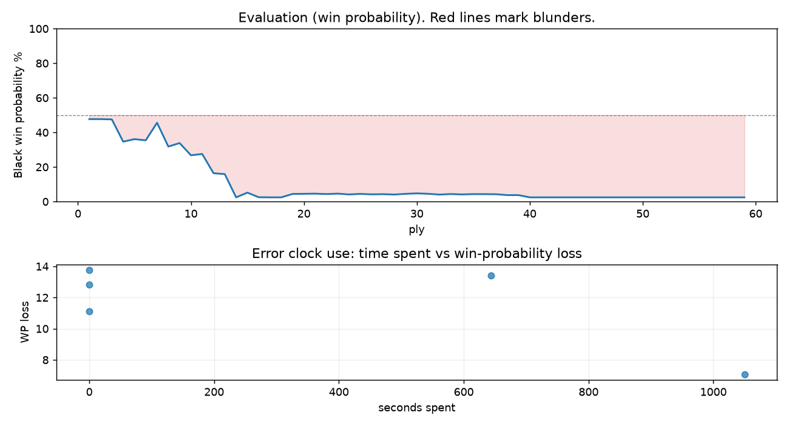

# (free, so lmk) Game analysis: DanielKetterer vs Jbrb8497

Date: 2026.08.11  |  Time control: daily (1/259200)  |  You played: black
Game ID: ef76cbfc-95b1-11f1-a0ca-9ec2cd01000b
Analysis: depth=24 multipv=3 findability=honest floor=6 stable_run=3 threads=1 hash_mb=256 deterministic=True engine_id=Stockfish_18 generated=2026-08-20T07:48:04Z
Game end time UTC: 2026-08-19T12:27:15+00:00
Game: https://www.chess.com/game/daily/1012413288

## Summary

- Lichess accuracy: you 83.6%, opponent 95.6%
- Opening: C40 King's Pawn Game: Damiano Defense (theory followed through ply 4)
- First deviation from theory: ply 5, Opponent played 3. Bc4
- Your moves: 10 best, 13 excellent, 1 good, 1 inaccuracy, 4 mistake, 0 blunder

METRICS:

Best: The played move exactly matches Stockfish's top move

Excellent: A non-best move that loses 2 WP points or less.

Good: WP loss is over 2, but under 5 points; also used for losses under 20 when the position remains already decided.

Inaccuracy: WP loss is at least 5 but under 10 points.

Mistake: WP loss is at least 10 but under 20 points; also generally used when a forced mate is missed with under 10 points of WP loss.

Blunder: WP loss is 20 points or more, or a forced mate is missed with at least 10 points of WP loss.

See: https://support.chess.com/en/articles/8572705-how-are-moves-classified-what-is-a-blunder-or-brilliant-etc 

(Brillint, Great and Miss are rating subjective)
- Puzzles: 56 open, 0 solved

### Puzzle gate tally (this game)

Gates: category in ['brilliant_sacrifice', 'missed_tactic', 'allowed_tactic', 'endgame'], refute depth in [3, 8], best-vs-second WP gap >= 5. Refute bar per move: max(5, 0.6 x WP loss).

| outcome | errors |
|---|---|
| accepted | 1 |
| category:opening | 1 |
| refute_too_shallow | 2 |
| wp_gap_too_small | 1 |

Four gates pass at once or nothing is generated, so a zero here is a product of four pass rates rather than a fault. Read the binding gate off this table before changing any threshold.

### Sacrifices in the engine's line

Real sacrifices are listed but never served as puzzles: compensation that never resolves back into material has no gradable answer.

| Move | Offered | Kind | Quiet | Line ends | Verdict |
|---|---|---|---|---|---|
| 5 | -3.0 (piece) | real | yes | -1.0 pawns | real_sacrifice_not_gradable |
| 6 | -3.0 (piece) | sham | yes | +2.0 pawns | opening_ply |
| 7 | -4.0 (piece) | real | yes | -3.0 pawns | real_sacrifice_not_gradable |

## Biggest missed opportunity

You played 4...h5. Stockfish preferred c6, after which the main line runs 4...c6 5. Bb3 d5 6. exd5 cxd5 7. d4. The evaluation crossed from equal to losing, which matters more than the raw number. This was a judgment error rather than a missed tactic; compare the pawn structure and piece activity after both moves. The engine first prefers this move at depth 8 and holds it; findable, but it takes a deliberate look rather than a scan. Candidates considered by the engine: c6 (+0.48), d5 (+1.10), Nbc6 (+1.18).

## Critical positions

- Ply 15 (opponent), 8.Nxg6: M2 -> +7.89 [forced mate was on the board]
- Ply 19 (opponent), 10.Qf3: M4 -> +8.34 [forced mate was on the board]
- Ply 49 (opponent), 25.b4: M9 -> +10.77 [forced mate was on the board]

## Your errors, move by move

| Move | Class | Category | WP loss | Refute depth | Seconds spent | Pre-error eval |
|---|---|---|---:|---|---:|---|
| 2...f6 | mistake | allowed_tactic | 13% | 4 | 0 | balanced |
| 4...h5 | mistake | opening | 14% | 6 | 0 | balanced |
| 5...b6 | inaccuracy | allowed_tactic | 7% | 1 | 1050 | losing |
| 6...fxe5 | mistake | missed_tactic | 11% | 2 | 0 | losing |
| 7...Ng6 | mistake | missed_tactic | 13% | 4 | 644 | losing |

### 2...f6 (mistake, positional, wp loss 13%)

You played 2...f6. Stockfish preferred Nc6, after which the main line runs 2...Nc6 3. Bc4 Nf6 4. d3 Bc5 5. O-O. The evaluation crossed from equal to losing, which matters more than the raw number. This was a judgment error rather than a missed tactic; compare the pawn structure and piece activity after both moves. The engine prefers this move from at or below depth 6, which is as shallow as this measurement resolves; it sits near the surface, a quiet move, but one whose point shows at a glance. Candidates considered by the engine: Nc6 (+0.27), Nf6 (+0.35), d6 (+0.64).

### 4...h5 (mistake, positional, wp loss 14%)

You played 4...h5. Stockfish preferred c6, after which the main line runs 4...c6 5. Bb3 d5 6. exd5 cxd5 7. d4. The evaluation crossed from equal to losing, which matters more than the raw number. This was a judgment error rather than a missed tactic; compare the pawn structure and piece activity after both moves. The engine first prefers this move at depth 8 and holds it; findable, but it takes a deliberate look rather than a scan. Candidates considered by the engine: c6 (+0.48), d5 (+1.10), Nbc6 (+1.18).

### 5...b6 (inaccuracy, positional, wp loss 7%)

You played 5...b6. Stockfish preferred d5, after which the main line runs 5...d5 6. exd5 e4 7. Nfd2 f5 8. Qe2. Why it went wrong: motif: fork; creates threat on e4, c4. This was a judgment error rather than a missed tactic; compare the pawn structure and piece activity after both moves. The engine first prefers this move at depth 10 and holds it; findable, but it takes a deliberate look rather than a scan. Candidates considered by the engine: d5 (+1.82), Ng6 (+2.21), a6 (+2.34).

### 6...fxe5 (mistake, tactical, wp loss 11%)

You played 6...fxe5. Stockfish preferred Ba6, after which the main line runs 6...Ba6 7. Bxa6 Nxa6 8. exf6 gxf6 9. O-O. Why it went wrong: left pawn on e5 insufficiently defended; motif: creates threat on c4. Before committing to a quiet move here, the checklist is checks, captures, threats, in that order. The engine first prefers this move at depth 10 and holds it; findable, but it takes a deliberate look rather than a scan. Candidates considered by the engine: Ba6 (+2.63), b5 (+3.16), Bb7 (+3.42).

### 7...Ng6 (mistake, tactical, wp loss 13%)

You played 7...Ng6. Stockfish preferred d5, after which the main line runs 7...d5 8. exd5 Qd6 9. Qe2 Bg4 10. Nxg4. Why it went wrong: left knight on g6 insufficiently defended; motif: fork; creates threat on e4, c4. Before committing to a quiet move here, the checklist is checks, captures, threats, in that order. The engine prefers this move from at or below depth 6, which is as shallow as this measurement resolves; it sits near the surface, a forcing move, the kind a checks-and-captures scan catches. Candidates considered by the engine: d5 (+4.53), Nd5 (+7.95), Ng8 (+12.18).

## Full move table

| Ply | Move | Eval before | Eval after | Best | CP loss | WP loss | Class |
|-----|------|-------------|------------|------|---------|---------|-------|
| 1 | 1.e4 | +0.31 | +0.25 | e4 | 6 | 1% | best |
| 2 | 1...e5* | +0.25 | +0.25 | e5 | 0 | 0% | best |
| 3 | 2.Nf3 | +0.25 | +0.27 | Nf3 | 0 | 0% | best |
| 4 | 2...f6* | +0.27 | +1.72 | Nc6 | 145 | 13% | mistake |
| 5 | 3.Bc4 | +1.72 | +1.55 | Nxe5 | 17 | 1% | excellent |
| 6 | 3...Ne7* | +1.55 | +1.63 | d6 | 8 | 1% | excellent |
| 7 | 4.c3 | +1.63 | +0.48 | O-O | 115 | 10% | mistake |
| 8 | 4...h5* | +0.48 | +2.07 | c6 | 159 | 14% | mistake |
| 9 | 5.d4 | +2.07 | +1.82 | Qb3 | 25 | 2% | good |
| 10 | 5...b6* | +1.82 | +2.73 | d5 | 91 | 7% | inaccuracy |
| 11 | 6.dxe5 | +2.73 | +2.63 | dxe5 | 10 | 1% | best |
| 12 | 6...fxe5* | +2.63 | +4.42 | Ba6 | 179 | 11% | mistake |
| 13 | 7.Nxe5 | +4.42 | +4.53 | Bg5 | 0 | 0% | excellent |
| 14 | 7...Ng6* | +4.53 | M2 | d5 |  | 13% | mistake |
| 15 | 8.Nxg6 | M2 | +7.89 | Bf7+ |  | 3% | mistake |
| 16 | 8...Rg8* | +7.89 | +9.93 | Rh6 | 204 | 3% | good |
| 17 | 9.Bxg8 | +9.93 | +10.11 | Qxh5 | 0 | 0% | excellent |
| 18 | 9...Bc5* | +10.11 | M4 | Qf6 |  | 0% | excellent |
| 19 | 10.Qf3 | M4 | +8.34 | Bf7+ |  | 2% | mistake |
| 20 | 10...Qf6* | +8.34 | +8.30 | Qf6 | 0 | 0% | best |
| 21 | 11.Qxf6 | +8.30 | +8.24 | Qf5 | 6 | 0% | excellent |
| 22 | 11...gxf6* | +8.24 | +8.39 | gxf6 | 15 | 0% | best |
| 23 | 12.O-O | +8.39 | +8.23 | Bd5 | 16 | 0% | excellent |
| 24 | 12...Na6* | +8.23 | +8.54 | Bb7 | 31 | 0% | excellent |
| 25 | 13.Be3 | +8.54 | +8.33 | Bf4 | 21 | 0% | excellent |
| 26 | 13...Bd6* | +8.33 | +8.50 | h4 | 17 | 0% | excellent |
| 27 | 14.Nd2 | +8.50 | +8.43 | Nd2 | 7 | 0% | best |
| 28 | 14...Bb7* | +8.43 | +8.58 | Bb7 | 15 | 0% | best |
| 29 | 15.Bd5 | +8.58 | +8.31 | f3 | 27 | 0% | excellent |
| 30 | 15...Bxd5* | +8.31 | +8.14 | Bxd5 | 0 | 0% | best |
| 31 | 16.exd5 | +8.14 | +8.29 | exd5 | 0 | 0% | best |
| 32 | 16...O-O-O* | +8.29 | +8.60 | Kf7 | 31 | 0% | excellent |
| 33 | 17.Nc4 | +8.60 | +8.39 | Ne4 | 21 | 0% | excellent |
| 34 | 17...Bc5* | +8.39 | +8.53 | Bc5 | 14 | 0% | best |
| 35 | 18.Bxc5 | +8.53 | +8.41 | b4 | 12 | 0% | excellent |
| 36 | 18...Nxc5* | +8.41 | +8.42 | Nxc5 | 1 | 0% | best |
| 37 | 19.Rfe1 | +8.42 | +8.45 | Ne7+ | 0 | 0% | excellent |
| 38 | 19...f5* | +8.45 | +8.81 | Kb7 | 36 | 1% | excellent |
| 39 | 20.Rad1 | +8.81 | +8.82 | h4 | 0 | 0% | excellent |
| 40 | 20...Rg8* | +8.82 | +10.14 | b5 | 132 | 1% | excellent |
| 41 | 21.Ne7+ | +10.14 | +10.36 | Ne7+ | 0 | 0% | best |
| 42 | 21...Kb7* | +10.36 | +10.52 | Kb7 | 16 | 0% | best |
| 43 | 22.Nxg8 | +10.52 | +10.57 | Nxg8 | 0 | 0% | best |
| 44 | 22...c6* | +10.57 | +11.20 | a5 | 63 | 0% | excellent |
| 45 | 23.dxc6+ | +11.20 | +11.21 | Nd6+ | 0 | 0% | excellent |
| 46 | 23...dxc6* | +11.21 | M10 | Kxc6 |  | 0% | excellent |
| 47 | 24.Nd6+ | M10 | M9 | Re7+ |  | 0% | excellent |
| 48 | 24...Ka6* | M9 | M9 | Ka6 |  | 0% | best |
| 49 | 25.b4 | M9 | +10.77 | Re7 |  | 0% | mistake |
| 50 | 25...Ne4* | +10.77 | M16 | Nb7 |  | 0% | excellent |
| 51 | 26.a4 | M16 | M6 | Ne7 |  | 0% | excellent |
| 52 | 26...Nxc3* | M6 | M6 | b5 |  | 0% | excellent |
| 53 | 27.Ra1 | M6 | M8 | b5+ |  | 0% | excellent |
| 54 | 27...Nd5* | M8 | M3 | c5 |  | 0% | excellent |
| 55 | 28.b5+ | M3 | M2 | b5+ |  | 0% | best |
| 56 | 28...Ka5* | M2 | M2 | Ka5 |  | 0% | best |
| 57 | 29.Reb1 | M2 | M1 | Reb1 |  | 0% | best |
| 58 | 29...Nc3* | M1 | M1 | f4 |  | 0% | excellent |
| 59 | 30.Nb7# | M1 | M1 | Nc4# |  | 0% | excellent |

Rows marked * are your moves. WP loss is win-probability loss; it is the primary signal, CP loss is shown for reference.

## Patterns in this game

- Error categories: 2 allowed_tactic, 2 missed_tactic, 1 opening.
- Attention errors per 100 moves: 0.0.
- Pre-error eval buckets: 0 winning, 2 balanced, 3 losing.
- Opening: 5 error(s) (avg wp loss 12%).
- 2 of your errors came with under a minute on the clock.
