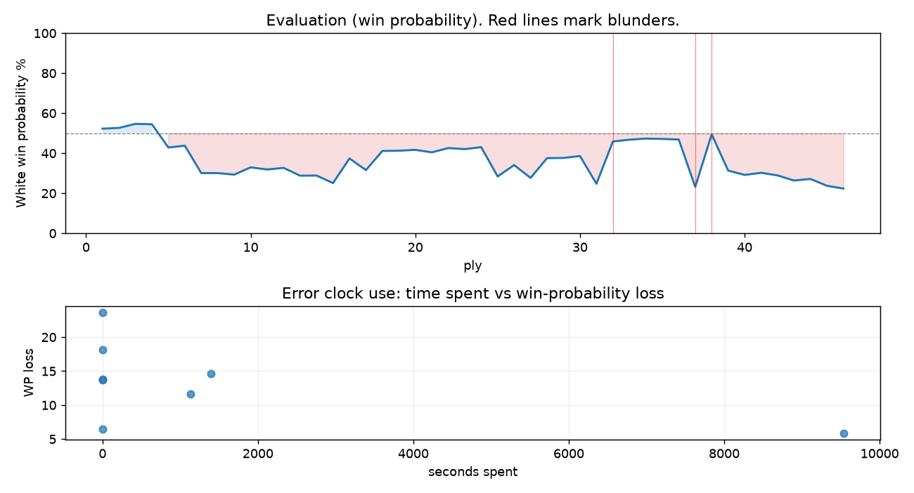

# (free, so lmk) Game analysis: Neuromorphic vs DanielKetterer

Date: 2026.08.21  |  Time control: daily (1/259200)  |  You played: white
Game ID: 4e632b90-9d52-11f1-a4df-48601f01000b
Analysis: depth=24 multipv=3 findability=honest floor=6 stable_run=3 threads=1 hash_mb=256 deterministic=True engine_id=Stockfish_18 generated=2026-09-14T13:38:11Z
Game end time UTC: 2026-09-13T10:55:26+00:00
Game: https://www.chess.com/game/daily/1017020672

## Summary

- Lichess accuracy: you 73.7%, opponent 78.7%
- Opening: B12 Caro-Kann Defense (theory followed through ply 4)
- First deviation from theory: ply 5, You played 3. Bf4
- Your moves: 8 best, 3 excellent, 4 good, 2 inaccuracy, 5 mistake, 1 blunder

METRICS:

Best: The played move exactly matches Stockfish's top move

Excellent: A non-best move that loses 2 WP points or less.

Good: WP loss is over 2, but under 5 points; also used for losses under 20 when the position remains already decided.

Inaccuracy: WP loss is at least 5 but under 10 points.

Mistake: WP loss is at least 10 but under 20 points; also generally used when a forced mate is missed with under 10 points of WP loss.

Blunder: WP loss is 20 points or more, or a forced mate is missed with at least 10 points of WP loss.

See: https://support.chess.com/en/articles/8572705-how-are-moves-classified-what-is-a-blunder-or-brilliant-etc 

(Brillint, Great and Miss are rating subjective)
- Puzzles: 56 open, 0 solved

### Puzzle gate tally (this game)

Gates: category in ['brilliant_sacrifice', 'missed_tactic', 'allowed_tactic', 'endgame'], refute depth in [3, 8], best-vs-second WP gap >= 5. Refute bar per move: max(5, 0.6 x WP loss).

| outcome | errors |
|---|---|
| category:attention | 2 |
| category:positional | 2 |
| refute_too_deep | 2 |
| refute_too_shallow | 2 |

Four gates pass at once or nothing is generated, so a zero here is a product of four pass rates rather than a fault. Read the binding gate off this table before changing any threshold.

### Sacrifices in the engine's line

Real sacrifices are listed but never served as puzzles: compensation that never resolves back into material has no gradable answer.

| Move | Offered | Kind | Quiet | Line ends | Verdict |
|---|---|---|---|---|---|
| 3 | -3.0 (piece) | sham | yes | +0.0 pawns | desperado |
| 4 | -3.0 (piece) | sham | yes | +0.0 pawns | opening_ply |
| 9 | -8.0 (piece) | sham | no | +0.0 pawns | opening_ply |
| 19 | -3.0 (piece) | sham | yes | +0.0 pawns | obvious |

## Biggest missed opportunity

You played 19.Rd2. Stockfish preferred Rd6, after which the main line runs 19. Rd6 e5 20. Rxb6 Rxc2 21. Rd6 h6. The evaluation crossed from equal to losing, which matters more than the raw number. Why it went wrong: motif: creates threat on b6. This was a judgment error rather than a missed tactic; compare the pawn structure and piece activity after both moves. The engine prefers this move from at or below depth 6, which is as shallow as this measurement resolves; it sits near the surface, a quiet move, but one whose point shows at a glance. Candidates considered by the engine: Rd6 (-0.34), Nh3 (-2.35), h4 (-2.49).

## Critical positions

- Ply 8 (opponent), 4...Rxb8: -2.29 -> -2.29 [only-move situation]
- Ply 20 (opponent), 10...Qxd7: -0.96 -> -0.91 [only-move situation]
- Ply 32 (opponent), 16...Rbc8: -3.02 -> -0.45 [evaluation crossed winning -> equal]
- Ply 33 (you), 17.Na4: -0.45 -> -0.35 [only-move situation]
- Ply 36 (opponent), 18...axb6: -0.31 -> -0.34 [only-move situation]
- Ply 37 (you), 19.Rd2: -0.34 -> -3.25 [only-move situation; evaluation crossed equal -> losing]
- Ply 38 (opponent), 19...Ra8: -3.25 -> -0.06 [evaluation crossed winning -> equal]
- Ply 39 (you), 20.Ra1: -0.06 -> -2.13 [only-move situation; evaluation crossed equal -> losing]

## Your errors, move by move

| Move | Class | Category | WP loss | Refute depth | Seconds spent | Pre-error eval |
|---|---|---|---:|---|---:|---|
| 3.Bf4 | mistake | attention | 12% | 1 | 1130 | balanced |
| 4.Bxb8 | mistake | allowed_tactic | 14% | 1 | 0 | balanced |
| 9.Bxb5+ | inaccuracy | allowed_tactic | 6% | 11 | 9534 | balanced |
| 13.Nh3 | mistake | missed_tactic | 15% | 2 | 1396 | balanced |
| 14.O-O | inaccuracy | attention | 6% | 2 | 0 | losing |
| 16.Ng5 | mistake | allowed_tactic | 14% | 15 | 0 | balanced |
| 19.Rd2 | blunder | positional | 24% | 7 | 0 | balanced |
| 20.Ra1 | mistake | positional | 18% | 3 | 0 | balanced |

### 3.Bf4 (mistake, tactical, wp loss 12%)

You played 3.Bf4. Stockfish preferred e5, after which the main line runs 3. e5 Bf5 4. Be2 e6 5. Nf3 c5. Why it went wrong: left pawn on e4 insufficiently defended. Before committing to a quiet move here, the checklist is checks, captures, threats, in that order. The engine prefers this move from at or below depth 6, which is as shallow as this measurement resolves; it sits near the surface, a forcing move, the kind a checks-and-captures scan catches. Candidates considered by the engine: e5 (+0.49), Nd2 (+0.40), Nc3 (+0.37).

### 4.Bxb8 (mistake, tactical, wp loss 14%)

You played 4.Bxb8. Stockfish preferred Ne2, after which the main line runs 4. Ne2 g6 5. Nbc3 Nf6 6. Qd2 h5. The evaluation crossed from equal to losing, which matters more than the raw number. Why it went wrong: left bishop on b8 insufficiently defended. Before committing to a quiet move here, the checklist is checks, captures, threats, in that order. The engine never settles on this move within the analysis depth, so how findable it was is not measured here; weigh this one lightly. Candidates considered by the engine: Ne2 (-0.68), Qd2 (-0.71), f3 (-0.78).

### 9.Bxb5+ (inaccuracy, positional, wp loss 6%)

You played 9.Bxb5+. Stockfish preferred dxc5, after which the main line runs 9. dxc5 Qxd1+ 10. Rxd1 Bxc5 11. b4 Bb6. The evaluation crossed from equal to losing, which matters more than the raw number. This was a judgment error rather than a missed tactic; compare the pawn structure and piece activity after both moves. The engine does not settle on this move until depth 12; reachable with real calculation, but not on a scan. Candidates considered by the engine: dxc5 (-1.40), d5 (-1.92), Bxb5+ (-2.04).

### 13.Nh3 (mistake, tactical, wp loss 15%)

You played 13.Nh3. Stockfish preferred b4, after which the main line runs 13. b4 Bb6 14. Na4 Rc8 15. Rc1 Kf7. The evaluation crossed from equal to losing, which matters more than the raw number. Why it went wrong: left pawn on b2 insufficiently defended; motif: creates threat on c5. Before committing to a quiet move here, the checklist is checks, captures, threats, in that order. The engine first prefers this move at depth 8 and holds it; findable, but it takes a deliberate look rather than a scan. Candidates considered by the engine: b4 (-0.76), Na4 (-1.31), f3 (-1.37).

### 14.O-O (inaccuracy, positional, wp loss 6%)

You played 14.O-O. Stockfish preferred Na4, after which the main line runs 14. Na4 Bb6 15. Nf4 Ke7 16. Ne2 Rhc8. Why it went wrong: left pawn on b2 insufficiently defended; motif: creates threat on c5. This was a judgment error rather than a missed tactic; compare the pawn structure and piece activity after both moves. The engine prefers this move from at or below depth 6, which is as shallow as this measurement resolves; it sits near the surface, a quiet move, but one whose point shows at a glance. Candidates considered by the engine: Na4 (-1.79), b4 (-1.80), Nf4 (-2.44).

### 16.Ng5 (mistake, positional, wp loss 14%)

You played 16.Ng5. Stockfish preferred Na4, after which the main line runs 16. Na4 Rfc8 17. c3 Kf7 18. Nf4 g5. The evaluation crossed from equal to losing, which matters more than the raw number. This was a judgment error rather than a missed tactic; compare the pawn structure and piece activity after both moves. The engine prefers this move from at or below depth 6, which is as shallow as this measurement resolves; it sits near the surface, a quiet move, but one whose point shows at a glance. Candidates considered by the engine: Na4 (-1.26), Rc1 (-1.60), g3 (-1.64).

### 19.Rd2 (blunder, positional, wp loss 24%)

You played 19.Rd2. Stockfish preferred Rd6, after which the main line runs 19. Rd6 e5 20. Rxb6 Rxc2 21. Rd6 h6. The evaluation crossed from equal to losing, which matters more than the raw number. Why it went wrong: motif: creates threat on b6. This was a judgment error rather than a missed tactic; compare the pawn structure and piece activity after both moves. The engine prefers this move from at or below depth 6, which is as shallow as this measurement resolves; it sits near the surface, a quiet move, but one whose point shows at a glance. Candidates considered by the engine: Rd6 (-0.34), Nh3 (-2.35), h4 (-2.49).

### 20.Ra1 (mistake, positional, wp loss 18%)

You played 20.Ra1. Stockfish preferred Rd6, after which the main line runs 20. Rd6 e5 21. Rxb6 Rxa3 22. c4 h6. The evaluation crossed from equal to losing, which matters more than the raw number. Why it went wrong: motif: creates threat on b6. This was a judgment error rather than a missed tactic; compare the pawn structure and piece activity after both moves. The engine prefers this move from at or below depth 6, which is as shallow as this measurement resolves; it sits near the surface, a quiet move, but one whose point shows at a glance. Candidates considered by the engine: Rd6 (-0.06), h4 (-1.88), Nh3 (-1.92).

## Full move table

| Ply | Move | Eval before | Eval after | Best | CP loss | WP loss | Class |
|-----|------|-------------|------------|------|---------|---------|-------|
| 1 | 1.e4* | +0.31 | +0.25 | e4 | 6 | 1% | best |
| 2 | 1...c6 | +0.25 | +0.29 | e5 | 4 | 0% | excellent |
| 3 | 2.d4* | +0.29 | +0.51 | c3 | 0 | 0% | excellent |
| 4 | 2...d5 | +0.51 | +0.49 | d5 | 0 | 0% | best |
| 5 | 3.Bf4* | +0.49 | -0.78 | e5 | 127 | 12% | mistake |
| 6 | 3...dxe4 | -0.78 | -0.68 | dxe4 | 10 | 1% | best |
| 7 | 4.Bxb8* | -0.68 | -2.29 | Ne2 | 161 | 14% | mistake |
| 8 | 4...Rxb8 | -2.29 | -2.29 | Rxb8 | 0 | 0% | best |
| 9 | 5.Nc3* | -2.29 | -2.39 | c3 | 10 | 1% | excellent |
| 10 | 5...f5 | -2.39 | -1.93 | Nf6 | 46 | 4% | good |
| 11 | 6.Bc4* | -1.93 | -2.06 | f3 | 13 | 1% | excellent |
| 12 | 6...e6 | -2.06 | -1.96 | e6 | 10 | 1% | best |
| 13 | 7.a3* | -1.96 | -2.46 | Bb3 | 50 | 4% | good |
| 14 | 7...b5 | -2.46 | -2.45 | b5 | 1 | 0% | best |
| 15 | 8.Be2* | -2.45 | -2.97 | Ba2 | 52 | 4% | good |
| 16 | 8...c5 | -2.97 | -1.40 | Bd6 | 157 | 12% | mistake |
| 17 | 9.Bxb5+* | -1.40 | -2.10 | dxc5 | 70 | 6% | inaccuracy |
| 18 | 9...Bd7 | -2.10 | -0.97 | Rxb5 | 113 | 10% | inaccuracy |
| 19 | 10.Bxd7+* | -0.97 | -0.96 | Bxd7+ | 0 | 0% | best |
| 20 | 10...Qxd7 | -0.96 | -0.91 | Qxd7 | 5 | 0% | best |
| 21 | 11.dxc5* | -0.91 | -1.05 | dxc5 | 14 | 1% | best |
| 22 | 11...Qxd1+ | -1.05 | -0.81 | Bxc5 | 24 | 2% | good |
| 23 | 12.Rxd1* | -0.81 | -0.87 | Rxd1 | 6 | 1% | best |
| 24 | 12...Bxc5 | -0.87 | -0.76 | Bxc5 | 11 | 1% | best |
| 25 | 13.Nh3* | -0.76 | -2.51 | b4 | 175 | 15% | mistake |
| 26 | 13...Nf6 | -2.51 | -1.79 | Rxb2 | 72 | 6% | inaccuracy |
| 27 | 14.O-O* | -1.79 | -2.61 | Na4 | 82 | 6% | inaccuracy |
| 28 | 14...O-O | -2.61 | -1.38 | Ke7 | 123 | 10% | inaccuracy |
| 29 | 15.b4* | -1.38 | -1.37 | b4 | 0 | 0% | best |
| 30 | 15...Bb6 | -1.37 | -1.26 | Bb6 | 11 | 1% | best |
| 31 | 16.Ng5* | -1.26 | -3.02 | Na4 | 176 | 14% | mistake |
| 32 | 16...Rbc8 | -3.02 | -0.45 | e3 | 257 | 21% | blunder |
| 33 | 17.Na4* | -0.45 | -0.35 | Na4 | 0 | 0% | best |
| 34 | 17...Rfe8 | -0.35 | -0.29 | Rfe8 | 6 | 1% | best |
| 35 | 18.Nxb6* | -0.29 | -0.31 | Nxb6 | 2 | 0% | best |
| 36 | 18...axb6 | -0.31 | -0.34 | axb6 | 0 | 0% | best |
| 37 | 19.Rd2* | -0.34 | -3.25 | Rd6 | 291 | 24% | blunder |
| 38 | 19...Ra8 | -3.25 | -0.06 | h6 | 319 | 26% | blunder |
| 39 | 20.Ra1* | -0.06 | -2.13 | Rd6 | 207 | 18% | mistake |
| 40 | 20...h6 | -2.13 | -2.41 | h6 | 0 | 0% | best |
| 41 | 21.Nh3* | -2.41 | -2.27 | Nh3 | 0 | 0% | best |
| 42 | 21...g5 | -2.27 | -2.44 | g5 | 0 | 0% | best |
| 43 | 22.Rd6* | -2.44 | -2.79 | c4 | 35 | 3% | good |
| 44 | 22...b5 | -2.79 | -2.68 | Rac8 | 11 | 1% | excellent |
| 45 | 23.g3* | -2.68 | -3.17 | Rb6 | 49 | 3% | good |
| 46 | 23...Nd5 | -3.17 | -3.38 | Kf7 | 0 | 0% | excellent |

Rows marked * are your moves. WP loss is win-probability loss; it is the primary signal, CP loss is shown for reference.

## Patterns in this game

- Error categories: 3 allowed_tactic, 2 attention, 1 missed_tactic, 2 positional.
- Attention errors per 100 moves: 8.7.
- Pre-error eval buckets: 0 winning, 7 balanced, 1 losing.
- Opening: 3 error(s) (avg wp loss 10%).
- Middlegame: 5 error(s) (avg wp loss 15%).
- 2 of your errors came with under a minute on the clock.
