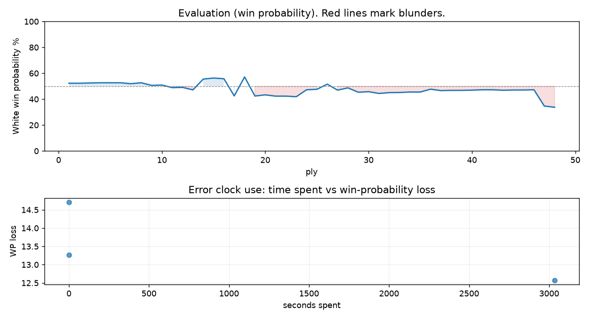

# (free, so lmk) Game analysis: LoedJuhu vs DanielKetterer

Date: 2026.08.03  |  Time control: daily (1/259200)  |  You played: white
Game ID: 478432bc-8f5e-11f1-8ccf-e7e3aa01000b
Analysis: depth=24 multipv=3 findability=honest floor=6 stable_run=3 threads=1 hash_mb=256 deterministic=True engine_id=Stockfish_18 generated=2026-10-04T13:04:34Z
Game end time UTC: 2026-10-03T12:00:25+00:00
Game: https://www.chess.com/game/daily/1008631838

## Summary

- Lichess accuracy: you 84.0%, opponent 90.1%
- Opening: C54 Italian Game: Giuoco Piano, Greco's Attack (theory followed through ply 13)
- First deviation from theory: ply 14, Opponent played 7... Bxc3+
- Your moves: 12 best, 5 excellent, 4 good, 0 inaccuracy, 3 mistake, 0 blunder

METRICS:

Best: The played move exactly matches Stockfish's top move

Excellent: A non-best move that loses 2 WP points or less.

Good: WP loss is over 2, but under 5 points; also used for losses under 20 when the position remains already decided.

Inaccuracy: WP loss is at least 5 but under 10 points.

Mistake: WP loss is at least 10 but under 20 points; also generally used when a forced mate is missed with under 10 points of WP loss.

Blunder: WP loss is 20 points or more, or a forced mate is missed with at least 10 points of WP loss.

See: https://support.chess.com/en/articles/8572705-how-are-moves-classified-what-is-a-blunder-or-brilliant-etc 

(Brillint, Great and Miss are rating subjective)
- Puzzles: 58 open, 0 solved

### Puzzle gate tally (this game)

Gates: category in ['brilliant_sacrifice', 'missed_tactic', 'allowed_tactic', 'endgame'], refute depth in [3, 8], best-vs-second WP gap >= 5. Refute bar per move: max(5, 0.6 x WP loss).

| outcome | errors |
|---|---|
| accepted | 1 |
| category:attention | 1 |
| wp_gap_too_small | 1 |

Four gates pass at once or nothing is generated, so a zero here is a product of four pass rates rather than a fault. Read the binding gate off this table before changing any threshold.

## Biggest missed opportunity

You played 10.Ng5. Stockfish preferred O-O, after which the main line runs 10. O-O Nf6 11. Qc2 d5 12. Bd3 O-O. Why it went wrong: left pawn on c3 insufficiently defended. Before committing to a quiet move here, the checklist is checks, captures, threats, in that order. The engine prefers this move from at or below depth 6, which is as shallow as this measurement resolves; it sits near the surface, a forcing move, the kind a checks-and-captures scan catches. Candidates considered by the engine: O-O (+0.78), Be3 (-0.28), Bb2 (-0.55).

## Critical positions

- Ply 15 (you), 8.bxc3: +0.60 -> +0.69 [only-move situation]
- Ply 23 (you), 12.Bxg5: -0.84 -> -0.89 [only-move situation]

## Your errors, move by move

| Move | Class | Category | WP loss | Refute depth | Seconds spent | Pre-error eval |
|---|---|---|---:|---|---:|---|
| 9.Qe2 | mistake | missed_tactic | 13% | 5 | 0 | balanced |
| 10.Ng5 | mistake | attention | 15% | 1 | 0 | balanced |
| 24.Kg2 | mistake | missed_tactic | 13% | 8 | 3034 | balanced |

### 9.Qe2 (mistake, tactical, wp loss 13%)

You played 9.Qe2. Stockfish preferred d5, after which the main line runs 9. d5 Ne7 10. Qd4 Nf6 11. Bg5 d6. Why it went wrong: left pawn on c3 insufficiently defended; motif: creates threat on c6. Before committing to a quiet move here, the checklist is checks, captures, threats, in that order. The engine prefers this move from at or below depth 6, which is as shallow as this measurement resolves; it sits near the surface, a forcing move, the kind a checks-and-captures scan catches. Candidates considered by the engine: d5 (+0.63), Bd3 (+0.00), Ba3 (-0.24).

### 10.Ng5 (mistake, tactical, wp loss 15%)

You played 10.Ng5. Stockfish preferred O-O, after which the main line runs 10. O-O Nf6 11. Qc2 d5 12. Bd3 O-O. Why it went wrong: left pawn on c3 insufficiently defended. Before committing to a quiet move here, the checklist is checks, captures, threats, in that order. The engine prefers this move from at or below depth 6, which is as shallow as this measurement resolves; it sits near the surface, a forcing move, the kind a checks-and-captures scan catches. Candidates considered by the engine: O-O (+0.78), Be3 (-0.28), Bb2 (-0.55).

### 24.Kg2 (mistake, tactical, wp loss 13%)

You played 24.Kg2. Stockfish preferred Bxc6, after which the main line runs 24. Bxc6 Rxc6 25. dxc5 bxc5 26. Re8+ Kh7. The evaluation crossed from equal to losing, which matters more than the raw number. Before committing to a quiet move here, the checklist is checks, captures, threats, in that order. The engine prefers this move from at or below depth 6, which is as shallow as this measurement resolves; it sits near the surface, a forcing move, the kind a checks-and-captures scan catches. Candidates considered by the engine: Bxc6 (-0.30), Ba6 (-0.51), Bf4 (-0.76).

## Full move table

| Ply | Move | Eval before | Eval after | Best | CP loss | WP loss | Class |
|-----|------|-------------|------------|------|---------|---------|-------|
| 1 | 1.e4* | +0.31 | +0.25 | e4 | 6 | 1% | best |
| 2 | 1...e5 | +0.25 | +0.25 | e5 | 0 | 0% | best |
| 3 | 2.Nf3* | +0.25 | +0.27 | Nf3 | 0 | 0% | best |
| 4 | 2...Nc6 | +0.27 | +0.29 | Nc6 | 2 | 0% | best |
| 5 | 3.Bc4* | +0.29 | +0.29 | Bc4 | 0 | 0% | best |
| 6 | 3...Bc5 | +0.29 | +0.29 | Nf6 | 0 | 0% | excellent |
| 7 | 4.c3* | +0.29 | +0.21 | O-O | 8 | 1% | excellent |
| 8 | 4...Nf6 | +0.21 | +0.29 | Nf6 | 8 | 1% | best |
| 9 | 5.d4* | +0.29 | +0.07 | d3 | 22 | 2% | good |
| 10 | 5...exd4 | +0.07 | +0.10 | exd4 | 3 | 0% | best |
| 11 | 6.cxd4* | +0.10 | -0.12 | e5 | 22 | 2% | good |
| 12 | 6...Bb4+ | -0.12 | -0.10 | Bb4+ | 2 | 0% | best |
| 13 | 7.Nc3* | -0.10 | -0.31 | Nc3 | 21 | 2% | best |
| 14 | 7...Bxc3+ | -0.31 | +0.60 | Nxe4 | 91 | 8% | inaccuracy |
| 15 | 8.bxc3* | +0.60 | +0.69 | bxc3 | 0 | 0% | best |
| 16 | 8...Nxe4 | +0.69 | +0.63 | Nxe4 | 0 | 0% | best |
| 17 | 9.Qe2* | +0.63 | -0.82 | d5 | 145 | 13% | mistake |
| 18 | 9...Qe7 | -0.82 | +0.78 | d5 | 160 | 15% | mistake |
| 19 | 10.Ng5* | +0.78 | -0.83 | O-O | 161 | 15% | mistake |
| 20 | 10...Nxg5 | -0.83 | -0.73 | Nxg5 | 10 | 1% | best |
| 21 | 11.Qxe7+* | -0.73 | -0.84 | Qxe7+ | 11 | 1% | best |
| 22 | 11...Nxe7 | -0.84 | -0.84 | Nxe7 | 0 | 0% | best |
| 23 | 12.Bxg5* | -0.84 | -0.89 | Bxg5 | 5 | 0% | best |
| 24 | 12...Ng6 | -0.89 | -0.30 | h6 | 59 | 5% | inaccuracy |
| 25 | 13.O-O* | -0.30 | -0.26 | O-O | 0 | 0% | best |
| 26 | 13...O-O | -0.26 | +0.17 | f6 | 43 | 4% | good |
| 27 | 14.Rfe1* | +0.17 | -0.33 | f4 | 50 | 5% | good |
| 28 | 14...d6 | -0.33 | -0.14 | h6 | 19 | 2% | excellent |
| 29 | 15.Rab1* | -0.14 | -0.51 | h4 | 37 | 3% | good |
| 30 | 15...b6 | -0.51 | -0.46 | b6 | 5 | 0% | best |
| 31 | 16.g3* | -0.46 | -0.61 | f3 | 15 | 1% | excellent |
| 32 | 16...h6 | -0.61 | -0.54 | Bg4 | 7 | 1% | excellent |
| 33 | 17.Bd2* | -0.54 | -0.53 | Bd2 | 0 | 0% | best |
| 34 | 17...Bf5 | -0.53 | -0.49 | Bf5 | 4 | 0% | best |
| 35 | 18.Rbc1* | -0.49 | -0.49 | Rb2 | 0 | 0% | excellent |
| 36 | 18...c5 | -0.49 | -0.25 | Rfe8 | 24 | 2% | good |
| 37 | 19.Bd5* | -0.25 | -0.37 | h4 | 12 | 1% | excellent |
| 38 | 19...Rae8 | -0.37 | -0.35 | Rab8 | 2 | 0% | excellent |
| 39 | 20.h4* | -0.35 | -0.35 | h4 | 0 | 0% | best |
| 40 | 20...Ne7 | -0.35 | -0.33 | Ne7 | 2 | 0% | best |
| 41 | 21.Bc4* | -0.33 | -0.30 | Bg2 | 0 | 0% | excellent |
| 42 | 21...Nc6 | -0.30 | -0.30 | Nc6 | 0 | 0% | best |
| 43 | 22.Bb5* | -0.30 | -0.34 | Bb5 | 4 | 0% | best |
| 44 | 22...Rxe1+ | -0.34 | -0.32 | Rxe1+ | 2 | 0% | best |
| 45 | 23.Rxe1* | -0.32 | -0.32 | Rxe1 | 0 | 0% | best |
| 46 | 23...Rc8 | -0.32 | -0.30 | Rc8 | 2 | 0% | best |
| 47 | 24.Kg2* | -0.30 | -1.72 | Bxc6 | 142 | 13% | mistake |
| 48 | 24...cxd4 | -1.72 | -1.83 | cxd4 | 0 | 0% | best |

Rows marked * are your moves. WP loss is win-probability loss; it is the primary signal, CP loss is shown for reference.

## Patterns in this game

- Error categories: 1 attention, 2 missed_tactic.
- Attention errors per 100 moves: 4.2.
- Pre-error eval buckets: 0 winning, 3 balanced, 0 losing.
- Opening: 2 error(s) (avg wp loss 14%).
- Middlegame: 1 error(s) (avg wp loss 13%).
