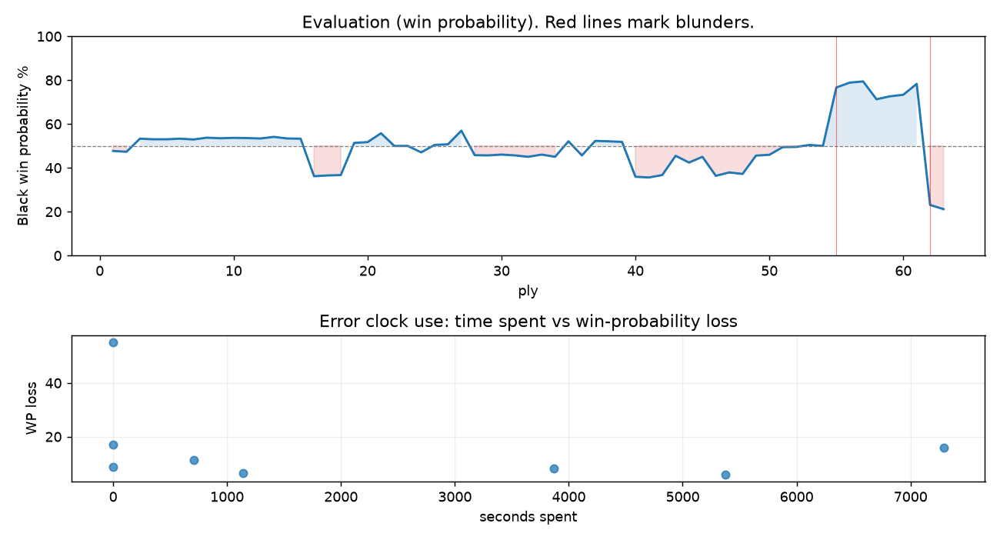

# (free, so lmk) Game analysis: BigLebowski22 vs DanielKetterer

Date: 2026.08.22  |  Time control: daily (1/259200)  |  You played: black
Game ID: 6eb6e132-9e35-11f1-907f-55d84c01000b
Analysis: depth=24 multipv=3 findability=honest floor=6 stable_run=3 threads=1 hash_mb=256 deterministic=True engine_id=Stockfish_18 generated=2026-10-04T13:18:06Z
Game end time UTC: 2026-10-03T13:38:14+00:00
Game: https://www.chess.com/game/daily/1017562048

## Summary

- Lichess accuracy: you 72.2%, opponent 84.3%
- Opening: B10 Caro-Kann Defense: Hillbilly Attack (theory followed through ply 3)
- First deviation from theory: ply 4, You played 2... d5
- Your moves: 12 best, 9 excellent, 2 good, 4 inaccuracy, 3 mistake, 1 blunder

METRICS:

Best: The played move exactly matches Stockfish's top move

Excellent: A non-best move that loses 2 WP points or less.

Good: WP loss is over 2, but under 5 points; also used for losses under 20 when the position remains already decided.

Inaccuracy: WP loss is at least 5 but under 10 points.

Mistake: WP loss is at least 10 but under 20 points; also generally used when a forced mate is missed with under 10 points of WP loss.

Blunder: WP loss is 20 points or more, or a forced mate is missed with at least 10 points of WP loss.

See: https://support.chess.com/en/articles/8572705-how-are-moves-classified-what-is-a-blunder-or-brilliant-etc 

(Brillint, Great and Miss are rating subjective)
- Puzzles: 59 open, 0 solved

### Puzzle gate tally (this game)

Gates: category in ['brilliant_sacrifice', 'missed_tactic', 'allowed_tactic', 'endgame'], refute depth in [3, 8], best-vs-second WP gap >= 5. Refute bar per move: max(5, 0.6 x WP loss).

| outcome | errors |
|---|---|
| category:attention | 1 |
| category:positional | 3 |
| refute_too_shallow | 2 |
| wp_gap_too_small | 2 |

Four gates pass at once or nothing is generated, so a zero here is a product of four pass rates rather than a fault. Read the binding gate off this table before changing any threshold.

### Sacrifices in the engine's line

Real sacrifices are listed but never served as puzzles: compensation that never resolves back into material has no gradable answer.

| Move | Offered | Kind | Quiet | Line ends | Verdict |
|---|---|---|---|---|---|
| 11 | -3.0 (piece) | sham | yes | +0.0 pawns | obvious |
| 20 | -3.0 (piece) | real | yes | -1.0 pawns | real_sacrifice_not_gradable |

## Biggest missed opportunity

You played 31...Nd5. Stockfish preferred Ne4, after which the main line runs 31...Ne4 32. Rd4+ Kb3 33. Rd7 Nd2 34. h4. The evaluation crossed from winning to losing, which matters more than the raw number. Why it went wrong: motif: creates threat on b4, c3. This was a judgment error rather than a missed tactic; compare the pawn structure and piece activity after both moves. The engine does not settle on this move until depth 11; reachable with real calculation, but not on a scan. Candidates considered by the engine: Ne4 (-3.49), Re5 (-3.22), Kb3 (-3.19).

## Critical positions

- Ply 20 (you), 10...e4: -0.15 -> -0.19 [only-move situation]
- Ply 31 (opponent), 16.Qxd7+: +0.43 -> +0.47 [only-move situation]
- Ply 32 (you), 16...Kxd7: +0.47 -> +0.54 [only-move situation]
- Ply 42 (you), 21...Kxd6: +1.61 -> +1.48 [only-move situation]
- Ply 50 (you), 25...Re5: +0.48 -> +0.44 [only-move situation]
- Ply 55 (opponent), 28.fxe4: +0.00 -> -3.23 [evaluation crossed equal -> losing]
- Ply 62 (you), 31...Nd5: -3.49 -> +3.27 [evaluation crossed winning -> losing]
- Ply 63 (opponent), 32.Rd4+: +3.27 -> +3.57 [only-move situation]

## Your errors, move by move

| Move | Class | Category | WP loss | Refute depth | Seconds spent | Pre-error eval |
|---|---|---|---:|---|---:|---|
| 8...e5 | mistake | allowed_tactic | 17% | 6 | 0 | balanced |
| 11...O-O-O | inaccuracy | positional | 6% | 3 | 5374 | balanced |
| 14...Rf8 | mistake | allowed_tactic | 11% | 8 | 706 | balanced |
| 18...g5 | inaccuracy | positional | 6% | 2 | 1142 | balanced |
| 20...Bd6 | mistake | allowed_tactic | 16% | 1 | 7289 | balanced |
| 23...h5 | inaccuracy | positional | 9% | 9 | 0 | balanced |
| 29...dxe4 | inaccuracy | attention | 8% | 1 | 3872 | winning |
| 31...Nd5 | blunder | allowed_tactic | 55% | 2 | 0 | winning |

### 8...e5 (mistake, positional, wp loss 17%)

You played 8...e5. Stockfish preferred e6, after which the main line runs 8...e6 9. c4 dxc4 10. Qe2 Nge7 11. Nc3. This was a judgment error rather than a missed tactic; compare the pawn structure and piece activity after both moves. The engine prefers this move from at or below depth 6, which is as shallow as this measurement resolves; it sits near the surface, a quiet move, but one whose point shows at a glance. Candidates considered by the engine: e6 (-0.36), Rd8 (-0.15), h5 (-0.08).

### 11...O-O-O (inaccuracy, positional, wp loss 6%)

You played 11...O-O-O. Stockfish preferred Nf6, after which the main line runs 11...Nf6 12. Bg5 Bc5 13. b4 Bxb4 14. Bxf6. Why it went wrong: motif: creates threat on f3. This was a judgment error rather than a missed tactic; compare the pawn structure and piece activity after both moves. The engine prefers this move from at or below depth 6, which is as shallow as this measurement resolves; it sits near the surface, a quiet move, but one whose point shows at a glance. Candidates considered by the engine: Nf6 (-0.63), Rd8 (-0.61), Be7 (-0.60).

### 14...Rf8 (mistake, positional, wp loss 11%)

You played 14...Rf8. Stockfish preferred Nf6, after which the main line runs 14...Nf6 15. a4 h6 16. Bh4 a6 17. a5. This was a judgment error rather than a missed tactic; compare the pawn structure and piece activity after both moves. The engine prefers this move from at or below depth 6, which is as shallow as this measurement resolves; it sits near the surface, a quiet move, but one whose point shows at a glance. Candidates considered by the engine: Nf6 (-0.76), Rd7 (-0.28), Ne7 (+0.00).

### 18...g5 (inaccuracy, positional, wp loss 6%)

You played 18...g5. Stockfish preferred Kc6, after which the main line runs 18...Kc6 19. Na4 Bd6 20. Rd1 g5 21. Bg3. This was a judgment error rather than a missed tactic; compare the pawn structure and piece activity after both moves. The engine does not settle on this move until depth 19; reachable with real calculation, but not on a scan. Candidates considered by the engine: Kc6 (-0.23), Nf6 (-0.22), Rh5 (-0.14).

### 20...Bd6 (mistake, positional, wp loss 16%)

You played 20...Bd6. Stockfish preferred Re8, after which the main line runs 20...Re8 21. Nb5 a5 22. c3 Nh5 23. Nd4. This was a judgment error rather than a missed tactic; compare the pawn structure and piece activity after both moves. The engine never settles on this move within the analysis depth, so how findable it was is not measured here; weigh this one lightly. Candidates considered by the engine: Re8 (-0.20), Kc6 (-0.19), Ke6 (-0.09).

### 23...h5 (inaccuracy, positional, wp loss 9%)

You played 23...h5. Stockfish preferred a6, after which the main line runs 23...a6 24. Nd4 Re5 25. Re3 Kd6 26. a5. Why it went wrong: left pawn on a7 insufficiently defended; motif: creates threat on b5. This was a judgment error rather than a missed tactic; compare the pawn structure and piece activity after both moves. The engine prefers this move from at or below depth 6, which is as shallow as this measurement resolves; it sits near the surface, a quiet move, but one whose point shows at a glance. Candidates considered by the engine: a6 (+0.54), Rd8 (+0.72), Re5 (+0.82).

### 29...dxe4 (inaccuracy, positional, wp loss 8%)

You played 29...dxe4. Stockfish preferred Nxe4, after which the main line runs 29...Nxe4 30. Ne2 Re5 31. Rd4+ Kb3 32. Rd3. Why it went wrong: a favorable capture was available (Rxe4). This was a judgment error rather than a missed tactic; compare the pawn structure and piece activity after both moves. The engine prefers this move from at or below depth 6, which is as shallow as this measurement resolves; it sits near the surface, a quiet move, but one whose point shows at a glance. Candidates considered by the engine: Nxe4 (-3.67), Rxe4 (-3.11), dxe4 (-2.40).

### 31...Nd5 (blunder, positional, wp loss 55%)

You played 31...Nd5. Stockfish preferred Ne4, after which the main line runs 31...Ne4 32. Rd4+ Kb3 33. Rd7 Nd2 34. h4. The evaluation crossed from winning to losing, which matters more than the raw number. Why it went wrong: motif: creates threat on b4, c3. This was a judgment error rather than a missed tactic; compare the pawn structure and piece activity after both moves. The engine does not settle on this move until depth 11; reachable with real calculation, but not on a scan. Candidates considered by the engine: Ne4 (-3.49), Re5 (-3.22), Kb3 (-3.19).

## Full move table

| Ply | Move | Eval before | Eval after | Best | CP loss | WP loss | Class |
|-----|------|-------------|------------|------|---------|---------|-------|
| 1 | 1.e4 | +0.31 | +0.25 | e4 | 6 | 1% | best |
| 2 | 1...c6* | +0.25 | +0.29 | e5 | 4 | 0% | excellent |
| 3 | 2.Bc4 | +0.29 | -0.36 | c3 | 65 | 6% | inaccuracy |
| 4 | 2...d5* | -0.36 | -0.33 | d5 | 3 | 0% | best |
| 5 | 3.exd5 | -0.33 | -0.33 | exd5 | 0 | 0% | best |
| 6 | 3...cxd5* | -0.33 | -0.36 | cxd5 | 0 | 0% | best |
| 7 | 4.Bb5+ | -0.36 | -0.32 | Bb5+ | 0 | 0% | best |
| 8 | 4...Bd7* | -0.32 | -0.41 | Nc6 | 0 | 0% | excellent |
| 9 | 5.Bxd7+ | -0.41 | -0.38 | Be2 | 0 | 0% | excellent |
| 10 | 5...Qxd7* | -0.38 | -0.40 | Qxd7 | 0 | 0% | best |
| 11 | 6.d4 | -0.40 | -0.39 | c3 | 0 | 0% | excellent |
| 12 | 6...Nc6* | -0.39 | -0.37 | e6 | 2 | 0% | excellent |
| 13 | 7.Nf3 | -0.37 | -0.45 | c3 | 8 | 1% | excellent |
| 14 | 7...f6* | -0.45 | -0.37 | e6 | 8 | 1% | excellent |
| 15 | 8.O-O | -0.37 | -0.36 | c4 | 0 | 0% | excellent |
| 16 | 8...e5* | -0.36 | +1.54 | e6 | 190 | 17% | mistake |
| 17 | 9.dxe5 | +1.54 | +1.50 | dxe5 | 4 | 0% | best |
| 18 | 9...fxe5* | +1.50 | +1.48 | fxe5 | 0 | 0% | best |
| 19 | 10.Re1 | +1.48 | -0.15 | Nxe5 | 163 | 15% | mistake |
| 20 | 10...e4* | -0.15 | -0.19 | e4 | 0 | 0% | best |
| 21 | 11.Nc3 | -0.19 | -0.63 | Nd4 | 44 | 4% | good |
| 22 | 11...O-O-O* | -0.63 | +0.00 | Nf6 | 63 | 6% | inaccuracy |
| 23 | 12.Nd4 | +0.00 | +0.00 | Nd4 | 0 | 0% | best |
| 24 | 12...Bc5* | +0.00 | +0.32 | Nf6 | 32 | 3% | good |
| 25 | 13.Nxc6 | +0.32 | -0.05 | Be3 | 37 | 3% | good |
| 26 | 13...Qxc6* | -0.05 | -0.08 | Qxc6 | 0 | 0% | best |
| 27 | 14.Bg5 | -0.08 | -0.76 | Be3 | 68 | 6% | inaccuracy |
| 28 | 14...Rf8* | -0.76 | +0.46 | Nf6 | 122 | 11% | mistake |
| 29 | 15.Qg4+ | +0.46 | +0.47 | Qg4+ | 0 | 0% | best |
| 30 | 15...Qd7* | +0.47 | +0.43 | Qd7 | 0 | 0% | best |
| 31 | 16.Qxd7+ | +0.43 | +0.47 | Qxd7+ | 0 | 0% | best |
| 32 | 16...Kxd7* | +0.47 | +0.54 | Kxd7 | 7 | 1% | best |
| 33 | 17.Re2 | +0.54 | +0.43 | Re2 | 11 | 1% | best |
| 34 | 17...Rf5* | +0.43 | +0.54 | h6 | 11 | 1% | excellent |
| 35 | 18.Bh4 | +0.54 | -0.23 | Rd1 | 77 | 7% | inaccuracy |
| 36 | 18...g5* | -0.23 | +0.47 | Kc6 | 70 | 6% | inaccuracy |
| 37 | 19.Bg3 | +0.47 | -0.25 | g4 | 72 | 7% | inaccuracy |
| 38 | 19...Nf6* | -0.25 | -0.23 | Nf6 | 2 | 0% | best |
| 39 | 20.Rd1 | -0.23 | -0.20 | Rd1 | 0 | 0% | best |
| 40 | 20...Bd6* | -0.20 | +1.57 | Re8 | 177 | 16% | mistake |
| 41 | 21.Bxd6 | +1.57 | +1.61 | Bxd6 | 0 | 0% | best |
| 42 | 21...Kxd6* | +1.61 | +1.48 | Kxd6 | 0 | 0% | best |
| 43 | 22.Nb5+ | +1.48 | +0.49 | Nxe4+ | 99 | 9% | inaccuracy |
| 44 | 22...Kc5* | +0.49 | +0.83 | Kd7 | 34 | 3% | good |
| 45 | 23.a4 | +0.83 | +0.54 | a4 | 29 | 3% | best |
| 46 | 23...h5* | +0.54 | +1.52 | a6 | 98 | 9% | inaccuracy |
| 47 | 24.c3 | +1.52 | +1.34 | Re3 | 18 | 2% | excellent |
| 48 | 24...a6* | +1.34 | +1.42 | Re5 | 8 | 1% | excellent |
| 49 | 25.Nd4 | +1.42 | +0.48 | b4+ | 94 | 8% | inaccuracy |
| 50 | 25...Re5* | +0.48 | +0.44 | Re5 | 0 | 0% | best |
| 51 | 26.f3 | +0.44 | +0.06 | Nf3 | 38 | 3% | good |
| 52 | 26...Rhe8* | +0.06 | +0.05 | h4 | 0 | 0% | excellent |
| 53 | 27.b4+ | +0.05 | -0.05 | Rf1 | 10 | 1% | excellent |
| 54 | 27...Kc4* | -0.05 | +0.00 | Kd6 | 5 | 0% | excellent |
| 55 | 28.fxe4 | +0.00 | -3.23 | Ra2 | 323 | 27% | blunder |
| 56 | 28...Rxe4* | -3.23 | -3.58 | Rxe4 | 0 | 0% | best |
| 57 | 29.Rxe4 | -3.58 | -3.67 | Rxe4 | 9 | 1% | best |
| 58 | 29...dxe4* | -3.67 | -2.47 | Nxe4 | 120 | 8% | inaccuracy |
| 59 | 30.Ne2 | -2.47 | -2.65 | Ne2 | 18 | 1% | best |
| 60 | 30...e3* | -2.65 | -2.75 | Re5 | 0 | 0% | excellent |
| 61 | 31.g3 | -2.75 | -3.49 | Rd4+ | 74 | 5% | good |
| 62 | 31...Nd5* | -3.49 | +3.27 | Ne4 | 676 | 55% | blunder |
| 63 | 32.Rd4+ | +3.27 | +3.57 | Rd4+ | 0 | 0% | best |

Rows marked * are your moves. WP loss is win-probability loss; it is the primary signal, CP loss is shown for reference.

## Patterns in this game

- Error categories: 4 allowed_tactic, 1 attention, 3 positional.
- Attention errors per 100 moves: 3.2.
- Pre-error eval buckets: 2 winning, 6 balanced, 0 losing.
- Opening: 1 error(s) (avg wp loss 17%).
- Middlegame: 6 error(s) (avg wp loss 9%).
- Endgame: 1 error(s) (avg wp loss 55%).
